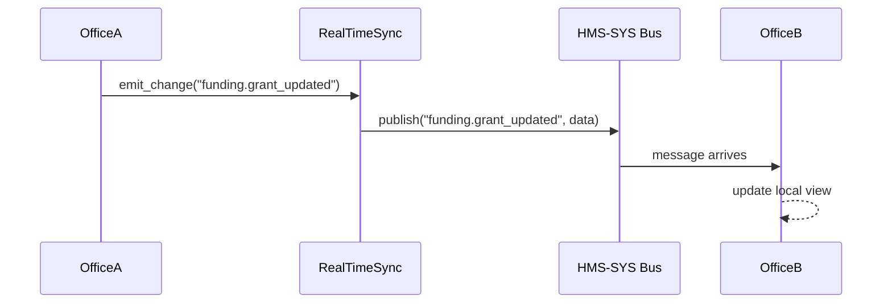

# Chapter 9: Real-Time Synchronization

In the last chapter we saw how to connect to outside systems in [Chapter 8: External System Integration](08_external_system_integration_.md). Now, let’s go one step further: making sure every office, every service, and every user sees the very latest data at the same time—no more stale spreadsheets or conflicting updates.

---

## 1. Motivation: Why Real-Time Synchronization Matters

Imagine three federal offices in different time zones all updating the same cross-border funding spreadsheet:

- Office A in Washington approves a budget line.  
- Office B in Berlin sees the old number and tries to approve the same line.  
- Office C in Tokyo needs to report totals on a live dashboard.

Without real-time sync, Office B might work off stale data and Office C reports wrong totals. In high-stakes scenarios—grant allocations, healthcare case updates, or emergency response coordination—stale or conflicting data can cause delays, duplicated payments, or worse.

**Real-Time Synchronization** is the abstraction that:

1. **Listens** for changes (from APIs, AI proposal engines, or manual edits).  
2. **Broadcasts** those changes instantly to all subscribed systems.  
3. **Resolves** simple conflicts (last‐write wins or merge rules).  
4. **Ensures** everyone sees up-to-the-second information.

---

## 2. Key Concepts

- **Change Listener**  
  Subscribes to events on our messaging bus and external hooks.

- **Update Broadcaster**  
  Pushes each change out to all integrated systems so they stay in sync.

- **Conflict Resolver**  
  Applies simple rules (e.g., time-stamp ordering) or custom merge logic.

- **Connector Adapters**  
  Bridges to specific systems (REST APIs, databases, AI engines).

---

## 3. Using Real-Time Synchronization

Here’s how you might wire up a simple real-time synchronizer in your application.

### 3.1 Initialize the Synchronizer

```python
# file: src/my_app/setup_sync.py
from hms_rt.sync import RealTimeSync

# We listen for changes from APIs and AI proposals.
sync = RealTimeSync(sources=["api_changes", "ai_proposals"])
sync.start()
```

*Explanation:*  
We create a `RealTimeSync` instance, telling it which topics to watch on our [HMS-SYS Messaging Bus](01_core_system_platform__hms_sys__.md). Calling `start()` begins listening and broadcasting.

### 3.2 Emitting a Change

```python
# file: src/my_app/actions.py
from hms_rt.sync import RealTimeSync

sync = RealTimeSync()  # already connected

def update_grant(grant_id, new_amount):
    # Save locally (using HMS-SYS DB), then notify everyone
    # db.save(...)  ← omitted for brevity
    sync.emit_change("funding.grant_updated", {
      "id": grant_id, "amount": new_amount
    })
```

*Explanation:*  
After updating your local store, call `emit_change` with a topic and data. The synchronizer broadcasts it to all other subscribers.

---

## 4. Under the Hood: Step-by-Step Flow

Here’s a simple sequence when Office A updates a grant and Office B receives it immediately:



1. **Office A** calls `emit_change`.  
2. `RealTimeSync` publishes on the HMS-SYS bus.  
3. **Office B** (or any subscriber) gets the event and updates its view.

---

## 5. Internal Implementation

Let’s peek at a minimal implementation to see how it hooks into the messaging system.

```python
# file: src/hms_rt/sync.py
from hms_sys.bus import HMSBus

class RealTimeSync:
    def __init__(self, sources=None):
        self.bus = HMSBus.connect()
        self.sources = sources or []

    def start(self):
        for topic in self.sources:
            # Subscribe to each topic so _on_change is called
            self.bus.subscribe(topic, self._on_change)

    def _on_change(self, topic, message):
        # Simple broadcast: send the change to a generic channel
        broadcast = {"topic": topic, "data": message}
        self.bus.publish("sync.broadcast", broadcast)

    def emit_change(self, topic, data):
        # Let others know about a local change
        self.bus.publish(topic, data)
```

*Explanation:*  
- We connect to the HMS-SYS bus ([Chapter 1](01_core_system_platform__hms_sys__.md)).  
- In `start()`, we subscribe to our list of source topics.  
- `_on_change` rebroadcasts each incoming update on a shared `sync.broadcast` topic.  
- `emit_change` lets your code announce local changes.

---

## 6. Conclusion

You’ve now seen how **Real-Time Synchronization**:

- Listens for updates from APIs or AI engines.  
- Instantly broadcasts changes to all subscribers.  
- Prevents stale data or conflicting edits across agencies.

This ensures everyone always sees the latest spreadsheet—whether they’re in Washington, Berlin, or Tokyo. Next up, we’ll learn how to guide users through the system with **Intent-Driven Navigation**.

[Chapter 10: Intent-Driven Navigation](10_intent_driven_navigation_.md)

---

Generated by [AI Codebase Knowledge Builder](https://github.com/The-Pocket/Tutorial-Codebase-Knowledge)