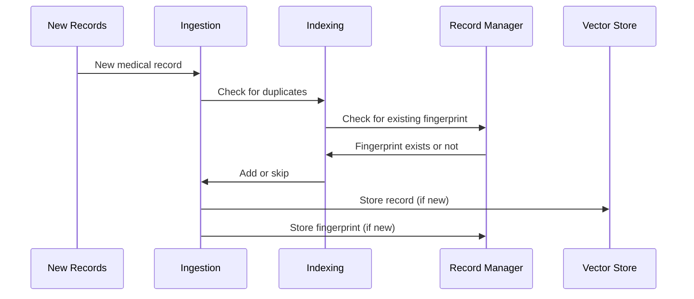

# Chapter 9: Record Manager

In the previous chapter, [Indexing](08_indexing.md), we learned how to avoid adding duplicate records to our [Vector Store](06_vector_store.md).  Now, let's dive deeper into the component that helps us keep track of what's already been indexed: the *Record Manager*.

Imagine you're a librarian and you're constantly adding new books to your collection. You need a way to quickly check if a book is already in the library before you accidentally add a duplicate. The Record Manager is like a librarian's notebook, keeping track of which documents have been indexed and when. This helps the system quickly determine if a document is new or already processed.

## What Problem Does a Record Manager Solve?

The Record Manager solves the problem of efficiently checking for duplicates during [Ingestion](07_ingestion.md).  Without it, the system would have to search the entire [Vector Store](06_vector_store.md) every time a new document is added, which would be very slow.

## How a Record Manager Works

Think of the Record Manager as a simple checklist.  Every time a new document is indexed, the Record Manager adds a checkmark next to the document's unique identifier (its "fingerprint" or hash).  When a new document is being considered for ingestion, the system first checks the Record Manager's checklist. If the document's fingerprint is already on the list, it means the document has already been indexed and can be skipped.

## Using a Record Manager in HMS-MED

Let's say we have a new medical record for John Doe. During ingestion:

1. HMS-MED calculates the fingerprint of the new record.
2. HMS-MED asks the Record Manager, "Have you seen this fingerprint before?"
3. If the Record Manager says "no," HMS-MED adds the record to the [Vector Store](06_vector_store.md) and adds the fingerprint to the Record Manager's checklist.
4. If the Record Manager says "yes," HMS-MED skips adding the record, avoiding duplication.

## Internal Implementation

Here's a simplified view of how the Record Manager interacts with other components:



The code for interacting with the Record Manager can be found in `HMS-EHR/backend/ingest.py`. Here's a simplified example:

```python
# ... other code ...

# Initialize the Record Manager (usually a SQL database).
record_manager = SQLRecordManager(
    f"weaviate/{WEAVIATE_DOCS_INDEX_NAME}", db_url=RECORD_MANAGER_DB_URL
)
record_manager.create_schema()

# ... code to load and prepare documents ...

# The 'index' function uses the Record Manager to check for duplicates.
indexing_stats = index(docs_transformed, record_manager, vectorstore, ...)

# ... more code ...
```

The `index` function handles the interaction with the Record Manager.  It first checks if a document's fingerprint already exists in the Record Manager.  If it doesn't, the document is added to the [Vector Store](06_vector_store.md), and its fingerprint is added to the Record Manager.

The `SQLRecordManager` uses a SQL database to store the fingerprints.  The `create_schema()` function sets up the necessary tables in the database.

```python
# ... other code within the 'index' function ...

# Simplified example of checking for existing documents:
existing_docs = record_manager.get_existing_docs(
    [doc.metadata["source"] for doc in docs]
)

# ... more code to handle indexing based on existing_docs ...
```

The `get_existing_docs` function retrieves the fingerprints of documents that have already been indexed. This information is then used to determine whether a new document should be added to the [Vector Store](06_vector_store.md).

## Conclusion

The Record Manager is a crucial component for efficient [Ingestion](07_ingestion.md) by preventing duplicates in the [Vector Store](06_vector_store.md). It acts like a diligent librarian, keeping track of what's already in the library.  This ensures that the system only stores unique information, saving space and improving search performance.


---

Generated by [AI Codebase Knowledge Builder](https://github.com/The-Pocket/Tutorial-Codebase-Knowledge)