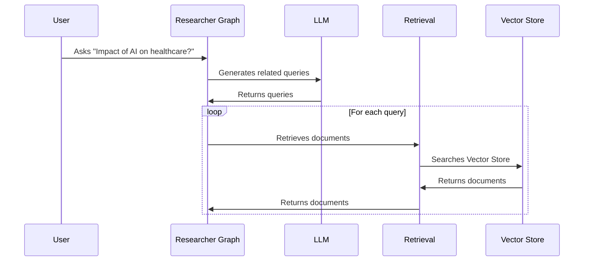

# Chapter 9: Researcher Graph

In the previous chapter, [Record Manager](08_record_manager_.md), we learned how to manage the data our chatbot uses. Now, let's dive into a more advanced retrieval technique called the *Researcher Graph*.  This component helps our chatbot become a more effective research assistant by strategically generating multiple search queries and gathering the most relevant information.

Imagine you're researching a complex topic like "The impact of AI on healthcare."  You wouldn't just type one search query into Google. You'd likely try different search terms, explore various aspects of the topic, and combine information from multiple sources. The Researcher Graph helps our chatbot do the same thing.

## What is the Researcher Graph?

The Researcher Graph is a specialized part of the [Retrieval Graph](10_retrieval_graph_.md) (which we'll cover in the next chapter) focused on generating search queries and retrieving documents. It's like a search expert within the research assistant team.  Instead of relying on a single rephrased question, the Researcher Graph generates multiple related queries to explore different facets of the user's question.

## How the Researcher Graph Works

Let's break down the process with our "impact of AI on healthcare" example:

1. **Initial Question:** You ask the chatbot "What is the impact of AI on healthcare?"

2. **Generate Queries:** The Researcher Graph uses an [LLM](01_llm__large_language_model__.md) to generate related queries, such as:
    * "AI applications in diagnosis"
    * "AI and drug discovery"
    * "Ethical implications of AI in healthcare"

3. **Retrieve Documents:** For each generated query, the Researcher Graph uses the standard [Retrieval](02_retrieval_.md) process (using [Embeddings](04_embeddings_.md) and the [Vector Store](03_vector_store_.md)) to find relevant documents.

4. **Combine Results:** The Researcher Graph gathers all the retrieved documents from the different queries.



## Researcher Graph in Code

The Researcher Graph is defined in `backend/retrieval_graph/researcher_graph/graph.py`. Let's look at a simplified version of the `generate_queries` function:

```python
# backend/retrieval_graph/researcher_graph/graph.py (simplified)
async def generate_queries(state, config):
    # ... other code ...

    model = load_chat_model(config).with_structured_output(Response)
    messages = [
        {"role": "system", "content": "Generate related search queries."},
        {"role": "human", "content": state.question},
    ]
    response = await model.ainvoke(messages)
    return {"queries": response["queries"]}
```

This function takes the user's `question` (from the `state`) and uses an [LLM](01_llm__large_language_model__.md) (`model`) to generate a list of related `queries`.

Here's a simplified version of the `retrieve_documents` function:

```python
# backend/retrieval_graph/researcher_graph/graph.py (simplified)
async def retrieve_documents(state, config):
    with retrieval.make_retriever(config) as retriever:
        response = await retriever.ainvoke(state.query, config)
        return {"documents": response}
```

This function uses the standard [Retrieval](02_retrieval_.md) process to fetch documents for a given `query`.

## Looking Under the Hood: `retrieve_in_parallel`

The `retrieve_in_parallel` function in `backend/retrieval_graph/researcher_graph/graph.py` orchestrates the parallel retrieval of documents for each generated query.

```python
# backend/retrieval_graph/researcher_graph/graph.py (simplified)
def retrieve_in_parallel(state):
    return [
        Send("retrieve_documents", QueryState(query=query)) for query in state.queries
    ]
```

This function creates a list of `Send` objects, each targeting the `retrieve_documents` node with a different `query`. This allows the graph to execute the retrieval process for all queries concurrently.

## Conclusion

The Researcher Graph enhances the chatbot's research capabilities by generating multiple search queries and retrieving documents for each, providing a more comprehensive set of information. This allows the chatbot to explore different facets of complex topics and provide more nuanced answers.  In the next chapter, [Retrieval Graph](10_retrieval_graph_.md), we'll see how the Researcher Graph fits into the larger retrieval system.


---

Generated by [AI Codebase Knowledge Builder](https://github.com/The-Pocket/Tutorial-Codebase-Knowledge)