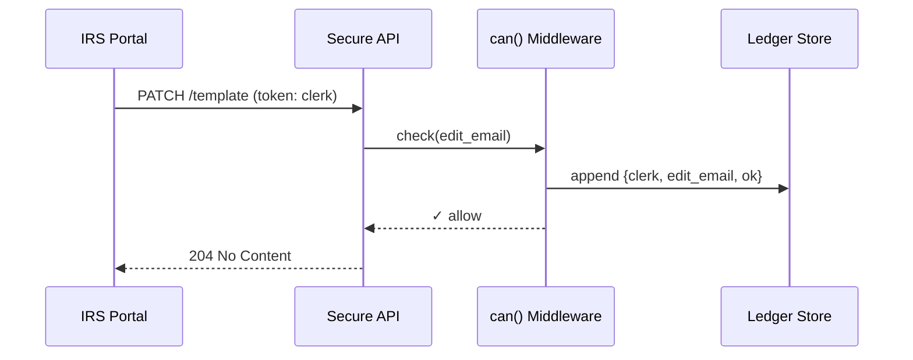

# Chapter 9: Role-Based Access Control & Accountability Ledger
[← Back to Chapter 8: Policy & Process Management API](08_policy___process_management_api_.md)

---

## 0. Why Bother With “Who Can Do What, When”?

Picture the **IRS Refund Service** at 4 PM on April 14.  
• A **Junior Clerk** wants to fix a typo in an email template.  
• A **Data Scientist** needs to run a SQL query on refund statistics.  
• An **Outside Special-Counsel Auditor** must inspect the algorithm *without seeing any citizen’s SSN*.

If the system mixes up these privileges you could get:

* Massive data leaks  
* Accidental code changes on production  
* Audit findings that shut the service down

Role-Based Access Control (RBAC) is the **badge reader on every software door**.  
The **Accountability Ledger** is the **CCTV camera** recording every swipe.  
Together they answer two questions clearly:

1. “Am I allowed to do this right now?”  
2. “Who exactly did what, and when?”

---

## 1. Key Concepts (Plain-English Cheat-Sheet)

| Concept | Everyday Analogy | One-Sentence Purpose |
|---------|-----------------|----------------------|
| Role | Job title on a badge | Bundles a set of permissions |
| Permission | Door access code | The exact action (e.g., `edit_email`) |
| RBAC Matrix | Security guard’s clipboard | Maps roles → permissions |
| Token | Wrist-stamp at a concert | Short-lived proof of who you are & your role |
| Ledger Entry | CCTV frame | Immutable record `{ who, action, when }` |
| Immutable Store | Tamper-evident seal | Nobody (even admins) can alter past entries |

Memorize these six; everything else is wiring.

---

## 2. The Smallest Working Example

We will:

1. Define three roles (`clerk`, `scientist`, `auditor`)  
2. Enforce them in a single Express endpoint  
3. Record every decision in the ledger

### 2.1 Role Matrix (JSON – 10 lines)

```json
// roles.json
{
  "clerk":     ["edit_email"],
  "scientist": ["run_query"],
  "auditor":   ["view_code"]
}
```

### 2.2 Express Middleware (RBAC + Ledger – 20 lines)

```ts
// rbac.ts
import roles from './roles.json';
import { ledger } from './ledger';

export function can(action: string) {
  return (req, res, next) => {
    const role = req.user.role;               // set by previous auth middleware
    const allowed = roles[role]?.includes(action);

    // 1️⃣  Write to ledger BEFORE responding
    ledger.append({
      who: req.user.id,
      role,
      action,
      allowed,
      at: new Date()
    });

    if (!allowed) return res.sendStatus(403);
    next();
  };
}
```

What you just did  
• Checked the user’s role against the matrix.  
• Logged the attempt **either way** (success *or* denial).

### 2.3 Protected Route (7 lines)

```ts
// routes/email.ts
router.patch('/template', can('edit_email'), (req, res) => {
  // ...update text...
  res.sendStatus(204);
});
```

A **Junior Clerk** hitting this endpoint succeeds; others get `403 Forbidden`.

---

## 3. Life of a Request (Step-by-Step)



Five moves, each under 50 ms on commodity hardware.

---

## 4. Peeking Inside the Accountability Ledger

### 4.1 Append-Only Helper (≤ 15 lines)

```ts
// ledger.ts
import fs from 'fs';
import crypto from 'crypto';

const file = './audit.log';

export const ledger = {
  append(record) {
    const line = JSON.stringify({
      ...record,
      hash: crypto.createHash('sha256')
                  .update(JSON.stringify(record))
                  .digest('hex')
    });
    fs.appendFileSync(file, line + '\n');
  }
};
```

Explanation  
* Each line is a self-hashed JSON blob—altering it changes the hash, making tampering obvious.  
* Production systems swap the file for an **append-only table** or **block-chain** store, but the idea stays the same.

---

## 5. Quick Demo: Querying the Ledger

```bash
grep '"action":"edit_email"' audit.log
```

Output:

```
{"who":"u_18","role":"clerk","action":"edit_email","allowed":true,"at":"2024-06-30T16:05:12Z", "hash":"..."}
```

Auditors can now prove **who** edited templates and **when**.

---

## 6. Folder Blueprint

```
hms-access/
 ├─ roles.json
 ├─ rbac.ts
 ├─ ledger.ts
 └─ routes/
     └─ email.ts
```

All under 40 total lines—easy for beginners to explore.

---

## 7. Tying Into the Rest of HMS

* **Agents** created in [Specialized AI Agents (HMS-A2A)](05_specialized_ai_agents__hms_a2a__.md) call `rbac.can('agent_run')` before executing.  
* Human overrides from [Human-in-the-Loop Oversight](07_human_in_the_loop__hitl__oversight_.md) are recorded here.  
* Policy changes via [Policy & Process Management API](08_policy___process_management_api_.md) require `can('policy_edit')`.  
* Live counts of denied vs. approved actions feed metrics in [Real-Time Metrics & Monitoring](10_real_time_metrics___monitoring_.md).

---

## 8. Mini-FAQ

**Q: Can one person hold multiple roles?**  
Yes—store `user.roles = ['scientist','auditor']` and allow if **any** role matches.

**Q: How long do ledger entries live?**  
Default 7 years (IRS standard); the store is WORM (Write-Once-Read-Many).

**Q: What if the matrix changes?**  
Update `roles.json` → redeploy. Previous ledger entries remain valid because they store the role name, not the permissions.

---

## 9. Recap & Next Steps

You learned:

1. Why RBAC + Ledger stops both accidents and malice.  
2. Six core ideas (role, permission, matrix, token, ledger entry, immutable store).  
3. A 20-line middleware that enforces access *and* logs it.  
4. How ledger hashes make tampering obvious.  
5. Where RBAC plugs into the wider HMS ecosystem.

Next we’ll watch these access events appear in live dashboards:  
[Chapter 10: Real-Time Metrics & Monitoring](10_real_time_metrics___monitoring_.md) →


---

Generated by [AI Codebase Knowledge Builder](https://github.com/The-Pocket/Tutorial-Codebase-Knowledge)