# Chapter 9: Security & Authorization Layer (HMS-SYS, Zero-Trust) 🔐

*(Coming from [Backend Policy API (HMS-SVC / HMS-API)](08_backend_policy_api__hms_svc___hms_api__.md)?  
Great—now that policies can **travel**, let’s make sure only the **right people and robots** can touch them.)*  

---

## 0. Why Do We Need “Nuclear-Launch” Security?

Imagine an attorney at the **U.S. Department of Justice (DOJ)** wants to raise the civil-penalty limit for telemarketing fraud.

1. She opens the Policy Editor and clicks **Save**.  
2. An *AI co-author* suggests wording tweaks.  
3. The *Workflow Manager* pushes the change toward production.  

If even **one** check is missing—say a token expired or the AI is spoofed—citizens could suddenly owe illegal fines.  
HMS-SYS solves this with a **Zero-Trust Security Mesh**:

> “Assume nothing, verify everything—identity, role, and context—for **every** single request.”

It’s the digital version of needing *two launch keys plus a retina scan* before pressing the red button.

---

## 1. Key Concepts (Beginner Edition)

| Term | Think “Plain English” |
|------|-----------------------|
| Zero-Trust | “Never trust, always verify” — every call re-authenticates. |
| Token (JWT) | A signed ID card that lasts only 15 minutes. |
| Scope | What the caller is **allowed** to do (`read:policy`, `write:policy`). |
| Role | Job title baked into the token (`Attorney`, `Clerk`, `AI_Agent`). |
| Context Claim | Extra facts: IP range, session age, mTLS thumb-print. |
| PEP (Policy Enforcement Point) | Gatekeeper that checks the token before forwarding. |
| PDP (Policy Decision Point) | Brain that answers “yes” or “no” based on rules. |

Keep these in mind; we’ll use them in the demo.

---

## 2. Walk-Through: DOJ Attorney Edits a Rule

### 2.1 Flow in 8 Seconds

1. Attorney clicks **Save**.  
2. Browser asks Identity Provider for a fresh **JWT**.  
3. Browser POSTs the edit + JWT to HMS-API.  
4. **PEP** validates the token & context.  
5. **PDP** checks scopes (`write:policy`).  
6. Request reaches Policy API, which stores the draft.  
7. Audit Log records *who, what, when, where*.  
8. Response **200 OK** sent back.

Below is the entire round-trip:

```mermaid
sequenceDiagram
    participant BR as Browser
    participant PEP as Gateway (PEP)
    participant PDP as Auth Service (PDP)
    participant API as Policy API
    BR->>PEP: POST /policies/5  +  JWT
    PEP->>PDP: isTokenValid?
    PDP-->>PEP: ✅ + scopes
    PEP->>API: forward request
    API-->>PEP: 200 OK
    PEP-->>BR: 200 OK
```



If **any** check fails, PEP returns `401 Unauthorized` or `403 Forbidden` and the journey stops.

---

## 3. Tiny Code Samples (≤ 20 Lines Each)

### 3.1 Front-End: Attach the Token

```js
// File: helpers/fetchSecure.js
export async function fetchSecure(url, opts = {}) {
  const token = await auth.refresh()      // gets 15-min JWT
  return fetch(url, {
    ...opts,
    headers: { ...opts.headers, Authorization: `Bearer ${token}` }
  })
}
```

*Beginner notes*:  
`auth.refresh()` hides the OAuth dance; you just import and call.

---

### 3.2 PEP Middleware: Verify & Authorize

```js
// File: pep/authorize.js
import jwt from 'jsonwebtoken'

export function authorize(scopeRequired) {
  return (req, res, next) => {
    try {
      const token = req.headers.authorization?.split(' ')[1]
      const data  = jwt.verify(token, process.env.JWTPUBKEY)

      if (!data.scopes?.includes(scopeRequired))
          return res.status(403).end()

      // Simple context check: IP must be GOV network
      if (!req.ip.startsWith('147.')) return res.status(403).end()

      req.user = data        // attach claims
      next()
    } catch { res.status(401).end() }
  }
}
```

*What it does*  
1. Validates the signature.  
2. Checks the requested **scope**.  
3. Makes sure the caller’s IP belongs to the .gov subnet.  

Attach it in Express:

```js
app.post('/policies/:id', authorize('write:policy'), savePolicy)
```

---

### 3.3 Token Issuer (Simplified)

```js
// File: idp/issue.js
import jwt from 'jsonwebtoken'
export function issue(user) {
  const payload = {
    sub: user.email,
    role: user.role,             // e.g., 'Attorney'
    scopes: user.scopes,         // array
    ctx: { net: user.ip }        // context claim
  }
  return jwt.sign(payload, process.env.JWT_SECRET, { expiresIn: '15m' })
}
```

Every 15 minutes the browser silently swaps tokens—no long-lived secrets.

---

## 4. Under the Hood (Non-Code View)

1. **Identity Provider (IdP)** holds the root key—not HMS-API.  
2. **PEP** is deployed at **every** micro-service ingress.  
3. **PDP** logic can live in a central Auth Service *or* be embedded; both read the same `authorization.yaml`.

```yaml
# authorization.yaml (snippet)
- role: Attorney
  can:
    - write:policy
    - read:policy

- role: AI_Agent
  context:
    mTLS: required
  can:
    - read:policy
```

*Key idea*: human tokens ride on browser cookies; machine tokens require **mutual TLS (mTLS)** to prevent replay.

---

## 5. Adding Zero-Trust to an Internal Service

Service reading policies? Add three lines:

```python
# svc/main.py
from flask import Flask, request
from pep import check_jwt      # tiny helper

@app.before_request
def guard():
    check_jwt(request, scope='read:policy')   # 2-line guard

@app.route('/run')
def run():
    return "service OK"
```

`check_jwt()` mirrors the Node example—language doesn’t matter; the **rulebook** is shared.

---

## 6. How HMS-SYS Links to Other Chapters

* **Dashboard & Editor** obtain tokens via this layer.  
* **AI Agents** use machine tokens signed by HMS-SYS before calling tools in [Model Context Protocol](05_model_context_protocol__hms_mcp__.md).  
* **Marketplace Installer** requires `install:skill` scope (see [HMS-MKT](06_agent_marketplace__hms_mkt__.md)).  
* **Workflow Manager** pauses any step lacking proper scope, routing it to [Human-in-the-Loop Oversight](11_human_in_the_loop_oversight__hitl__.md).  
* **Metrics & Monitoring** record **denied vs. allowed** counts to detect brute-force attempts (Chapter 14).

---

## 7. Quick FAQ

**Q:** *Is a VPN enough?*  
A: VPN adds transport privacy, but Zero-Trust requires **per-request** auth. Keep both.

**Q:** *How do AI agents authenticate?*  
A: They hold short-lived **client credentials** and must present an mTLS certificate—token alone isn’t sufficient.

**Q:** *What if a token leaks?*  
A: Max lifetime is 15 minutes. You can also revoke via the IdP, instantly black-listing its `jti` claim.

---

## 8. Summary & Next Steps

You learned:

1. The **Zero-Trust mindset**: verify identity, role, and context on every single call.  
2. How **tokens, scopes, and context claims** form a triple lock.  
3. Tiny snippets to issue, attach, and verify JWTs in both Node and Python.  
4. How HMS-SYS weaves through *all* other layers of HMS-GOV.

With the doors now locked, we’re ready to study **how a policy becomes “real law” inside the system**—the Legislative Process Engine.

➡️ Continue to [Legislative Process Engine (HMS-CDF)](10_legislative_process_engine__hms_cdf__.md)

---

Generated by [AI Codebase Knowledge Builder](https://github.com/The-Pocket/Tutorial-Codebase-Knowledge)