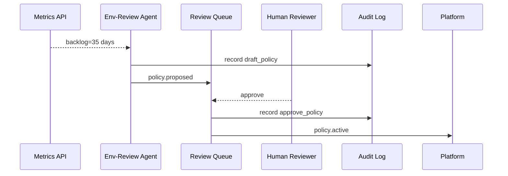

# Chapter 9: Specialized AI Agents (HMS-A2A)  
*(Little in-house experts that never sleep)*  

[← Back to Chapter 8: Compliance & Audit Trail Module](08_compliance___audit_trail_module_.md)

---

## 1. Why Bother With Specialized Agents?

Picture the **U.S. Fish & Wildlife Service (FWS)**.  
Every spring it receives a surge of **Environmental Review** requests from construction firms. Backlogs grow, permit times double, and governors call.

Enter an **“Env-Review Agent.”**

1. It watches live queue metrics.  
2. When average wait time > 30 days, it drafts a *policy tweak*:  
   “Skip step B for low-impact projects.”  
3. It posts the idea in staff chat and waits for humans to approve it.  
4. All of this is auto-logged in the [Compliance & Audit Trail Module](08_compliance___audit_trail_module_.md).

No one needed a massive new ML team—just a **Specialized AI Agent (HMS-A2A)** plugged into the platform.

---

## 2. Key Concepts (Plain English)

| Term | What It Really Means | Quick Analogy |
|------|----------------------|---------------|
| Skill Pack | JSON file describing what the agent can do. | Résumé attached to a job application. |
| Data Tap | Read-only API the agent listens to (metrics, forms, etc.). | A water meter on a pipe. |
| Draft Suggestion | Machine-generated policy or workflow change. | A sticky note left on your monitor. |
| Talk Channel | Where humans chat with the agent (Teams, Slack, or in-app). | Helpdesk window. |
| Guardrails | Calls to [Values Framework](06_ai_governance_values_framework_.md) + [HITL Oversight](07_human_in_the_loop__hitl__oversight_.md). | Safety rails on a balcony. |

---

## 3. A 3-Step “Hello, Agent!” Walk-Through

We’ll build a *mini* Env-Review Agent.

### 3.1 Describe the Skill Pack (≤ 15 lines)

```jsonc
// env_review.skill.json
{
  "id": "env_review_agent",
  "tasks": ["watch_backlog", "draft_policy"],
  "dataTap": "/metrics/environmental_reviews",
  "threshold": { "avgDays": 30 },
  "chatChannel": "#env-review-ai"
}
```

**Explanation**  
The agent knows **where** to listen, **what** to do, and **where** to talk.

---

### 3.2 The Tiny Agent Loop (18 lines)

```ts
// agents/envReview.ts
import { fetchJSON } from "../lib/http";
import { valuesCheck } from "@hms-nfo/values";
import { record } from "@hms-nfo/catm";            // Audit log

export async function tick() {
  const m = await fetchJSON("/metrics/environmental_reviews");
  if (m.avgDays <= 30) return;                    // nothing to do

  const proposal = {
    id: "env_speedup_" + Date.now(),
    text: "Skip Step B for low-impact reviews for 90 days."
  };

  // 1. Guardrails
  valuesCheck({ action: "draft_policy", values: ["truth","ethics","safety"] });

  // 2. Audit
  record("env_review_agent", "draft_policy", proposal);

  // 3. Hand to HITL reviewers
  publish("policy.proposed", proposal);           // via event bus
}
```

What will happen?  
• If backlog > 30 days, the agent proposes a shortcut.  
• The proposal is automatically signed & stored.  
• Humans receive it for review (see Chapter 7).

---

### 3.3 Chat With Humans (16 lines)

```ts
// chat/onMessage.ts
import { publish } from "../lib/bus";

export function onMessage(msg) {
  if (!msg.text.startsWith("@env")) return;

  const question = msg.text.replace("@env ", "");
  const answer = aiModel.respond(question);   // ✂ simplified

  publish("chat.reply", {to: msg.user, answer});
}
```

Staff can ask:  
“@env Why skip Step B?” → Agent replies with its rationale.

---

## 4. How the Pieces Dance Together



1. Agent listens ➜ drafts ➜ logs.  
2. Human approves ➜ logs again ➜ policy goes live.

---

## 5. Internal Anatomy (Code-Light)

1. **Scheduler** calls `tick()` every 15 min.  
2. **Values Guard** blocks shady suggestions early.  
3. **Audit Hook** writes every action to the immutable ledger.  
4. **Event Bus** (`policy.*`) hands off to [HITL Oversight](07_human_in_the_loop__hitl__oversight_.md).  
5. On approval, downstream services update workflow configs.

---

## 6. File Structure Peek

```
hms-a2a/
  env_review/
    env_review.skill.json
    tick.ts
    chat/
      onMessage.ts
  common/
    scheduler.ts
    bus.ts
```

Small, focused, easy to fork for the **DEA Finance Agent** or **LSC Scheduling Agent**.

---

## 7. Hands-On Exercise (5 min)

1. Clone repo & run `npm start env_demo`.  
2. Edit `metrics.json` so `"avgDays": 45`.  
3. Wait for scheduler log:  
   `→ Drafted policy env_speedup_1698765432`  
4. Open Review UI (hosted by HITL). Approve it.  
5. Check `ledger.jsonl`—you’ll see **two** signed events (draft + approve). 🎉

---

## 8. Common Pitfalls & Quick Fixes

| Problem | Symptom | Fix |
|---------|---------|-----|
| Agent chat spam | Too many channel posts | Add cooldown in `chat/onMessage.ts`. |
| Data Tap breaks | Agent throws 500 | Retry w/ backoff; raise alert. |
| Policy loops | Agent proposes same idea daily | Store last proposal ID & throttle. |

---

## 9. Where This Fits in the Bigger Picture

• **Values Framework** (Chapter 6) ensures proposals are ethical.  
• **Human-in-the-Loop** (Chapter 7) adds expert approval.  
• **Audit Trail** (Chapter 8) keeps investigators happy.  
• Next we’ll meet a *singleton* agent that goes beyond suggestions and directly **optimizes** entire processes: [Autonomous Process Optimization Agent](10_autonomous_process_optimization_agent_.md).

---

## 10. Summary

You just built a micro-expert that:

1. Monitors live government metrics.  
2. Suggests improvements when thresholds break.  
3. Chats politely with humans.  
4. Plays by the ethical & audit rules of HMS-NFO.

Clone, tweak the Skill Pack, and create your own department-specific helper!

[→ Continue to Chapter 10: Autonomous Process Optimization Agent](10_autonomous_process_optimization_agent_.md)

---

Generated by [AI Codebase Knowledge Builder](https://github.com/The-Pocket/Tutorial-Codebase-Knowledge)