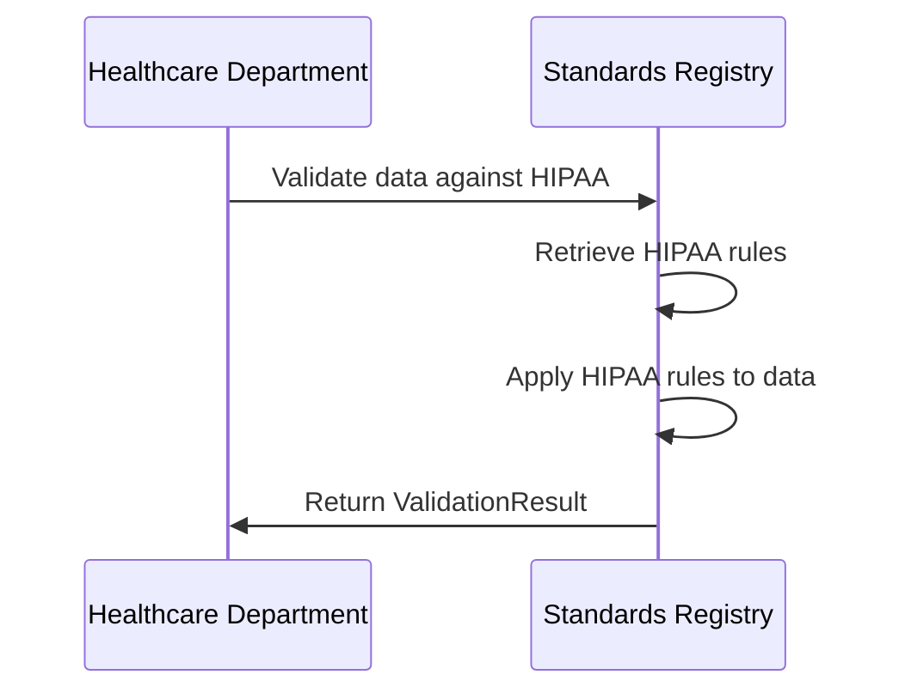

# Chapter 9: Standards Registry

Following on from our understanding of the [A2A (Agent-to-Agent) Protocol](08_a2a__agent_to_agent__protocol.md), we'll now explore the *Standards Registry*.

Imagine our factory has different departments – healthcare, education, and government. Each department has its own set of rules and regulations.  For example, the healthcare department must comply with HIPAA, while the education department must comply with FERPA. How do we ensure that all operations within our factory adhere to these various standards? That's where the Standards Registry comes in.

## Understanding the Standards Registry

The Standards Registry is like the factory's quality control department. It holds all the rules and regulations that each department must follow.  When a department performs an action, the Standards Registry checks if that action complies with the relevant standards.

## Key Concepts

1. **Standards:** These are sets of rules and regulations, like HIPAA or FERPA.
2. **Validation Rules:** These are specific requirements within a standard, like "Patient identifiers must be properly protected."
3. **Validation Severity:** This indicates the importance of a rule – Warning, Error, or Critical.

## Using the Standards Registry: Example

Let's say the healthcare department wants to share patient data.  Here's a simplified example of how the Standards Registry would be used to validate this action:

```rust
// Simplified example - details omitted for clarity
use crate::protocols::mcp::{StandardsRegistry, ValidationSeverity};

// ... other code ...

// Assume 'registry' is a StandardsRegistry instance
let standards_to_check = vec!["HIPAA".to_string()]; // Check HIPAA compliance
let data_to_validate = serde_json::json!({"patient_id": "12345", "name": "John Doe"});

let result = registry.validate("healthcare", &standards_to_check, &data_to_validate);

if result.valid {
    println!("Data is compliant!");
    // Proceed with data sharing
} else {
    println!("Data violates the following rules:");
    for violation in result.violations {
        println!("- {} ({:?})", violation.description, violation.severity);
    }
}
```

This code snippet shows how to validate data against a specific standard. The `validate` function checks the data against the specified standards and returns a `ValidationResult`.  If `result.valid` is true, the data is compliant. Otherwise, `result.violations` contains a list of violations.

## Inside the Standards Registry: Implementation

Here's a sequence diagram illustrating the validation process:



The Standards Registry is implemented in `src/protocols/mcp/mod.rs`.  Here's a simplified snippet for registering a standard:

```rust
// src/protocols/mcp/mod.rs
use crate::protocols::mcp::{StandardsRegistry, ValidationRule, ValidationSeverity};

// ... other code ...

impl StandardsRegistry {
    // ... other code ...

    pub fn register_standard(
        &mut self,
        name: &str,
        description: &str,
        domains: Vec<String>,
        validation_rules: Vec<ValidationRule>,
    ) {
        // ... code to store the standard ...
    }
}
```

This code defines the `register_standard` function, which adds a new standard to the registry.  The `validate` function (shown in the usage example) retrieves the relevant standard and applies its rules to the data.  The `StandardsLoader` in `src/protocols/mcp/standards_loader.rs` loads standards from JSON files.

## Conclusion

The Standards Registry acts as a central repository for all standards, ensuring that all operations within our factory comply with the relevant rules and regulations. This is crucial for maintaining compliance and avoiding potential issues. Next, we'll explore how [Agents](04_agent.md) receive and process responses from tools using [ToolResponse](10_toolresponse.md).


---

Generated by [AI Codebase Knowledge Builder](https://github.com/The-Pocket/Tutorial-Codebase-Knowledge)