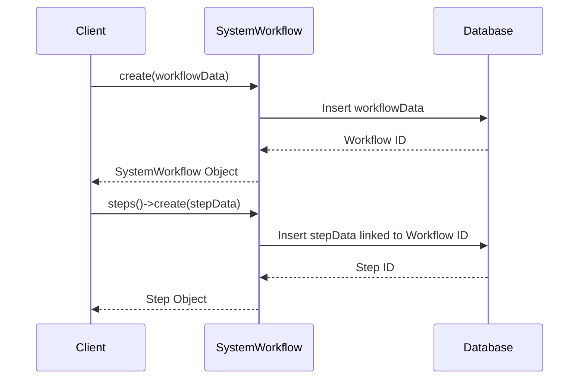

# Chapter 9: SystemWorkflow

In the previous chapter, [SystemResource](08_systemresource.md), we learned how Sunnyside Elementary manages its resources. Now, let's think about how a student goes through the process of enrolling in the Chess Club. This involves several steps: filling out a form, paying a fee, attending the first meeting, and so on. This sequence of steps is a `SystemWorkflow`.

## What problem does SystemWorkflow solve?

Imagine a student wants to join Sunnyside Elementary's Chess Club. They need to know what steps to take, what information to provide, and who to contact.  `SystemWorkflow` guides participants through a system to achieve a specific outcome. It's like a roadmap that shows you how to get from point A (wanting to join the club) to point B (being a member).

## Key Concepts

1. **Steps:** A `SystemWorkflow` is made up of individual steps, like filling out a form or attending a meeting. Each step has a description and a status (e.g., "pending," "in progress," "completed").

2. **Outcome:** The `SystemWorkflow` is designed to achieve a specific outcome, like "Student enrolled in Chess Club."

3. **Participant:** The `SystemWorkflow` guides a specific participant, like a student, through the system.

## Using SystemWorkflow: Enrolling in the Chess Club

Let's create a `SystemWorkflow` for enrolling in Sunnyside's Chess Club.

```php
// Simplified example - see SystemWorkflow.php for full implementation
use App\Models\SystemWorkflow;

$workflow = new SystemWorkflow([
    'system_id' => 1, // Sunnyside Elementary's ID
    'user_id' => 2, // The student's ID
    'intent' => 'Join Chess Club',
    'desired_outcome' => 'Enrolled in Chess Club',
    'status' => 'pending' // The workflow starts as pending
]);

$workflow->save();

// Add steps (simplified - see WorkflowStep model)
$workflow->steps()->create(['description' => 'Fill out registration form', 'order' => 1]);
$workflow->steps()->create(['description' => 'Pay club fee', 'order' => 2]);
$workflow->steps()->create(['description' => 'Attend first meeting', 'order' => 3]);
```

This code creates a new `SystemWorkflow` for a student enrolling in the Chess Club. We add three steps: filling out the form, paying the fee, and attending the first meeting.

## Internal Implementation

When you call `save` on the `SystemWorkflow`, it creates a new entry in the database representing the workflow.  The `steps()->create` function creates new [WorkflowStep](Not_provided_in_prompt.md) entries linked to the workflow.



The code for saving the `SystemWorkflow` and its steps can be found in `Gov/Entities/Base/Workflow/SystemWorkflow.php`.

```php
// Gov/Entities/Base/Workflow/SystemWorkflow.php (simplified)
public function steps(): HasMany
{
    return $this->hasMany(WorkflowStep::class, 'workflow_id')->orderBy('order');
}
```

This code defines the relationship between the `SystemWorkflow` and its steps.

## Conclusion

In this chapter, we learned about `SystemWorkflow`, which guides participants through a system to achieve a specific outcome. We saw how to create a `SystemWorkflow` for enrolling in Sunnyside Elementary's Chess Club. In the next chapter, [SystemOutcome](10_systemoutcome.md), we'll explore how to define and measure the success of these workflows.


---

Generated by [AI Codebase Knowledge Builder](https://github.com/The-Pocket/Tutorial-Codebase-Knowledge)