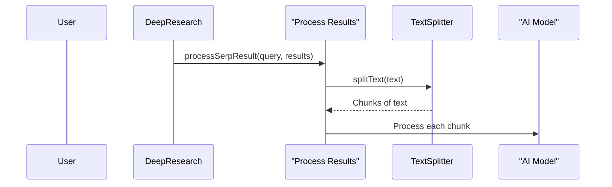

# Chapter 9: Text Splitter

In the previous chapter, [AI Model Provider](08_ai_model_provider_.md), we learned how HMS-AGX uses different AI models. Now, let's explore how HMS-AGX handles large texts that might be too big for these AI models to process at once using the *Text Splitter*.

Imagine you have a very long book and want to summarize it using an AI.  The AI might have a limit on how much text it can handle at a time.  The Text Splitter is like dividing that book into smaller, manageable chapters that the AI can read individually.

## What is the Text Splitter?

The Text Splitter breaks down large texts into smaller chunks, ensuring they fit within the AI model's input limits.  This is crucial for tasks like [Learning Extraction](05_learning_extraction_.md) and [Report Generation](07_report_generation_.md), where the AI needs to process potentially large amounts of text.

## Using the Text Splitter

Let's say you have a long text about the history of computers:

```
The history of computers begins with early mechanical devices like the abacus...  Later, Charles Babbage designed the Analytical Engine...  In the 20th century, electronic computers emerged...  Today, we have powerful computers in our pockets...
```

The Text Splitter can divide this text into smaller chunks:

```
Chunk 1: The history of computers begins with early mechanical devices like the abacus...
Chunk 2: Later, Charles Babbage designed the Analytical Engine...
Chunk 3: In the 20th century, electronic computers emerged...
Chunk 4: Today, we have powerful computers in our pockets...
```

Here's a simplified example of how to use the `RecursiveCharacterTextSplitter`:

```typescript
// src/ai/text-splitter.ts
import { RecursiveCharacterTextSplitter } from './text-splitter';

const splitter = new RecursiveCharacterTextSplitter({ chunkSize: 100, chunkOverlap: 20 });
const text = "This is a long text that needs to be split into smaller chunks.";
const chunks = splitter.splitText(text);
console.log(chunks);
```

This code creates a `RecursiveCharacterTextSplitter` with a `chunkSize` of 100 characters and a `chunkOverlap` of 20 characters. It then splits the input text into chunks and prints them to the console.

## Inside the Text Splitter

Here's a simplified sequence diagram showing how the Text Splitter works:



1. The `processSerpResult` function (part of [Learning Extraction](05_learning_extraction_.md)) receives the search results.
2. It calls the `splitText` function of the Text Splitter.
3. The Text Splitter returns smaller chunks of text.
4. The AI model processes each chunk individually.

Here's a simplified look at the `splitText` function from `src/ai/text-splitter.ts`:

```typescript
// src/ai/text-splitter.ts
class RecursiveCharacterTextSplitter {
  // ...

  splitText(text: string): string[] {
    // ... (Logic to split the text into chunks based on separators like newline, period, comma, etc.)
  }
}
```

The `splitText` function recursively splits the input text based on a list of separators. It prioritizes separators like newlines and periods, ensuring that chunks maintain coherent sentences where possible.  The `chunkSize` and `chunkOverlap` parameters control the size and overlap of the chunks.  `chunkOverlap` helps maintain context between chunks.

## Conclusion

This chapter explained how the Text Splitter breaks down large texts into smaller, manageable chunks for the AI model to process. This is essential for handling large amounts of information effectively. This concludes the core concepts of HMS-AGX.  You can now explore the codebase and experiment with different research questions and parameters.


---

Generated by [AI Codebase Knowledge Builder](https://github.com/The-Pocket/Tutorial-Codebase-Knowledge)