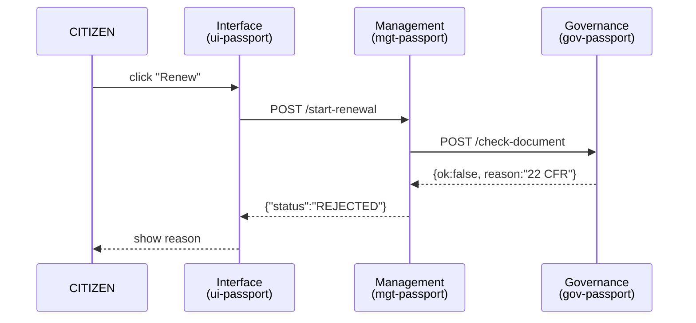

# Chapter 9: Three-Layer Micro-Service Stack (Governance / Management / Interface)

[← Back to Chapter 8: Legal & Compliance Reasoner (HMS-ESQ)](08_legal___compliance_reasoner__hms_esq__.md)

---

## 1 Why Split the Building Into Three Floors?

Picture a brand-new **“One-Stop Passport Renewal”** portal funded by Congress.  
In six months it must:

1. Accept citizen applications online,  
2. Route payments to Treasury,  
3. Enforce every line of the Passport Act **and** the Privacy Act,  
4. Let future teams add “Expedited Renewal” without breaking what’s live.

Trying to code all of that in one chunky service is like squeezing every federal office into one room—chaos!  
Instead, HMS projects follow a **Three-Layer Micro-Service Stack**—think of a government office tower with three public floors:

```
┌────────────┐
│ Floor 3    │  Service Counters
│ Interface  │  (HMS-MFE widgets, mobile apps)          Citizens & Staff
├────────────┤
│ Floor 2    │  Back-office Ops
│ Management │  (workflow, billing, data adapters)      Dev Teams
├────────────┤
│ Floor 1    │  Law & Oversight
│ Governance │  (policy engines, audit, guardrails)     Lawyers & IGs
└────────────┘
```

Each floor is **independent but polite**—so you can renovate one without closing the whole building.

---

## 2 Key Concepts (Plain English)

| Term | What It Really Means | Government Analogy |
|------|---------------------|--------------------|
| Governance Service | Small API that enforces law & ethics (e.g., HMS-ESQ). | Office of Inspector General on Floor 1. |
| Management Service | Workflow & data plumbing (e.g., claim router, payment batcher). | Back-office clerk on Floor 2. |
| Interface Service | UI or public API citizens touch (e.g., HMS-MFE widget). | Front-desk window on Floor 3. |
| “Up-Only” Calls | Higher floors may call **down**, never up. | Clerk can ask legal for advice, but lawyers never poke UI code. |
| Plug-In Module | Drop-in feature that follows the three-floor rules. | New kiosk added to the lobby without changing blueprints. |

Keep these five ideas handy—everything else is wiring.

---

## 3 A 15-Minute Mini-Build

Goal: create a **Passport Renewal** feature that lives on all three floors.

### 3.1 Spin Up the Skeleton (≤20 lines)

```bash
# Clone starter repo
git clone https://github.com/hms/example-stack passport-stack
cd passport-stack

# Start all three floors
docker compose up -d
```

`docker-compose.yml` (excerpt)  

```yaml
services:
  gov-passport:          # Floor 1
    image: hms/gov-base
    ports: ["8001:8000"]

  mgt-passport:          # Floor 2
    image: hms/mgt-base
    environment:
      GOV_URL: http://gov-passport:8000
    ports: ["8002:8000"]

  ui-passport:           # Floor 3
    image: hms/ui-base
    environment:
      MGT_URL: http://mgt-passport:8000
    ports: ["8003:8000"]
```

Explanation  
1. **gov-passport** = Governance micro-service (legal checks).  
2. **mgt-passport** = Management micro-service (workflow & DB).  
3. **ui-passport**  = Interface micro-service (web component bundle).  
Each knows only the floor *below* via `*_URL`.

---

### 3.2 Add a New Rule (Governance Floor)

_File: `gov/routes.py` (8 lines)_

```python
@app.post("/check-document")
def check_doc(doc_type: str):
    illegal = {"military_id", "social_security_card"}
    if doc_type in illegal:
        return {"ok": False, "reason": "Prohibited ID under 22 CFR §51.23"}
    return {"ok": True}
```

Beginner talk: The governance service says “Yes/No” and *why*—nothing else.

---

### 3.3 Consume the Rule (Management Floor)

_File: `mgt/workflow.py` (14 lines)_

```python
def start_renewal(applicant):
    # 1) Ask lawyers downstairs
    r = httpx.post(f"{GOV_URL}/check-document",
                   json={"doc_type": applicant["id_doc"]}).json()

    if not r["ok"]:
        return {"status": "REJECTED", "reason": r["reason"]}

    # 2) Save to DB & create payment stub (skipped)
    return {"status": "PENDING_PAYMENT", "fee": 130}
```

Note: Workflow never *parses CFR text*—it trusts Floor 1.

---

### 3.4 Expose to Citizens (Interface Floor)

_File: `ui/passport.js` (16 lines)_

```js
customElements.define('passport-renewal',
  class extends HTMLElement {
    connectedCallback() {
      this.innerHTML = `
        <button id="apply">Renew Passport</button>
        <pre id="out"></pre>`;
      this.querySelector('#apply')
          .addEventListener('click', () => this.apply());
    }
    async apply() {
      const res = await fetch('/api/start-renewal',{
        method:'POST', body: JSON.stringify({id_doc:'military_id'})
      }).then(r=>r.json());
      this.querySelector('#out').textContent = JSON.stringify(res,null,2);
    }
  });
```

The widget calls `/api/start-renewal` (proxy to Management floor).  
If lawyers yell “Prohibited ID,” the UI simply shows the message—no legal logic in JavaScript.

---

## 4 What Happens on a Single Click?



Takeaway: Each layer does **one job**; messages only flow *downward*.

---

## 5 Under-the-Hood Folder Layout

```
passport-stack/
├─ gov-passport/
│  └─ routes.py              (law checks)
├─ mgt-passport/
│  └─ workflow.py            (business logic)
└─ ui-passport/
   └─ passport.js            (front-end widget)
```

Middle-school takeaway: One file per floor keeps it crystal clear.

---

## 6 Plug-In a New Feature Without Drama

Need “Expedited Renewal”?  

1. Clone **mgt-passport** into `mgt-expedite`.  
2. Point its `GOV_URL` to the same **gov-passport**—no legal copy-paste.  
3. Add a new widget `ui-expedite.js` that calls the new management endpoint.

The legal floor already knows the CFR rule, so nothing changes there.  
Zero downtime, zero cross-team shouting.

---

## 7 Common Pitfalls & Quick Fixes

| Symptom | Floor | Cause | Quick Fix |
|---------|-------|-------|-----------|
| UI prints “502 Bad Gateway” | Interface → Management | Wrong `MGT_URL` env var | `docker inspect` port, update env |
| Workflow bypasses legal check | Management | Dev forgot to call GOV API | Add unit test: assert `check_doc` called |
| Governance service overloaded | Governance | Too many UI calls | Add caching on Management floor |
| Need cross-layer data access | (Any) | Temptation to call two floors at once | Refactor so only *lower* floor returns needed info |

---

## 8 Where the Three Floors Meet Other Chapters

• Floor 1 uses modules from [AI Governance Values Pipeline](07_ai_governance_values_pipeline_.md) and [Legal & Compliance Reasoner](08_legal___compliance_reasoner__hms_esq__.md).  
• Floor 2 orchestrates agents from [AI Agent Framework](04_ai_agent_framework__hms_agt__.md) and queues in [Activity Orchestrator & Task Queues](11_activity_orchestrator___task_queues__hms_act___hms_oms__.md).  
• Floor 3 is rendered with components from [Micro-Frontend Library (HMS-MFE)](03_micro_frontend_library__hms_mfe__.md).

---

## 9 Recap

You just:

1. Learned the **Three-Layer Stack** metaphor (Governance, Management, Interface).  
2. Spun up a tiny passport-renewal service using Docker.  
3. Watched one click travel down and back up the tower.  
4. Saw how to plug in new features without rewriting law checks or UI code.

Separation of floors = separation of headaches.

Ready to expose these services safely to the outside world?  
Head downstairs to [Chapter 10: Backend Service Gateway (HMS-SVC / HMS-API)](10_backend_service_gateway__hms_svc___hms_api__.md).

---

Generated by [AI Codebase Knowledge Builder](https://github.com/The-Pocket/Tutorial-Codebase-Knowledge)