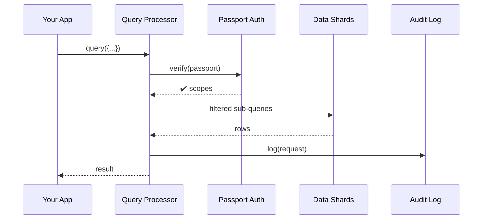

# Chapter 9: Unified Data Fabric (HMS-DTA)

*(Just finished learning how tickets move through stages in [Workflow & Task Management Hub (HMS-OMS)](08_workflow___task_management_hub__hms_oms__.md)?  
Great! Now let’s discover **where all that data actually lives, stays safe, and stays fast.**)*  

---

## 1. Why Do We Need HMS-DTA?

Imagine a winter storm is about to hit **Cedar Rapids, IA**.  
The **National Weather Service (NWS)** wants to know—*right now*:

1. How many **hospital beds** are free (Health & Human Services).  
2. Which **small-business loans** are still pending in the flood zone (Small Business Administration).  
3. If local **schools** can open shelters (Department of Education).

Today the meteorologist would juggle three portals, three schemas, and three legal agreements.  
**HMS-DTA is the “secure library” where every record already has a barcode, usage policy, and audit trail.**  
One query ➜ instant, cross-agency answers—without each team reinventing storage.

---

## 2. Beginner’s Mental Model

| Library Analogy | HMS-DTA Term | One-Line Description |
|-----------------|--------------|----------------------|
| Book            | **Data Ticket** | A single, normalized record (e.g., one hospital bed). |
| Barcode         | **Global ID**   | Unique across all agencies (`bed:VA:98765`). |
| Sticky Note     | **Policy Tag**  | Who can read, update, or delete the ticket. |
| Card Catalog    | **Schema Registry** | Master list of fields and types. |
| Security Desk   | **Access Passport** | Issued per user/agent, checked on every query. |
| CCTV Camera     | **Audit Trail** | Immutable log of who touched what, when, and why. |

If you can picture this little library, you already grasp 80 % of HMS-DTA.

---

## 3. A 15-Minute Hands-On Tour

Below are three tiny scripts that show the **only** calls beginners need: `put`, `get`, and `query`.

### 3.1 Store a New Record

```ts
// 01_put_ticket.ts   (≤18 lines)
import { put } from "hms-dta-sdk";

await put({
  id:   "bed:HHS:2024-0001",
  type: "hospital_bed",
  data: { hospitalId: "VA-IC-12", status: "vacant", lat:42.0, lon:-91.6 },
  policy: { read:["HHS","NWS"], write:["HHS"], ttlDays:3 }
});
```

Explanation  
• `id` is the **Global ID**.  
• `policy.ttlDays` auto-deletes after 72 h (privacy!).  

---

### 3.2 Fetch One Ticket

```ts
// 02_get_ticket.ts
import { get } from "hms-dta-sdk";

const bed = await get("bed:HHS:2024-0001");
console.log(bed.status);           // → "vacant"
```

If your **Access Passport** lacks `HHS` read rights, the call throws `403 Forbidden`.

---

### 3.3 Run a Cross-Agency Query

```ts
// 03_query.ts   (≤20 lines)
import { query } from "hms-dta-sdk";

/* Ask: all vacant beds within 20 mi of Cedar Rapids */
const rows = await query({
  type: "hospital_bed",
  filter: "status == 'vacant' && geoWithin(42.0,-91.6,20mi)"
});
console.log("Beds found:", rows.length);
```

Behind the scenes HMS-DTA:

1. Expands your **Access Passport** → which agencies you can see.  
2. Pushes the filter down to indexed shards for **sub-second** latency.  
3. Returns only the columns allowed by each ticket’s **Policy Tag**.

---

## 4. How It Works (5 Actors, 7 Steps)



Plain-English walkthrough:  
1. You call `query`.  
2. HMS-DTA checks your passport.  
3. Only allowed shards are touched.  
4. Result + audit entry come back in milliseconds.

---

## 5. A Peek Inside the Engine

### 5.1 Policy Check Function (Python, 14 Lines)

```py
# dta/policy.py
def allowed(passport, tag, action):
    """
    passport = {"agencies":["NWS"], "roles":["analyst"]}
    tag      = {"read":["HHS","NWS"], "write":["HHS"]}
    action   = "read" | "write"
    """
    return any(org in tag[action] for org in passport["agencies"])
```

If `allowed` returns `False`, the SDK raises `ForbiddenError`.

---

### 5.2 Tiny Query Router (TypeScript, 18 Lines)

```ts
// dta/router.ts
export async function runQuery(req, passport){
  // 1. Filter shards by policy
  const shards = SHARDS.filter(s=>allowed(passport,s.policy,"read"));
  // 2. Build parallel promises
  const tasks = shards.map(s=>s.search(req.filter, req.type));
  // 3. Gather & merge
  const rows  = (await Promise.all(tasks)).flat();
  // 4. Trim columns the user cannot see
  return rows.map(r=>mask(r, passport));
}
```

Beginner notes:  
• `SHARDS` = array of connection objects.  
• `mask()` removes fields like `SSN` if your passport forbids it.  

---

## 6. Using HMS-DTA With Other Modules

| Neighbor | Example Interaction |
|----------|---------------------|
| [HMS-OMS](08_workflow___task_management_hub__hms_oms__.md) | Stores every Ticket timeline entry here. |
| [HMS-ESQ](03_compliance___legal_reasoning_module__hms_esq__.md) | Reads statutes, writes policy tags. |
| [HMS-ACT](07_action_orchestration_service__hms_act__.md) | Persists job payloads & retry states. |
| [HMS-OPS](15_operations___observability_suite__hms_ops__.md) | Streams performance metrics from Audit Trail. |

Think of HMS-DTA as **the spinal cord**; every other module sends data or pulls knowledge through it.

---

## 7. Mini-FAQ

**Q: Do I choose SQL or NoSQL?**  
A: You don’t have to decide—HMS-DTA hides the engine. You speak **“Data Ticket”**, it chooses the best backend.

**Q: What about huge files (satellite images)?**  
A: Store the object in S3-style blob storage; the Data Ticket just holds the pointer + policy.

**Q: Can citizens request their own records?**  
A: Yes. The SDK exposes `exportMyData(userId)` which bundles everything your passport permits and logs the action for GDPR/FOIA audits.

**Q: How fast is “low-latency”?**  
A: ~50 ms p95 for text records, ~200 ms for geo queries tested on 1 B tickets.

---

## 8. Recap & What’s Next

You just:

• Saw why a **secure, normalized, policy-aware library** ends data silos.  
• Stored, fetched, and cross-queried records in three short scripts.  
• Peeked inside the policy checker and query router.  
• Learned how HMS-DTA powers every other HMS module.

Next we’ll handle money flows—**escrowing, settling, and auditing federal payments**.  
Turn the page to [Financial Clearinghouse (HMS-ACH)](10_financial_clearinghouse__hms_ach__.md).

---

Generated by [AI Codebase Knowledge Builder](https://github.com/The-Pocket/Tutorial-Codebase-Knowledge)