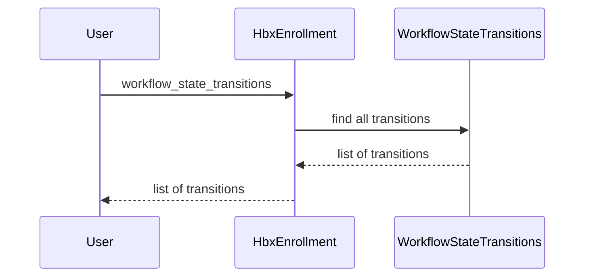

# Chapter 9: WorkflowStateTransition

In the previous chapter, [QualifyingLifeEventKind](08_qualifyinglifeeventkind.md), we learned about events that allow individuals to enroll in health plans outside of the standard open enrollment period.  This chapter introduces the `WorkflowStateTransition` concept, which tracks the history of changes to an object's status over time.

## What problem does `WorkflowStateTransition` solve?

Imagine we're tracking the status of Alice's [HbxEnrollment](06_hbxenrollment.md).  Initially, it's in the "coverage_selected" state. Then it moves to "enrolled," and later, perhaps to "coverage_terminated." How do we keep a record of these changes, including when they happened and why?  The `WorkflowStateTransition` model solves this by storing each status change as a separate record.  It's like a detailed logbook for an object's journey through different states.

## Key Concepts:

1. **States:** A state represents the current status of an object.  Think of it like a snapshot of the object at a particular point in time.  For example, "coverage_selected," "enrolled," and "coverage_terminated" are all states of an [HbxEnrollment](06_hbxenrollment.md).

2. **Transitions:** A transition is the act of moving from one state to another.  It's like flipping a page in the object's logbook. Each `WorkflowStateTransition` record represents a single transition.

3. **Attributes:** Each `WorkflowStateTransition` stores important information about the transition:
    - `from_state`: The previous state of the object.
    - `to_state`: The new state of the object.
    - `transition_at`: The timestamp of when the transition occurred.
    - `event`: The event that triggered the transition (e.g., `approve_enrollment`).
    - `reason`:  The reason for the transition (e.g., "Open Enrollment").
    - `comment`: Additional notes about the transition.
    - `user_id`: The ID of the user who initiated the transition.


## Using the `WorkflowStateTransition` model

Let's say we want to see the history of state transitions for Alice's enrollment:

```ruby
# ... other code ...

enrollment = HbxEnrollment.find(enrollment_id) # Assuming enrollment_id is known

enrollment.workflow_state_transitions.each do |transition|
  puts "From: #{transition.from_state}"
  puts "To: #{transition.to_state}"
  puts "When: #{transition.transition_at}"
end

# ... other code ...
```

This code retrieves Alice's [HbxEnrollment](06_hbxenrollment.md) and iterates through its `workflow_state_transitions`.  For each transition, it prints the `from_state`, `to_state`, and `transition_at` timestamp.

## Under the Hood

When you call `enrollment.workflow_state_transitions`, the following happens:

1. **Retrieve Transitions:** The `HbxEnrollment` retrieves all embedded `WorkflowStateTransition` objects associated with it.



The code for this is in `hbx_enrollment.rb`:

```ruby
# hbx_enrollment.rb
class HbxEnrollment
  # ... other code ...

  embeds_many :workflow_state_transitions, as: :transitional

  # ... other code ...
end
```

This code snippet shows the `embeds_many` association that links the `HbxEnrollment` to its `WorkflowStateTransition` records.  The `as: :transitional` option allows other models (like [PlanYear](04_planyear.md), [BrokerRole](broker_role.md), etc.) to embed `WorkflowStateTransition` objects as well, using the same association name.

The `record_transition` method in various models (e.g., `consumer_role.rb`, `plan_year.rb`) is responsible for creating and saving new `WorkflowStateTransition` records:

```ruby
# consumer_role.rb
class ConsumerRole
  # ... other code ...

  def record_transition(*args)
    self.workflow_state_transitions << WorkflowStateTransition.new(
      from_state: aasm.from_state,
      to_state: aasm.to_state,
      event: aasm.current_event,
      user_id: SAVEUSER[:current_user_id]
    )
  end

  # ... other code ...
end
```

This simplified code snippet shows how the `record_transition` method creates a new `WorkflowStateTransition` object and adds it to the `workflow_state_transitions` collection.  The `aasm` object provides information about the state transition, such as the `from_state`, `to_state`, and the triggering `event`.

## Conclusion

This chapter introduced the `WorkflowStateTransition` model, which tracks the history of an object's state changes.  We learned about its key attributes and how it's used. In the next chapter, we'll explore [EnrollRegistry](10_enrollregistry.md).


---

Generated by [AI Codebase Knowledge Builder](https://github.com/The-Pocket/Tutorial-Codebase-Knowledge)