# Chapter 10: Agent Action Orchestrator (HMS-ACT)

[← Back to Chapter&nbsp;9: Model Context Protocol (HMS-MCP)](09_model_context_protocol__hms_mcp__.md)

---

## 1. Why do we need a “mission-control tower”?

Imagine a huge winter storm just hit Colorado.  
Thousands of residents jump on a state portal and type:

> “My furnace is broken—need emergency heating aid.”

Behind the scenes the request triggers **three** separate actions:

1. Verify applicant income with the IRS.  
2. Reserve a hotel room for 2 nights.  
3. Schedule a home-heating repair visit.

If every agent tries to do its piece **in random order**, we might book a hotel room before we even know the citizen is eligible—or worse, two different agents might overwrite each other’s data.

**HMS-ACT** is the air-traffic tower that:

* Reads the approved MCP “flight plan” (see [Model Context Protocol](09_model_context_protocol__hms_mcp__.md)).  
* Assigns each step to the right agent or micro-service.  
* Makes sure steps happen in the correct sequence.  
* Logs everything so auditors can later ask, “Who did what, and when?”

Think of ACT as FEMA’s real-world command center—only fully automated and always awake.

---

## 2. Key ideas in plain English

| Term | Think of it as… | Analogy |
|------|-----------------|---------|
| **Job** | One atomic task from an MCP (`"verify_income"`). | A single plane take-off |
| **Workflow** | Ordered list of jobs. | The day’s flight schedule |
| **Dispatcher** | Matches a job to the best agent. | Air-traffic controller |
| **Execution Log** | Tamper-proof record of every job. | Flight recorder (“black box”) |
| **Retry / Fallback** | Plan B when a job fails. | Rerouting a delayed flight |

---

## 3. Quick start – run a 3-step workflow in 18 lines

```python
from hms_agx.act import Orchestrator

orc = Orchestrator()       # 🗼 power on mission control

workflow = [
  {"job": "check_income", "agent": "IRSBot"},
  {"job": "book_hotel",   "agent": "LodgingBot",  "after": "check_income"},
  {"job": "schedule_fix", "agent": "RepairBot",   "after": "book_hotel"}
]

ticket = orc.submit(workflow, mcp_id="MCP-987")  # link to approved MCP
print(ticket.status)          # "completed"
print(ticket.log[-1])         # "schedule_fix ✅ at 14:32"
```

What happened?

1. We built a **workflow** list (just dictionaries).  
2. `submit()` handed it to HMS-ACT.  
3. Each job ran **in order** (`after` key).  
4. We printed the final log entry—proof the repair was scheduled.

---

## 4. Life of a workflow – step-by-step

```mermaid
sequenceDiagram
    participant AG as Agent
    participant ACT as Orchestrator
    participant DSP as Dispatcher
    participant LOG as Exec Log
    AG->>ACT: submit(workflow)
    ACT->>DSP: First job
    DSP-->>AG: run check_income
    AG-->>ACT: result ✅
    ACT->>LOG: write entry
    ACT-->>DSP: next job...
```



Five actors: **Agent, ACT, Dispatcher, Log, Agent** (again).  
No one else—easy to trace.

---

## 5. Peek inside the Orchestrator (super-mini code)

### 5.1 Core file (14 lines)

```python
# file: hms_agx/act/core.py
class Orchestrator:
    def __init__(self, dispatcher=None, logger=None):
        from .dispatcher import Dispatcher
        self.dispatcher = dispatcher or Dispatcher()
        self.logger     = logger or []

    def submit(self, wf, mcp_id):
        for step in wf:
            self._wait_for_dependency(step, wf)
            result = self.dispatcher.execute(step)
            self.logger.append(f"{step['job']} {'✅' if result else '❌'}")
            if not result:
                return Ticket("failed", self.logger)
        return Ticket("completed", self.logger)

    def _wait_for_dependency(self, step, wf):
        dep = step.get("after")
        if dep:
            while dep not in [l.split()[0] for l in self.logger]:
                pass            # tiny busy-wait for demo
```

Explanation  
* `_wait_for_dependency` makes sure we don’t run a job before its prerequisite finished.  
* `Dispatcher.execute()` (next snippet) picks the right agent.  
* `self.logger` stores the **Execution Log**.

### 5.2 Micro Dispatcher (≤ 12 lines)

```python
# file: hms_agx/act/dispatcher.py
AGENTS = {
  "IRSBot":      lambda j: True,   # pretend they succeed
  "LodgingBot":  lambda j: True,
  "RepairBot":   lambda j: True
}

class Dispatcher:
    def execute(self, step):
        agent_fn = AGENTS[step["agent"]]
        return agent_fn(step)      # returns True/False
```

You can swap `AGENTS` with real functions or network calls.

### 5.3 Ticket dataclass

```python
class Ticket:
    def __init__(self, status, log): self.status, self.log = status, log
```

It’s that simple—real HMS-ACT stores the log in the [Data & Metrics Observatory](16_data___metrics_observatory__hms_dta___ops__.md).

---

## 6. Where does the workflow come from?

1. The **MCP Gateway** (see [Chapter 9](09_model_context_protocol__hms_mcp__.md)) approves a plan.  
2. The generating agent bundles the **`action_plan`** into a workflow JSON.  
3. That JSON is passed here.  
4. **HMS-ACT** ensures only the tools & data declared in the MCP are used—nothing extra.

---

## 7. Handling errors & retries (2 new lines)

```python
orc = Orchestrator(retry=2, backoff=3)  # 2 retries, 3-sec gaps
```

Now a failing job is retried twice before marking the workflow “failed”.  
The back-off delay prevents hammering fragile agency APIs.

---

## 8. Visualising the log – micro-frontend brick

```html
<div id="log"></div>
<script>
  mfe.load("act/workflow-log", { target:"#log", ticket:"MCP-987" });
</script>
```

The brick shows a live list:

| Time | Job | Status |
|------|-----|--------|
| 14:21 | check_income | ✅ |
| 14:25 | book_hotel | ✅ |
| 14:32 | schedule_fix | ✅ |

No custom UI code required—thanks to [Micro-Frontend Library](02_micro_frontend_library__hms_mfe__.md).

---

## 9. Connecting to other HMS components

• **HITL Oversight** – If a job fails twice, HMS-ACT auto-generates a HITL task.  
• **Compliance (ESQ)** – The dispatcher refuses any job whose agent or API is not in the **approved MCP**.  
• **Process Optimization Workflow** – POW can create new workflows and hand them to ACT for execution.  
• **Secure Inter-Agency Exchange** – Cross-agency jobs are routed through the secure mesh (see upcoming [Chapter 13](13_secure_inter_agency_exchange__hms_a2a__.md)).

---

## 10. FAQ

**Q: Does every job need an `after` key?**  
No. Jobs without `after` run as soon as possible—great for parallel tasks (e.g., “send email” + “update dashboard”).

**Q: Can workflows call other workflows?**  
Yes—submit a child workflow inside a job. ACT nests them and links logs.

**Q: How big can a workflow get?**  
Tested up to 5 000 jobs; ACT chunks them into batches to keep memory low.

**Q: Where are logs stored?**  
In an append-only ledger replicated to the Data & Metrics Observatory for 10-year retention.

---

## 11. What you learned

• HMS-ACT is the mission-control tower that turns MCP plans into real actions.  
• Core pieces: Job, Workflow, Dispatcher, Execution Log, Retry/Fallback.  
• You ran a 3-step disaster-relief flow in under 20 lines of code.  
• You saw a tiny internal implementation and how ACT plugs into earlier chapters.  
• Logs are visible to humans and survive audits.

Ready to discover **how all these services talk to each other securely and reliably** across datacenters?  
Continue to [Chapter&nbsp;11: Backend Service Mesh (HMS-SVC layer)](11_backend_service_mesh__hms_svc_layer__.md) →

---

---

Generated by [AI Codebase Knowledge Builder](https://github.com/The-Pocket/Tutorial-Codebase-Knowledge)