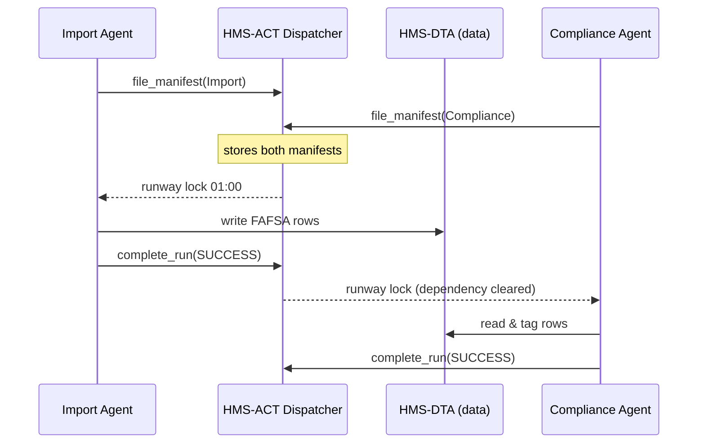

# Chapter 10: Agent Orchestration (HMS-ACT)

*(linked from [Agent Framework (HMS-AGT) & Extensions (HMS-AGX)](09_agent_framework__hms_agt____extensions__hms_agx__.md))*  

---

## 1. Why Do Agents Need an “Air-Traffic Controller”?

In the last chapter we built individual **agents**—digital employees that can read PDFs, draft policies, or move money.  
But imagine a *real* day inside the **Federal Student Aid Information Center**:

1. At 1 a.m. an “Import FAFSA” agent scoops 40 000 new applications from the IRS data-feed.  
2. At 1 : 05 a “Compliance Checker” agent must review each record **after** the import finishes.  
3. At 1 : 07 a “Grant Calculator” agent runs heavy math on the same data.  
4. A human auditor wants a **timestamped log** showing exactly who (or *what*) touched every file.

If all three agents fire at the same time, they will **step on each other’s toes**, overwrite rows, or double-charge families.

**HMS-ACT** is the air-traffic controller that:

* Schedules when each agent may take off or land.  
* Guarantees only one agent writes to a record at a time.  
* Stores a tamper-proof audit trail so future inspectors can replay the night’s activity in minutes.

---

## 2. Key Concepts (Plain-English Cheat-Sheet)

| Concept | What It Really Means | Analogy |
|---------|---------------------|---------|
| Runway  | A scheduled time-slot for one agent + one dataset. | Assigned runway at an airport. |
| Lock    | Short-lived token that blocks other agents from the same record. | “Runway in use” light. |
| Manifest| JSON doc describing what the agent *will* do. | Flight plan filed with control tower. |
| Audit Trail | Immutable timeline of manifests + results. | Black box in an airplane. |
| Dispatcher | Tiny service that hands out runways and enforces locks. | Tower controller with a clipboard. |

---

## 3. Five-Minute Walk-Through  
### Goal: Import FAFSA files, then run Compliance, then Grant Calculation—without collisions.

#### 3.1  File a Manifest (≤ 15 lines)

```python
# file: import_manifest.py
from hms_act_client import file_manifest, poll_clearance

manifest = {
    "agent": "Import_FAFSA_001",
    "dataset": "fafsa_2024_03_16",
    "action": "IMPORT",
    "earliest_start": "01:00"
}

runway_id = file_manifest(manifest)
print("Filed as", runway_id)
```

Explanation:  
1. `file_manifest` inserts the plan into HMS-ACT and returns a **runway ID**.  
2. No agent code has run yet—only the plan is logged.

#### 3.2  Agent Waits for a Green Light

```python
# file: import_run.py
from hms_act_client import poll_clearance, complete_run
from time import sleep

runway = poll_clearance(runway_id)  # blocks until 01:00 & locks dataset
# ...perform the import...
complete_run(runway, status="SUCCESS")
```

The dispatcher:

* Releases the lock at 01 a.m.  
* Records **start time** in the audit trail.  
* Grants a 30-minute window (configurable).

#### 3.3  Down-Stream Agent Declares Dependency

```python
# file: compliance_manifest.py
manifest = {
    "agent": "Compliance_Checker_002",
    "dataset": "fafsa_2024_03_16",
    "action": "COMPLIANCE",
    "after": ["Import_FAFSA_001"]   # dependency
}
runway_id = file_manifest(manifest)
```

HMS-ACT automatically schedules this manifest **only after** the import agent marks `"SUCCESS"`—zero hard-coded sleeps!

---

## 4. What Happens Behind the Curtain?



Only **four actors**—easy to track.

---

## 5. Peek at the Dispatcher Code (≤ 20 Lines)

```python
# file: act/dispatcher.py
QUEUE, LOCKS, AUDIT = [], set(), []

def file_manifest(m):
    QUEUE.append(m); AUDIT.append(("FILED", m))
    return len(QUEUE)-1          # simple runway_id

def poll_clearance(rid):
    m = QUEUE[rid]
    deps_ok = all(d in LOCKS for d in m.get("after", []))
    time_ok = m.get("earliest_start") <= now_clock()
    if deps_ok and time_ok and m["dataset"] not in LOCKS:
        LOCKS.add(m["dataset"])
        AUDIT.append(("START", m))
        return m
    sleep(5); return poll_clearance(rid)  # tail recursion

def complete_run(m, status):
    LOCKS.remove(m["dataset"])
    AUDIT.append(("END", m["agent"], status))
```

Highlights:

* **Three** in-memory structures: `QUEUE`, `LOCKS`, `AUDIT`.  
* Less than **20 lines** yet enforces dependencies + serial writes.  
* Real deployment swaps in [HMS-DTA](07_central_data_repository__hms_dta__.md) and a cron worker.

---

## 6. Exploring the Audit Trail

```python
# file: show_audit.py
from hms_act_client import get_audit

for evt in get_audit(dataset="fafsa_2024_03_16"):
    print(evt)
```

Sample console:

```
[01:00] FILED  Import_FAFSA_001
[01:00] START  Import_FAFSA_001
[01:04] END    Import_FAFSA_001  SUCCESS
[01:05] START  Compliance_Checker_002
[01:06] END    Compliance_Checker_002 SUCCESS
```

Auditors (or [Accountability Tracker](05_accountability___performance_metrics_tracker_.md)) can replay the exact sequence.

---

## 7. How HMS-ACT Cooperates with the Rest of HMS

• **Data Locks** live in [HMS-DTA](07_central_data_repository__hms_dta__.md) so every service sees them.  
• **Sensitive actions** still respect [HITL](04_human_in_the_loop_oversight__hitl__.md)—the dispatcher *won’t* release a lock if a pending HITL ticket exists.  
• **Performance metrics** (wait time, run time) feed straight into [APMT](05_accountability___performance_metrics_tracker_.md).  
• **Agents** continue to be coded with [HMS-AGT](09_agent_framework__hms_agt____extensions__hms_agx__.md); they simply wrap their main function with `poll_clearance(...)`.

---

## 8. Hands-On Mini-Lab (10 Minutes)

1. Clone the demo repo  
   `git clone https://github.com/example/hms-nfo.git`  
2. Start the mock dispatcher  
   `python -m act.mock_server`  
3. Run `python import_manifest.py`, then `python compliance_manifest.py`.  
4. Open `http://localhost:9500/audit?dataset=fafsa_2024_03_16` to watch the log grow in real time.  
5. Try filing two imports for the **same** dataset—the second one will wait until the first ends.

You just choreographed two digital employees without writing a single thread lock yourself!

---

## 9. Recap

* **HMS-ACT** is the platform’s **air-traffic controller**—handing out runways, enforcing locks, and writing black-box logs.  
* Filing a **manifest** + calling `poll_clearance()` is all an agent developer needs to stay safe.  
* Dependencies, time windows, and audit trails are first-class citizens—no ad-hoc cron-jobs ever again.

Ready to see how each agent run automatically receives *contextual knowledge* (who, what, and why) without repeating boilerplate prompts?  
Glide into the next chapter: [Model Context Protocol (HMS-MCP)](11_model_context_protocol__hms_mcp__.md)  

---

---

Generated by [AI Codebase Knowledge Builder](https://github.com/The-Pocket/Tutorial-Codebase-Knowledge)