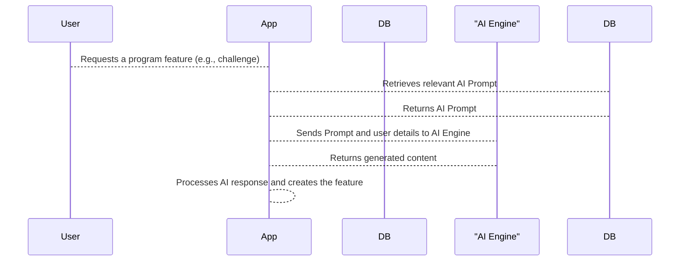

# Chapter 10: AI Prompts

In the previous chapter, [Codify Requests](09_codify_requests.md), we learned how users tell the system what kind of program they want.  Now, let's explore how the system translates those requests into instructions the AI can understand. These instructions are called *AI Prompts*.

Imagine Alice requests a "Morning Yoga" program.  The system needs to tell the AI *exactly* what to create.  It needs to specify the type of program, the exercises involved, and any other requirements.  This is where AI Prompts come in. They are like detailed recipes for the AI chef, telling it exactly what ingredients to use and how to combine them.

## What is an AI Prompt?

An AI Prompt is a specific instruction given to the AI engine to generate parts of a program, like challenges, assessments, or even the overall program structure.  They are like detailed orders for our AI chef, specifying exactly what kind of dish to prepare.

## Key Concepts in an AI Prompt

* **Prompt Key:** A unique identifier for the prompt, like "ChallengeGeneration" or "AssessmentGeneration".  Think of this like the name of a dish on a menu.
* **Prompt Text:** The actual instruction given to the AI.  This is like the recipe itself, listing the ingredients and steps.

## Creating an AI Prompt

Let's create a simple AI Prompt for generating a challenge.

```php
// File: seeders/AiPromptsSeeder.php (Simplified)

use App\Models\Core\Dashboard\AiPrompts;

AiPrompts::create([
    'prompt_key' => 'ChallengeGeneration',
    'prompt_text' => "Create a simple challenge.",
]);
```

This code creates a new AI Prompt in the `ai_prompts` table.  The `prompt_key` is "ChallengeGeneration", and the `prompt_text` is "Create a simple challenge."

## Using an AI Prompt

When Alice requests a "Morning Yoga" program, the system selects the appropriate AI Prompts based on her request.  For example, if she requests a challenge, the system will use the "ChallengeGeneration" prompt.

```php
// Simplified example - actual implementation is more complex

$prompt = AiPrompts::where('prompt_key', 'ChallengeGeneration')->first();
$aiResponse = $this->aiEngine->generate($prompt->prompt_text, $userRequestDetails);
// Process the AI's response and create the challenge
```

This simplified code retrieves the "ChallengeGeneration" prompt and sends it to the AI engine along with Alice's request details. The AI engine then generates a response, which the system uses to create the challenge.

## Under the Hood

Here's a simplified sequence diagram showing how AI Prompts are used:



The `ai_prompts` table stores the AI Prompts. The `CreateAiPromptsTable` migration file defines the structure of this table.

```php
// File: migrations/2024_03_04_110940_create_ai_prompts_table.php
// ... code to create the ai_prompts table ...
```

The `a_i_prompt_parts` table allows for more complex prompts with multiple parts. The `ExtendAiPromptsWithEditableOptionAndSubprojectTable` migration adds fields for managing subprojects and editable parts of prompts.

```php
// File: migrations/2025_03_25_135518_extend_ai_prompts_with_editable_option_and_subproject_table.php
// ... code to add fields to the ai_prompts table ...
```

## Conclusion

In this chapter, we learned about AI Prompts, the specific instructions given to the AI engine to generate different parts of a program. We saw how AI Prompts are created, stored, and used to fulfill user requests.  This concludes our tutorial on the `database` project.  We hope this has provided a clear and beginner-friendly introduction to the core concepts of our system.


---

Generated by [AI Codebase Knowledge Builder](https://github.com/The-Pocket/Tutorial-Codebase-Knowledge)