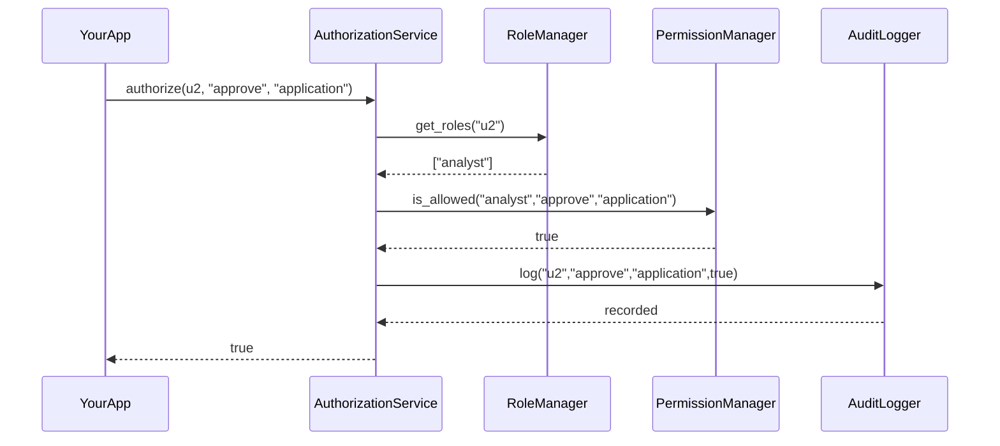

# Chapter 10: Authorization & Access Control

Welcome back! In [Chapter 9: Frontend Interface Components](09_frontend_interface_components_.md), we saw how user interfaces and forms are built. Now we’ll lock down **who** can click which button or view which data—just like a vault with layered locks. This is **Authorization & Access Control**.

---

## 1. Why We Need Authorization & Access Control

Imagine a public‐sector portal where:

- **Citizens** submit benefit applications  
- **Analysts** review and approve those applications  
- **Managers** can override approvals or reassign cases  

We need to enforce policies so that only the right roles can perform each action. We must also log every attempt—successful or not—to meet audit, privacy, and regulatory requirements.

---

## 2. Key Concepts

1. **Role**  
   A user’s job title (citizen, analyst, manager).

2. **Action**  
   What the user wants to do (view, submit, approve, override).

3. **Resource**  
   The object of the action (application form, feedback, policy).

4. **Permission**  
   A mapping: “role X can do action Y on resource Z.”

5. **Audit Log**  
   A record of every authorize check for compliance and traceability.

---

## 3. Using the Abstraction

Below is a minimal example showing how your app asks “Can user u2 approve application app123?”:

```python
from hms_utl.authorization import (
    AuthorizationService,
    RoleManager,
    PermissionManager,
    AuditLogger
)

authz = AuthorizationService(
    RoleManager(), PermissionManager(), AuditLogger()
)

user = "u2"          # e.g. an analyst
action = "approve"
resource = "application"

if authz.authorize(user, action, resource):
    print("✅ Access granted")
else:
    print("❌ Access denied")
```

Explanation:
- We build `AuthorizationService` with helpers for roles, permissions, and auditing.
- `authorize()` returns `True` or `False`.
- We can branch on that result to allow or block an operation.

---

## 4. Under the Hood: Step-by-Step Flow



1. **YourApp** asks `AuthorizationService`.
2. **RoleManager** returns roles for the user.
3. **PermissionManager** checks if any role allows the action on that resource.
4. **AuditLogger** records the check and its outcome.
5. The final boolean goes back to **YourApp**.

---

## 5. Internal Implementation Highlights

### 5.1 hms_utl/authorization.py

```python
# file: hms_utl/authorization.py
class AuthorizationService:
    def __init__(self, role_mgr, perm_mgr, audit):
        self.roles = role_mgr
        self.perms = perm_mgr
        self.audit = audit

    def authorize(self, user_id, action, resource):
        roles = self.roles.get_roles(user_id)
        allowed = any(
            self.perms.is_allowed(r, action, resource)
            for r in roles
        )
        self.audit.log(user_id, action, resource, allowed)
        return allowed
```

- Gathers user roles.
- Checks permissions per role.
- Logs every decision.

### 5.2 hms_utl/role_manager.py

```python
# file: hms_utl/role_manager.py
class RoleManager:
    def __init__(self):
        # In real life, load from a database
        self.mapping = {
            "u1": ["citizen"],
            "u2": ["analyst"],
            "u3": ["manager"]
        }

    def get_roles(self, user_id):
        return self.mapping.get(user_id, [])
```

- Returns a list of roles for a user.

### 5.3 hms_utl/permission_manager.py

```python
# file: hms_utl/permission_manager.py
class PermissionManager:
    def __init__(self):
        # role → list of (action, resource)
        self.rules = {
            "citizen": [("submit","application")],
            "analyst": [("view","application"),("approve","application")],
            "manager": [("override","application"),("view","application")]
        }

    def is_allowed(self, role, action, resource):
        return (action, resource) in self.rules.get(role, [])
```

- Defines which roles can perform which actions.

### 5.4 hms_utl/audit_logger.py

```python
# file: hms_utl/audit_logger.py
class AuditLogger:
    def log(self, user, action, resource, allowed):
        # Imagine writing to a tamper-proof audit store
        status = "GRANTED" if allowed else "DENIED"
        print(f"[Audit] user={user} action={action} "
              f"resource={resource} → {status}")
```

- Prints or persists every authorization attempt.

---

## Conclusion

You’ve learned how to lock down your system with **Authorization & Access Control**—defining roles, mapping permissions, and auditing every check. Now only the right users get through each layered lock. Next up, we’ll watch your system in action and make sure it’s working as intended in [Chapter 11: Monitoring & Outcome Verification](11_monitoring___outcome_verification_.md).

---

Generated by [AI Codebase Knowledge Builder](https://github.com/The-Pocket/Tutorial-Codebase-Knowledge)