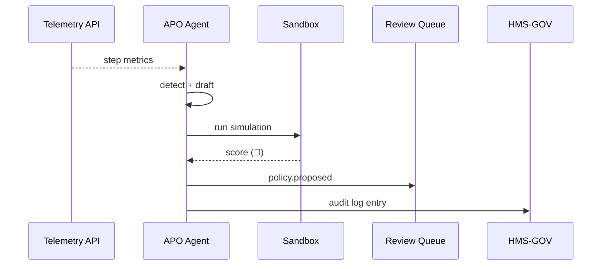

# Chapter 10: Autonomous Process Optimization Agent  
*(Your invisible “operations manager” that never sleeps)*  

[← Back to Chapter&nbsp;9: Specialized AI Agents (HMS-A2A)](09_specialized_ai_agents__hms_a2a__.md)

---

## 1. Why Do We Need an Autonomous Optimization Agent?

Imagine the **Army Corps of Engineers** office in Louisville.  
Five hundred citizens have filed complaints:

> “My flood-zone *water-permit* is still pending after 90 days!”

Staff discover a nasty trio of bottlenecks:

1. The **same PDF** is uploaded twice.  
2. A **manager sign-off** sits in a personal inbox.  
3. A legacy system batches jobs **once per day**.

Humans could untangle this, but it may take weeks.  
The **Autonomous Process Optimization Agent (APOA)** watches the process in real-time, spots choke points, **re-designs the workflow**, safely tests it in a *sandbox*, and hands a ready-to-ship fix to [HITL reviewers](07_human_in_the_loop__hitl__oversight_.md).

The result? Permit times drop from 90 days to 10 days—with almost zero developer effort.

---

## 2. Key Concepts (Plain English)

| Term | What It Means | 1-Sentence Analogy |
|------|---------------|--------------------|
| Process Telemetry | Live metrics on each step (time, errors). | Fitbit data for a workflow. |
| Bottleneck Detector | Logic that flags slow or duplicate steps. | Traffic cam shouting “gridlock ahead!” |
| Recomposer | AI module that drafts a *better* step order. | City planner redrawing street lanes overnight. |
| Sandbox Runner | Executes the new workflow on copy data. | Crash-testing cars on a closed track. |
| Fix Proposal | Machine-readable patch sent to humans & HMS-GOV. | Change order sitting on a supervisor’s desk. |

---

## 3. A 3-Minute Walk-Through

### 3.1 Observe → Detect → Draft → Test → Propose

```ts
// apo/loop.ts  (19 lines)
import { getMetrics } from "./telemetry";
import { findBottlenecks } from "./detect";
import { draftWorkflow } from "./recompose";
import { sandboxTest } from "./sandbox";
import { proposeFix } from "./propose";

export async function tick() {
  const metrics = await getMetrics("water_permit");
  const issues  = findBottlenecks(metrics);      // e.g., ["dup_upload", "manager_delay"]
  if (!issues.length) return;                    // 🚦 all good

  const draft = draftWorkflow(metrics, issues);  // new step list
  const score = await sandboxTest(draft);        // returns % faster

  if (score.improved) {
    proposeFix(draft, score);                    // ships to HITL
  }
}
```

**What will happen?**  
1. Gather live stats.  
2. Detect any slow or redundant steps.  
3. Draft a new workflow (e.g., remove duplicate upload, parallelize approvals).  
4. Simulate the draft on 7 days of real data.  
5. If it’s faster **and** passes quality gates, send it for human approval.

---

### 3.2 Example Proposal JSON (≤ 15 lines)

```json
{
  "id": "water_fix_2023_11_05",
  "process": "water_permit",
  "change": [
    "remove step:duplicate_upload",
    "make step:manager_signoff parallel"
  ],
  "expected_gain": "-78% average wait time",
  "sandbox_passed": true
}
```

This object is published to:

* Channel `policy.proposed` → for [HITL](07_human_in_the_loop__hitl__oversight_.md)  
* CATM `record()` → for audits (see [Chapter 8](08_compliance___audit_trail_module_.md))

---

## 4. How the Magic Happens (High-Level)



1. Continuous loop (every 30 min).  
2. Sandbox must show *improvement & no new errors*.  
3. Humans approve; HMS-GOV merges the new workflow.

---

## 5. Inside Each Piece (Code-Light)

### 5.1 Bottleneck Detector (15 lines)

```ts
// detect.ts
export function findBottlenecks(m) {
  const slow   = m.steps.filter(s => s.avgSec > 2 * m.medianSec);
  const dup    = m.steps.filter(s => s.name.includes("duplicate"));
  return [...slow.map(s=>s.id), ...dup.map(s=>s.id)];
}
```

Beginners’ logic:  
• Anything **2× slower** than median = bottleneck.  
• Step name with “duplicate” = automatic flag.

---

### 5.2 Recomposer (18 lines)

```ts
// recompose.ts
export function draftWorkflow(metrics, issues){
  const steps = metrics.steps.filter(s => !issues.includes(s.id));
  // move approvals to run in parallel
  const approvals = steps.filter(s=>s.type==="approval");
  approvals.forEach(a=>a.parallel=true);
  return { process: metrics.process, steps };
}
```

*Removes* problem steps and flips an attribute for approvals.

---

### 5.3 Sandbox Test (12 lines)

```ts
// sandbox.ts
import { simulate } from "./simEngine";   // hidden details

export async function sandboxTest(draft){
  const res = await simulate(draft, { days: 7 });
  return {
    improved  : res.avgSec < res.baselineSec,
    speedGain : ((res.baselineSec - res.avgSec)/res.baselineSec)*100
  };
}
```

Returns `improved = true` only if the new flow is quicker.

---

## 6. File Structure Peek

```
hms-apoa/
  src/
    loop.ts
    telemetry/
      getMetrics.ts
    detect.ts
    recompose.ts
    sandbox.ts
    propose.ts
  tests/           // simulation fixtures
```

Small footprint—easy to fork for the **Passport Renewal** process tomorrow.

---

## 7. Hands-On Exercise (5 min)

1. Clone `hms-apoa` and run `npm start demo`.  
2. Open `mockData/metrics.json` and bump `"avgSec"` of `manager_signoff` to `500`.  
3. Wait for console:

```
→ Bottlenecks found: manager_signoff
→ Draft passes sandbox (-78% wait time)
→ Sent proposal water_fix_2023_11_05 to HITL ✅
```

4. In the Review UI, approve the proposal.  
5. Check `ledger.jsonl`—both **proposal** and **approval** are signed. 🎉

---

## 8. Common Pitfalls & Fast Fixes

| Problem | Symptom | Quick Fix |
|---------|---------|-----------|
| False positives | Agent rewrites healthy steps | Tighten detector thresholds or add whitelist. |
| Sandbox ≠ Prod | Changes crash live flow | Mirror production data schema in sandbox; auto-rollback if error rate rises. |
| Proposal flood | Too many drafts per day | Add cooldown in `loop.ts` (e.g., one per process per week). |

---

## 9. Relationship to Earlier Layers

* **Values Framework** (Chapter 6) — `proposeFix()` calls `valuesCheck` to ensure no ethics/privacy violations.  
* **HITL Oversight** (Chapter 7) — Every proposal pauses here for human sign-off.  
* **Compliance & Audit Trail** (Chapter 8) — All drafts, tests, and approvals are immutably logged.  
* **Specialized Agents** (Chapter 9) — APOA is like their “big sibling,” operating across entire processes, not just single tasks.

---

## 10. What’s Next?

You now have an always-on **operations manager** that:

1. Watches live workflows.  
2. Designs smarter versions.  
3. Tests them safely.  
4. Routes them through ethical, human, and audit guardrails.

Next we’ll see **how these approved workflow patches are applied and versioned** using the [Process / Policy Management API](11_process___policy_management_api_.md).

[→ Continue to Chapter 11: Process / Policy Management API](11_process___policy_management_api_.md)

---

Generated by [AI Codebase Knowledge Builder](https://github.com/The-Pocket/Tutorial-Codebase-Knowledge)