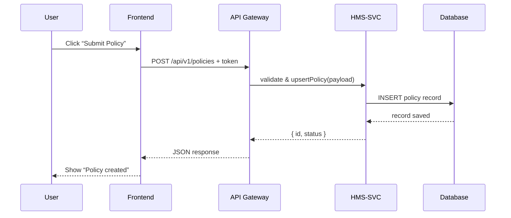

# Chapter 10: Backend API Interface

Welcome back! In [Chapter 9: Specialized AI Agents](09_specialized_ai_agents_.md) we saw how domain-specific agents plug into our UI. Now let’s look at the **Backend API Interface**—the contract between our frontend portals (HMS-GOV, HMS-MFE) and backend microservices (HMS-API / HMS-SVC).

Imagine your policy editor is like a front desk clerk dialing a switchboard in a government office. You dial an endpoint (extension), hand over your request (payload), and get back a response (JSON). The **Backend API Interface** defines:

- Authentication (who can call)  
- Versioning (which extension you dial)  
- Error handling (busy signals vs. busy pages)  
- Endpoint definitions (CRUD for policies, AI proposals)

---

## 1. Why Backend API Interface?

Use case: A policy analyst fills out a form and clicks **Submit for Review**. Behind the scenes:

1. The frontend calls `POST /api/v1/policies`.  
2. The HMS-API validates the token, checks the schema, and saves the draft.  
3. The microservice returns `{ id: 123, status: "draft" }`.  

Without a clear interface, every team would invent its own endpoints, auth format, and error codes—like each office using different phone wiring!

---

## 2. Key Concepts

- **Endpoint Definitions**  
  A central list of routes, HTTP verbs, URL patterns, and payload schemas.  

- **Authentication**  
  Bearer tokens (JWT) sent in `Authorization` header to prove who you are.  

- **Versioning**  
  e.g. `/api/v1/...` vs `/api/v2/...` so we can evolve the API without breaking old clients.  

- **Error Handling**  
  Standard HTTP status codes (400, 401, 500) and JSON error shapes:
  ```json
  { "error": "InvalidDate", "message": "Effective date must be in the future." }
  ```

- **Data Models**  
  Shared TypeScript or JSON Schema definitions for Policy, Proposal, etc.

---

## 3. Using the Backend API Interface

Here’s a minimal frontend example. We wrap Axios in an `ApiService` to talk to our API.

```js
// File: src/services/ApiService.js
import axios from 'axios'

const client = axios.create({
  baseURL: '/api/v1',
  headers: { 'Content-Type': 'application/json' }
})
client.interceptors.request.use(cfg => {
  cfg.headers.Authorization = `Bearer ${localStorage.token}` // auth
  return cfg
})

export default {
  createPolicy(form) {
    return client.post('/policies', form).then(r => r.data)
  },
  getPolicies() {
    return client.get('/policies').then(r => r.data)
  }
}
```

Explanation:
- We set `baseURL` to `/api/v1`.  
- We attach a JWT from `localStorage`.  
- We expose methods like `createPolicy()` that return parsed JSON.

In your Vue component:

```vue
<script>
import ApiService from '../services/ApiService'

export default {
  methods: {
    async submitPolicy() {
      try {
        const result = await ApiService.createPolicy(this.form)
        alert(`Policy created: ID ${result.id}`)
      } catch (err) {
        console.error(err.response.data)
        alert('Failed: ' + err.response.data.message)
      }
    }
  }
}
</script>
```

---

## 4. What Happens Under the Hood?



1. **Frontend** calls **API Gateway**.  
2. Gateway checks the JWT, enforces versioning, routes to **HMS-SVC**.  
3. Service writes to **Database** and returns JSON.  
4. Frontend shows success or error to the user.

---

## 5. Internal Implementation

### 5.1 Route Definitions

```js
// File: src/api/policyRoutes.js
import express from 'express'
import { createPolicy, listPolicies } from './policyController'
const router = express.Router()

router.post('/v1/policies', createPolicy)
router.get('/v1/policies', listPolicies)

export default router
```

Explanation:
- We mount our endpoints under `/api`.
- We version them with `/v1`.

### 5.2 Controller Stubs

```js
// File: src/api/policyController.js
import PolicyService from '../services/policyService'

export async function createPolicy(req, res) {
  const data = req.body
  // 1. Validate payload (omitted)
  // 2. Call service
  const newPolicy = await PolicyService.saveDraft(data, req.user.id)
  res.status(201).json(newPolicy)
}
```

Explanation:
- We extract the JSON body.  
- We call a service layer method, then send back the created record.

### 5.3 Service Layer

```js
// File: src/services/policyService.js
export default {
  async saveDraft(data, authorId) {
    // Insert into DB (pseudo)
    const record = await db.policies.insert({ ...data, authorId })
    return { id: record.id, status: record.status }
  }
}
```

Explanation:
- Business logic lives here (e.g., default status).

---

## 6. Conclusion

You’ve learned how HMS-GOV defines a clear **Backend API Interface**:

- A consistent set of **endpoints** (`/api/v1/...`)  
- **Authentication** via JWT in headers  
- **Error handling** with standard codes and JSON shapes  
- A layered approach: **Routes → Controllers → Services**

This contract ensures that both HMS-GOV and HMS-MFE frontends speak the same “language” to backend microservices, just like well-labeled phone extensions in a government building. 

Next up, we’ll synchronize with external systems in [Chapter 11: External System Synchronization](11_external_system_synchronization_.md).

---

Generated by [AI Codebase Knowledge Builder](https://github.com/The-Pocket/Tutorial-Codebase-Knowledge)