# Chapter 10: Backend Service APIs (HMS-SVC & HMS-API)


*(continuation of [HMS-ACT Orchestration Engine](09_hms_act_orchestration_engine_.md))*  

---

## 1. 60-Second Story – “Flu-Shot Reimbursement”

Joana, an Air-Force veteran, gets a flu shot at a local clinic:  

1. The **Healthcare module** (HMS-HLT) must store her vaccination record (PHI).  
2. The **Finance module** (HMS-FIN) must pay the clinic.  
3. Both services sit in different data centers—and the audit team insists no PHI leaks.

How do two totally different teams exchange *just the right* data, stay version-safe for 10 years, and pass HIPAA audits?

Answer: they march through the **Backend Service APIs**—the encrypted hallways that connect every module inside HMS-ACT.

---

## 2. What Are HMS-SVC & HMS-API?

• **HMS-SVC** – a micro-framework for *building* services (routes, validators, auth guards, rate-limits).  
• **HMS-API** – a tiny client for *calling* those services (automatic headers, retries, pagination helpers).

Think of HMS-SVC as the **corridor blueprint** and HMS-API as the **badge scanner** citizens carry while walking through.

---

## 3. Key Concepts (Plain English)

| Term | Meaning in 1 Sentence |
|------|-----------------------|
| Service | A back-end app with a clear mission, e.g. “Finance-Payor.” |
| Endpoint | One door inside the service (`POST /v1/claims/pay`). |
| Gateway | Front desk that checks ID, schema, and rate before letting requests in. |
| Schema | JSON file describing the request/response shapes. |
| Version (`/v1/`) | Frozen contract; `/v2/` can break fields safely. |
| Rate-limit | Speed bump per token (`100 req/min`). |
| PHI Guard | Strip or encrypt fields flagged `sensitive:true`. |

---

## 4. Building Your First Service (HMS-SVC)

Below we create a **Finance** service that receives a claim and returns a payment status—all in **16 lines**.

```javascript
// finance/index.js  (16 lines)
import { svc } from '@hms-svc/core';          // ← tiny wrapper on Express
import schema from './schemas/claim.json';    // JSON Schema file

svc.post('/v1/claims/pay', { schema }, async (req, res) => {
  const { vetId, amountUsd } = req.body;      // field names validated already
  // Fake business logic
  const txId = await bank.transfer('clinic', amountUsd);
  res.send({ ok: true, txId, processedAt: Date.now() });
});

svc.listen(8002, () => console.log('💸 Finance SVC on 8002'));
```

What the wrapper gives you for **free**:  
✓ Token verification (from [Role & Identity Management](02_role___identity_management__accounts___authorization__.md))  
✓ JSON-schema enforcement  
✓ Automatic `/docs` Swagger page  
✓ 429 replies when rate-limit is hit

---

### 4.1 The Minimal Schema (8 lines)

```json
{
  "$id": "claim.json",
  "type": "object",
  "required": ["vetId", "amountUsd"],
  "properties": {
    "vetId":     { "type": "string" },
    "amountUsd": { "type": "number", "minimum": 0 }
  }
}
```

---

## 5. Calling the Service (HMS-API)

Joana’s vaccination record has already triggered an orchestration run (Chapter 9).  
The **Healthcare step** now calls Finance:

```javascript
// steps/payClaim.js  (14 lines)
import { api } from '@hms-api/client';
import { getToken } from '@hms-auth/client';  // Chapter 2

export async function pay(vetId, amt) {
  const token = await getToken({ actor: 'HMS-HLT' });

  const res = await api.post('finance/v1/claims/pay', {
    body:   { vetId, amountUsd: amt },
    token,                         // auto-added as Authorization header
    retry:  2                      // automatic exponential back-off
  });

  return res.txId;                 // used by the next orchestration step
}
```

Explanation  
• No hard-coded URLs—service discovery is handled by HMS-API.  
• If Finance returns 429, HMS-API waits & retries (max 2).

---

## 6. Request Life-Cycle (Step-By-Step)

```mermaid
sequenceDiagram
    participant HLT as Healthcare Service
    participant GW as HMS-SVC Gateway
    participant FIN as Finance Service
    participant ESQ as Security Engine
    HLT->>GW: POST /v1/claims/pay  (JWT)
    GW->>FIN: validated request
    FIN-->>GW: {txId:…}
    GW-->>HLT: 200 OK
    GW-)ESQ: audit log (hash)
```



Only 4 participants—easy to store and audit.

---

## 7. Under the Hood

### 7.1 Gateway Middleware Chain (pseudocode)

```javascript
verifyToken        // JWT signature & role check
rateLimit          // 100 req/min per token
validateSchema     // AJV against JSON Schema
phiGuard           // redact fields flagged sensitive
routeHandler       // hits your business code
```

Each link is *pluggable*. Agencies can eject `phiGuard` for non-PHI endpoints.

---

### 7.2 Tiny Rate-Limiter (14 lines)

```javascript
// middleware/rateLimit.js
const buckets = new Map();               // key = token, val = {count, ts}

export function rateLimit(req, res, next) {
  const key = req.user.sub;
  const now = Date.now() / 60000 | 0;    // current minute bucket
  const b  = buckets.get(key) || { ts: now, count: 0 };

  if (b.ts !== now) { b.ts = now; b.count = 0; }
  if (++b.count > 100) return res.status(429).send('Slow down');
  buckets.set(key, b);
  next();
}
```

Simple, but plenty for low-traffic federal APIs.

---

### 7.3 Version Bump in 4 Lines

```javascript
// finance/index.js  (add v2 route)
svc.post('/v2/claims/pay', { schema: v2schema }, payV2Handler);
svc.deprecate('/v1/claims/pay', '2026-01-01');  // auto “Sunset” header
```

HMS-SVC will:  
• Tag `/v1/` responses with `Sunset: 2026-01-01` header.  
• Emit a **metric** so OPS (Chapter 12) can graph remaining v1 traffic.

---

## 8. Directory Peek

```
hms-backend/
 ├─ finance/            // HMS-SVC service above
 │   ├─ schemas/
 │   └─ index.js
 ├─ healthcare/         // uses HMS-API client
 └─ shared/
```

Everything stays small and git-friendly.

---

## 9. Where Backend APIs Fit in HMS-ACT

* **Tokens** arrive from [Role & Identity Management](02_role___identity_management__accounts___authorization__.md).  
* Orchestrated **steps** (Chapter 9) reference services by ID (`svc:getSensor`).  
* All requests & responses are hashed and stored by [Security & Compliance Engine (HMS-ESQ)](11_security___compliance_engine__hms_esq__.md).  
* Latency & 429 counts stream to [Monitoring & Telemetry Stack (HMS-OPS)](12_monitoring___telemetry_stack__hms_ops__.md).

---

## 10. Recap

You learned:

1. HMS-SVC builds **secure, versioned endpoints** with almost no boilerplate.  
2. HMS-API calls those endpoints with **automatic tokens, retries, and discovery**.  
3. The **gateway chain** enforces auth, schema, rate, and PHI redaction—before your business code runs.  
4. Versioning (`/v1/`, `/v2/`) and deprecation are a one-liner.  
5. Everything ties back to auditing (ESQ) and monitoring (OPS).

Next up, we dive into the **watchdog** that signs every request, scans for PHI leaks, and keeps auditors smiling:  
[Security & Compliance Engine (HMS-ESQ)](11_security___compliance_engine__hms_esq__.md)

---

---

Generated by [AI Codebase Knowledge Builder](https://github.com/The-Pocket/Tutorial-Codebase-Knowledge)