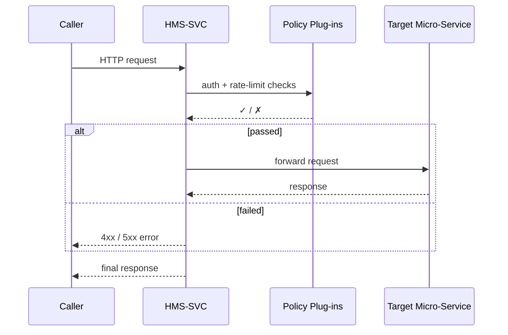

# Chapter 10: Backend Service Gateway (HMS-SVC / HMS-API)

[← Back to Chapter 9: Three-Layer Micro-Service Stack](09_three_layer_micro_service_stack__governance___management___interface__.md)

---

## 1 Why Do We Need a “Secure Switchboard”?

Picture the **Federal Aviation Administration (FAA)**.  
On a normal day…

* A citizen checks flight-safety stats in a public portal.  
* An airline files an aircraft-maintenance report.  
* An OSHA auditor pulls engine data for a safety investigation.

Three very different callers, one shared rule:

> “Internal micro-services must **never** be exposed directly to the internet.”

Enter **HMS-SVC / HMS-API**—our **Backend Service Gateway**.  
Think of it as a **classified switchboard** in a government building:

1. **Verifies ID** – Is the caller an airline, a citizen, or an auditor?  
2. **Logs every word** – For FOIA & IG audits later.  
3. **Connects the call** – Routes the request to the right micro-service (health records, billing, AI agents…).  
4. **Shields the phones** – No one can dial an internal extension directly.

Without the gateway, you would need to bolt authentication, rate-limits, and logging onto **every single micro-service**—a recipe for chaos.

---

## 2 Key Concepts (Plain English)

| Term | In Everyday Words | Government Analogy |
|------|-------------------|--------------------|
| **Service Gateway (HMS-SVC)** | The network door all requests must walk through. | Security desk in a federal building lobby. |
| **Route** | A rule mapping “/api/claims” → billing micro-service. | Telephone switchboard card: dial 123 for HR. |
| **Policy Plug-in** | Small module that can allow, rate-limit, or block a request. | Capitol Police deciding who gets past the rope line. |
| **Credential** | API key, OAuth token, or mutual TLS cert. | Government badge shown at the lobby. |
| **Audit Trail** | Tamper-proof log of who called what & when. | Visitor sign-in sheet stored at NARA. |

Keep these five terms handy—everything that follows is built on them.

---

## 3 Your First “Hello Gateway” in 15 Lines

Goal: Route two paths:

* `/public/faq` → a *public* micro-service  
* `/secure/claims` → a *protected* claims micro-service

### 3.1 Install & Run

```bash
pip install hms-svc
export HMS_SVC_TOKEN="demo-sandbox-token"   # admin token
hms-svc start --port 8080
```

### 3.2 Declare Routes (YAML ≤20 lines)

Create `routes.yml`:

```yaml
# routes.yml
- path: /public/faq
  forward_to: http://faq-svc:9000
  auth: none

- path: /secure/claims
  forward_to: http://claims-svc:9001
  auth: oauth
  rate_limit: 30/m          # 30 calls per minute
```

Load it:

```bash
hms-svc reload routes.yml
```

What did we do?

1. Told the gateway **where** to forward each path.  
2. Marked `/public/faq` as open; `/secure/claims` requires OAuth and gets rate-limited.

---

### 3.3 Test the Paths

```bash
# Public path (no token)
curl http://localhost:8080/public/faq

# Secure path (needs token)
curl -H "Authorization: Bearer demo-user-token" \
     http://localhost:8080/secure/claims
```

Expected results

* First call: 200 OK with FAQ text.  
* Second call: 401 if token missing/bad, 200 if valid.

---

## 4 What Happens on Each Request?



Takeaway: Every request is **filtered once** at the lobby; inner offices never worry about creds or throttling.

---

## 5 Under the Hood (Mini Code Tour)

`hms_svc/core/gateway.py` (trimmed to 15 lines)

```python
class Gateway:
    def __init__(self, routes):
        self.routes = routes              # loaded from YAML

    async def handle(self, req):
        route = self._match(req.path)
        if not route:
            return _error(404, "No such path")

        if not _check_auth(req, route.auth):
            return _error(401, "Bad credentials")

        if not _rate_ok(req.ip, route.rate_limit):
            return _error(429, "Too many calls")

        _audit(req, route)               # log to HMS-OPS
        resp = await _proxy(req, route.forward_to)
        return resp
```

Beginner-friendly notes:

1. `_match()` picks the right route.  
2. `_check_auth()` uses OAuth / API-key / mTLS based on `route.auth`.  
3. `_rate_ok()` consults in-memory counters (Redis in prod).  
4. `_audit()` streams a JSON line to [Observability & Operations Center](15_observability___operations_center__hms_ops__.md).  
5. `_proxy()` forwards the request and returns the downstream response.

---

## 6 Adding a Custom Policy Plug-in (12 Lines)

Suppose the **Bureau of Industry and Security** wants to block any file upload larger than 5 MB.

```python
# is_large_file.py
from hms_svc import Policy, Verdict

class LargeFileBlocker(Policy):
    def check(self, req, route):
        if int(req.headers.get("Content-Length", 0)) > 5*1024*1024:
            return Verdict.block("File exceeds 5 MB limit")
        return Verdict.pass_()
```

Enable it in `routes.yml`:

```yaml
- path: /secure/upload
  forward_to: http://upload-svc:9002
  policies: [is_large_file.LargeFileBlocker]
```

Restart the gateway—done! No micro-service code touched.

---

## 7 Troubleshooting Cheat-Sheet

| Symptom | Likely Cause | Quick Fix |
|---------|--------------|-----------|
| All requests return **404** | `routes.yml` not loaded | `hms-svc reload routes.yml` |
| **429 Too Many Requests** even at low traffic | Shared IP behind NAT | Switch `rate_limit` to `per_token` mode |
| Audit logs empty | OPS endpoint mis-set | `export HMS_OPS_URL=http://ops:9400` |
| Custom plug-in not found | Wrong module path | Use Python import path `pkg.module:ClassName` |

---

## 8 Where Does HMS-SVC Fit in the Big Picture?

* Front-end widgets from [Micro-Frontend Library](03_micro_frontend_library__hms_mfe__.md) hit **only** the gateway, never raw micro-services.  
* Governance checks (Chapter 8) and rate-limits are attached here, so inner services stay slim.  
* The gateway can enqueue long-running jobs into the [Activity Orchestrator & Task Queues](11_activity_orchestrator___task_queues__hms_act___hms_oms__.md) when a request needs background processing.

---

## 9 Recap

You have:

1. Learned the purpose of the **Backend Service Gateway**—a one-stop security desk.  
2. Declared simple routes in YAML and tested public vs. protected paths.  
3. Walked through the internal request flow and peeked at the 15-line core.  
4. Added a custom policy plug-in in under a dozen lines.  
5. Seen how HMS-SVC ties the entire HMS stack together.

Ready to manage *background* work (e-mail batches, PDF generation, AI inference) behind those routes?  
March on to [Chapter 11: Activity Orchestrator & Task Queues (HMS-ACT / HMS-OMS)](11_activity_orchestrator___task_queues__hms_act___hms_oms__.md).

---

欢迎来到更安全、更整洁的服务世界 🚀

---

Generated by [AI Codebase Knowledge Builder](https://github.com/The-Pocket/Tutorial-Codebase-Knowledge)