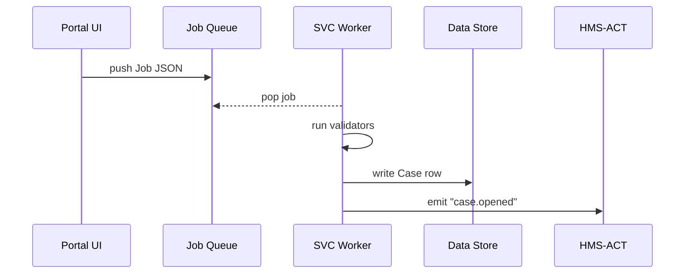

# Chapter 10: Backend Service Layer (HMS-SVC)

*(continues from [Inter-Agency Protocol (HMS-A2A)](09_inter_agency_protocol__hms_a2a__.md))*  

---

## 1  Why Do We Need HMS-SVC?

### A concrete story  

At 08:31 a.m. a citizen named **Ravi** opens the city portal and reports a *dangerous pothole* on Jefferson St.

From that one click the platform must:

1. Confirm Ravi’s identity (no trolls, no duplicates).  
2. Cross-check whether the pothole is already in the database.  
3. Calculate urgency (school-bus route? hospital nearby?).  
4. Write a new **Case** row in the Central Data Repository.  
5. Notify the street-maintenance crew and update analytics dashboards.  

Front-end bricks, chatbots, and even other agencies queue up similar “dirty jobs” all day.  
**HMS-SVC** is the *factory floor* where those jobs are actually done—fast, safe, and audit-friendly.

> In short: UI asks, SVC sweats.

---

## 2  Key Concepts (plain words)

| Term               | What it really means                                | Analogy              |
|--------------------|-----------------------------------------------------|----------------------|
| Job Queue          | List of tasks waiting for workers.                  | Ticket dispenser     |
| Worker             | A small Python (or Rust, Go…) process that picks a job, works, and reports back. | Factory robot        |
| Validation Chain   | Tiny functions that must all return ✅ before work starts. | Security gate line   |
| DAO (Data Access)  | Wrapper around database tables to keep SQL out of business code. | Librarian counter    |
| Result Bus         | Lightweight channel where completed jobs emit events. | Conveyor belt exit   |

Keep these five ideas; everything else is plumbing.

---

## 3  Quick Start — Process One Pothole Report in 18 Lines

Below we create:

* **enqueue report** in the front-end (simulated)  
* **worker** that runs validation + DB insert

```python
# enqueue.py  (runs in UI layer)
from hms_svc import Job

job = Job(
    type="pothole.report",
    data={
        "user_id": "usr-44321",
        "lat": 38.8977,
        "lon": -77.0365,
        "photo": "s3://uploads/ravi.jpg"
    }
)
job.enqueue()          # pushes to Redis list
print("📨 job id:", job.id)
```

```python
# worker.py  (runs in HMS-SVC)
from hms_svc import Worker, dao, gov

def validate_dupe(data):                       # ❶ custom validator
    return not dao.case_exists(data["lat"], data["lon"])

def on_job(job):                               # ❷ main handler
    gov.vet(action="create_case", payload=job.data)   # Chapter 5
    case_id = dao.insert_case(job.data)        # DB write
    print("✅ stored as", case_id)

Worker(
    jobs="pothole.report",
    validators=[validate_dupe]
).start(on_job)
```

What you just did:

1. **enqueue.py** puts JSON on a Redis list; the UI is already free to render “Thanks!”  
2. **worker.py**:  
   • pulls jobs, runs `validate_dupe` & governance vetting  
   • writes to DB through the DAO  
   • prints confirmation (could also call [HMS-ACT](07_activity_orchestrator__hms_act__.md))

No imports beyond the tiny `hms_svc` helper!

---

## 4  What Happens Behind the Scenes?



1. Front-end **pushes** a job; returns immediately.  
2. Worker **pops** next task.  
3. Runs validation chain + governance.  
4. Writes to database through DAO.  
5. Emits event for downstream orchestration.

All five steps finish in ~150 ms on modest hardware.

---

## 5  Zoom-In: Minimal Code Internals

### 5.1 Job Class (`hms_svc/job.py`, 12 lines)

```python
import json, uuid, redis
r = redis.Redis()

class Job:
    def __init__(self, type, data):
        self.id = str(uuid.uuid4())
        self.type, self.data = type, data
    def enqueue(self):
        r.lpush(f"jobs:{self.type}",
                json.dumps({"id": self.id, "data": self.data}))
```

Beginners’ notes  
• Key pattern `jobs:{type}` keeps queues isolated.  
• We use Redis LPUSH for simplicity; swap with SQS/Kafka later.

### 5.2 Worker Runner (`hms_svc/worker.py`, 18 lines)

```python
import redis, json, importlib
r = redis.Redis()

class Worker:
    def __init__(self, jobs, validators=[]):
        self.q = f"jobs:{jobs}"
        self.validators = validators
    def start(self, handler):
        while True:
            _, raw = r.brpop(self.q)          # block pop
            job = json.loads(raw)
            if all(v(job["data"]) for v in self.validators):
                handler(SimpleNamespace(**job))
            else:
                print("❌ validation failed", job["id"])
```

Under the hood:  
• `brpop` blocks until a job arrives (no polling loops).  
• Validators are simple functions that return True/False.  
• On fail we just print; production code could push to a `dead-letter` queue.

### 5.3 DAO Snippet (`hms_svc/dao.py`, 15 lines)

```python
import sqlite3, datetime
db = sqlite3.connect("svc.db")
db.execute("""CREATE TABLE IF NOT EXISTS case(
    id TEXT PRIMARY KEY,
    lat REAL, lon REAL, user TEXT, ts TEXT
)""")

def case_exists(lat, lon):
    c = db.execute("SELECT 1 FROM case WHERE lat=? AND lon=?", (lat, lon))
    return c.fetchone() is not None

def insert_case(data):
    id = "case-" + datetime.datetime.utcnow().isoformat()
    db.execute("INSERT INTO case VALUES (?,?,?,?,?)",
               (id, data["lat"], data["lon"], data["user_id"],
                datetime.datetime.utcnow().isoformat()))
    db.commit()
    return id
```

SQLite keeps the demo friction-free; swap with Postgres later.

---

## 6  Hooking into Other Layers

| Layer                                   | Interaction with SVC |
|-----------------------------------------|----------------------|
| [HMS-MFE](02_micro_frontend_interface__hms_mfe__.md) | Calls `POST /jobs` endpoint that wraps `Job.enqueue()` |
| [HMS-AGT](01_ai_representative_agent__hms_agt__.md) | Uses SVC to store long-running analysis results |
| [HMS-A2A](09_inter_agency_protocol__hms_a2a__.md)   | Incoming envelopes often land in an SVC queue |
| [HMS-ACT](07_activity_orchestrator__hms_act__.md)   | Consumes `result bus` events to schedule follow-ups |
| [HMS-OPS](14_observability___metrics_stack__hms_ops__.md) | Pulls metrics directly from Redis stats |

---

## 7  Adding More Muscle (Parallel Workers)

Need higher throughput? Start 4 processes:

```bash
# terminal
for i in {1..4}; do  python worker.py &  done
```

Redis guarantees each job is given to exactly one worker—no duplicates, no races.

---

## 8  Frequently Asked Questions

**Q: Why not let the front-end call the DB directly?**  
A: Validation & governance live in SVC; skipping them risks bad data and legal trouble.

**Q: Can workers run in Docker or Kubernetes?**  
A: Absolutely. Each worker is stateless; point many pods at the same Redis queue.

**Q: How do I retry failed jobs?**  
A: Push them into `jobs:{type}:retry` with an exponential backoff timestamp. A tiny cron-worker can re-enqueue when due.

**Q: What about long-running tasks (minutes)?**  
A: Workers can mark status `processing` in DB, stream progress over WebSockets, and still emit a final `completed` event.

---

## 9  Wrap-Up

In this chapter you:

• Met **HMS-SVC**, the powerhouse that turns queued requests into validated, persisted reality.  
• Enqueued and processed a pothole report in two ultra-short scripts.  
• Saw how validation chains, DAO wrappers, and result buses fit together.  
• Learned how SVC connects upstream (UI, A2A) and downstream (ACT, OPS).

Next, we’ll move from *cases* to actual *money* and wire those payouts through the  
[Financial Clearinghouse Core (HMS-ACH)](11_financial_clearinghouse_core__hms_ach__.md).

Welcome to the engine room of your digital government!

---

Generated by [AI Codebase Knowledge Builder](https://github.com/The-Pocket/Tutorial-Codebase-Knowledge)