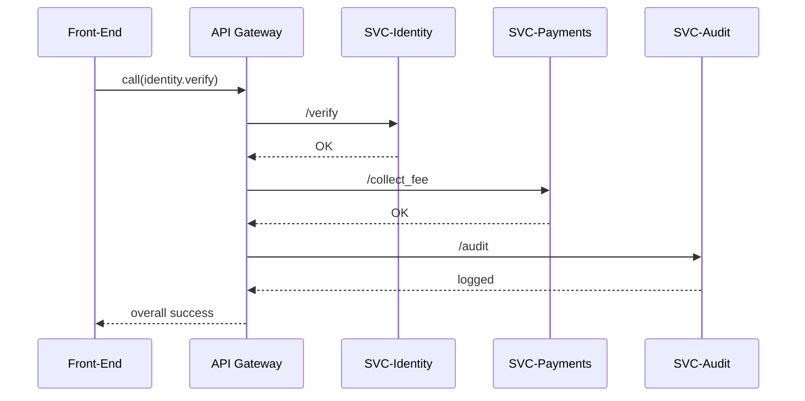
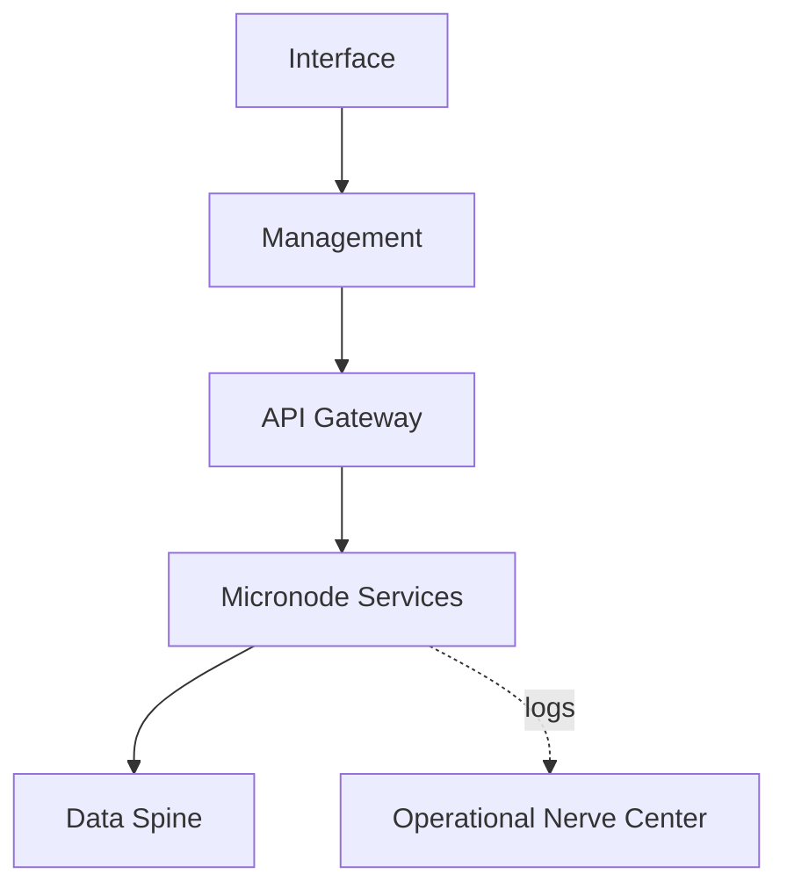

# Chapter 10: Backend Service Mesh (HMS-SVC & HMS-API)

*[← Back to Chapter 9: Data Spine (HMS-DTA)](09_data_spine__hms_dta__.md)*  

---

## 0. Why Do We Need a “Service Mesh”? — The Passport-Renewal Gauntlet  

When a citizen renews a passport, the HMS platform quietly performs **six** back-end actions:

1. Validate the applicant’s identity.  
2. Check for unpaid child-support (Dept. of Health & Human Services).  
3. Collect the renewal fee.  
4. Generate a shipping label.  
5. Update the travel-advisory mailing list.  
6. Write an audit entry to the [Data Spine](09_data_spine__hms_dta__.md).

If *any* of those calls times out, the whole experience stalls.  
In legacy stacks each API call is hand-wired, retry logic is copy-pasted, and debugging feels like spelunking a cave with a flashlight.

**HMS-SVC & HMS-API**, together called the **Backend Service Mesh**, give us:

* point-and-shoot service discovery  
* automatic retries, time-outs, and circuit breakers  
* uniform security, logging, and versioning  

All with **zero boiler-plate** in your business code.

---

## 1. Key Concepts — Five Words to Tattoo on Your Brain

| Term | Government Analogy | 1-Line Purpose |
|------|--------------------|----------------|
| Micronode | DMV window clerk | Smallest unit of business logic |
| SVC (Service) | Agency department | Collection of micronodes behind one name |
| API Gateway | 311 call center | Single phone number that finds the right department |
| Circuit Breaker | Budget sequester | Temporarily halts a failing service |
| Retry Policy | Follow-up form letter | Automatic re-attempt with back-off |

Remember: **Micronode → SVC → API Gateway**, protected by Circuit Breakers & Retries.

---

## 2. “Hello Service Mesh” in <20 Lines

We will:

1. Call `identity.verify` (Micronode)  
2. Let the mesh route and retry automatically.

```python
# verify_id.py  (18 lines)
from hms_api import call   # thin client generated by the mesh

payload = {
    "ssn": "123-45-6789",
    "name": "Alex Rivera",
    "dob": "1990-04-02"
}

try:
    res = call("identity.verify.v1", payload)   # <-- just one line
    print("✅ Verified:", res["score"])
except Exception as e:
    print("⛔ Service unavailable:", e)
```

What you did **not** write:

* URL building  
* Auth headers  
* Retry loops  
* Logging  

The mesh injected all of that for you.

---

## 3. How Does the Mesh Pull This Off? (5-Step Walkthrough)



1. **UI** sends *one* request to **API Gateway**.  
2. Gateway looks up `identity.verify.v1` in its **Service Catalog**.  
3. Calls the correct Micronode in **SVC-Identity**.  
4. Chains additional Micronodes (`collect_fee`, `audit`) without UI knowing.  
5. Sends a single consolidated response back.

---

## 4. Under the Hood — A Tiny Peek at Routing Logic

```python
# mesh/router.py  (≤18 lines, simplified)
ROUTES = {
   "identity.verify.v1": ("svc_identity", "/verify"),
}

def route(tool_name):
    svc, path = ROUTES[tool_name]
    host = _discover(svc)          # e.g., "http://10.4.2.7:8080"
    return host + path

def _discover(svc):
    # real code queries Consul; here we hard-code
    return {"svc_identity": "http://127.0.0.1:7001"}[svc]
```

Beginner notes:

* `ROUTES` maps **tool names** (same format used across HMS) to a **service + path**.  
* `_discover` finds the live pod/container via Consul or Kubernetes.  
* The caller never sees IPs or ports.

---

## 5. Automatic Retries & Circuit Breakers (No Extra Code!)

Configuration lives in `mesh_policy.yaml`:

```yaml
# mesh_policy.yaml (≤15 lines)
policies:
  identity.verify.v1:
    retry:
      attempts: 3
      backoff_ms: 200
    circuit_breaker:
      failure_threshold: 5   # trips after 5 fails within 1 min
      reset_seconds: 60
```

Save → The mesh hot-reloads the policy.  
If `identity.verify` starts failing, new requests **instantly** receive “Service Unavailable” without wasting user time.

---

## 6. Where Do SVC & API Live in the GMI Cake?



* **API Gateway** straddles the **Interface–Management** border.  
* **Micronode Services (HMS-SVC)** sit firmly on the **Management** floor.  
* Health and latency metrics flow to the upcoming [Operational Nerve Center (HMS-OPS)](11_operational_nerve_center__hms_ops__.md).

---

## 7. Adding Your Own Micronode — “zip.income.lookup”

### 7.1 12-Line Flask Micronode

```python
# micronodes/zip_income.py  (12 lines)
from flask import Flask, request, jsonify
import hms_dta as dta                # Data Spine client
app = Flask(__name__)

@app.post("/lookup")
def lookup():
    zip_code = request.json["zip"]
    row = dta.read("census/income_by_zip",
                   version="latest")[zip_code]
    return jsonify({"median_income": row["median_income"]})

if __name__ == "__main__":
    app.run(port=7002)
```

### 7.2 Register It in the Service Catalog

```bash
$ hms-svc register \
      --name svc_census \
      --addr http://zip_income:7002
$ hms-api map zip.income.lookup.v1 svc_census /lookup
```

And that’s it — front-end code can now call `zip.income.lookup.v1` with the same `call()` helper shown earlier.

---

## 8. Common Pitfalls (and Mesh Fixes)

Problem | Old Way | In HMS-SVC / HMS-API
---------|--------|----------------------
Copy-pasted retry code | Hidden bugs | Central **Retry Policy**
Hard-coded URLs | Break on deploy | **Service Discovery**
Silent time-outs | User spins | **Circuit Breaker** returns fast error
Inconsistent logging | Debugging hell | Unified audit in OPS

---

## 9. What You Learned

• The **Backend Service Mesh** hides every IP, port, and retry loop behind a friendly tool name like `identity.verify.v1`.  
• **Micronodes** are tiny, single-purpose Flask/FastAPI apps; you registered one in two commands.  
• **API Gateway** enforces retry & circuit-breaker policies with hot-reload YAML.  
• All calls are automatically logged and piped to the upcoming **Operational Nerve Center**.

Next you’ll see how HMS keeps those services healthy 24/7 and what dashboards operators watch:  
[Operational Nerve Center (HMS-OPS)](11_operational_nerve_center__hms_ops__.md)

---

---

Generated by [AI Codebase Knowledge Builder](https://github.com/The-Pocket/Tutorial-Codebase-Knowledge)