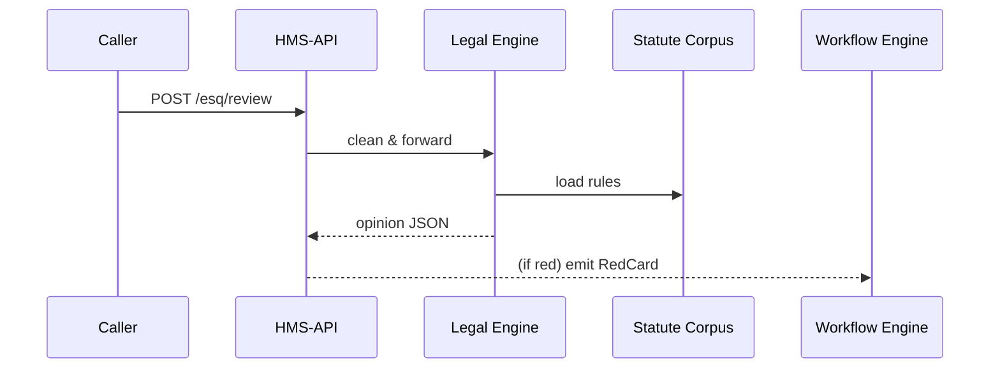

# Chapter 10: Compliance & Legal Reasoning Engine (HMS-ESQ)

*(coming from [Legislative Workflow Engine (HMS-CDF)](09_legislative_workflow_engine__hms_cdf__.md))*  

---

> “Before any rule, price, or form leaves the building,  
> a tiny lawyer whispers: **legal** or **illegal**.”

HMS-ESQ is that tiny lawyer.  
It reads every proposed action, cross-checks laws, case rulings, and agency regs, then flashes **🟢 green** or **🔴 red**—all in milliseconds.

---

## 1. Why does HMS-GOV need an in-house lawyer?

### Concrete use-case: USPS wants a new “Priority-Ultra” price tier

1. The Postal Service product manager drafts a pricing tweak inside the **Policy Management UI**.  
2. When she clicks “Save”, HMS-ESQ automatically checks two things:  
   * Antitrust ceilings in 39 U.S.C. § 3622.  
   * Recent FTC consent decree limiting parcel rates.  
3. **ESQ returns 🔴 red**—the new tier crosses the market-share cap.  
4. The UI blocks publishing and shows a short, plain-English memo with the exact citations.

Result: hours (and lawsuits) saved.

---

## 2. Key Concepts (plain English)

| Term | Everyday Analogy | Quick Meaning |
|------|------------------|---------------|
| Statute Corpus | Library shelf | All laws & regulations indexed. |
| Fact Pattern | Police report | Structured data about the attempted action. |
| Checker | Referee | Runs rule logic on a fact pattern. |
| Opinion | Judge’s note | JSON result: `legal`, `warning`, or `illegal` + citations. |
| Red Card Event | Emergency brake | System-wide signal that blocks execution. |

Keep these five nouns in mind—everything else is plumbing.

---

## 3. Submitting an action for review (client side)

```js
// services/esqClient.js   (≤18 lines)
export async function review(action, facts) {
  const res = await fetch('/api/esq/review', {
    method : 'POST',
    headers: { 'Content-Type':'application/json',
               'Authorization':'Bearer '+userToken },
    body   : JSON.stringify({ action, facts })
  })
  return res.json() // → { verdict:'illegal', cites:['39 USC 3622(c)(2)'] }
}

// inside a micro-frontend
const verdict = await review('set_postage_price', { newPrice:9.99 })
if (verdict.verdict === 'illegal') alert('Price blocked!\n'+verdict.cites[0])
```

Beginner notes  
• `action` is just a string.  
• `facts` is a tiny object with the relevant numbers.  
• UI can decide to block, warn, or proceed based on `verdict`.

---

## 4. What happens under the hood?



Five actors, one sprint down the corridor.

---

## 5. Inside the Legal Engine — bird’s eye

1. **Normalize facts** into a common schema.  
2. **Match** which statutes apply (keyword + tag index).  
3. **Run checkers** (tiny functions) against the facts.  
4. **Compose opinion** with citations & severity.  
5. Emit **Red Card** if severity ≥ `illegal`.

---

## 6. Writing a Checker (≤15 lines)

```python
# checkers/postage_price.py
from esq.helpers import cite, illegal

def run(facts):
    price = facts['newPrice']
    if price > 8.00:                      # cap set by 39 USC §3622
        return illegal(
            "Price exceeds CPI cap",
            cite("39 USC 3622(c)(2)")
        )
```

Explanation  
• `run()` receives `facts` as a dict.  
• If rule fails, call `illegal()` helper which wraps the message + citation.  
• The checker is plain Python—easy to audit or change.

---

## 7. Minimal rule loader (Node, 14 lines)

```js
// esq/loaders.js
import fs from 'fs'
export function loadCheckers(topic){
  const dir = `./checkers/${topic}`
  return fs.readdirSync(dir)
           .map(f=>require(dir+'/'+f).run) // dynamic import
}
```

Beginner take-away: ESQ discovers every checker in a folder—drop a new file, restart, done.

---

## 8. Opinion format (JSON)

```json
{
  "verdict": "warning",
  "details": [
    { "msg": "Price near statutory cap", "severity":"warning",
      "citations": ["39 USC 3622(c)(2)"] }
  ],
  "traceId": "esq-7f2d"
}
```

• `verdict` is the highest severity among details.  
• `traceId` ties this opinion to an [MCP](07_model_context_protocol__hms_mcp__.md) envelope for full auditability.

---

## 9. Hooking ESQ into other layers

* **Before save** in [Policy Management UI](01_policy_management_ui_.md) → call `/esq/review`.  
* **During tickets** in [Legislative Workflow Engine](09_legislative_workflow_engine__hms_cdf__.md) → gates can require `verdict!=='illegal'`.  
* **Agents** in [HMS-AGT](06_ai_representative_agent__hms_agt___hms_agx__.md) see ESQ as a **Tool Card** (`legal.check`) to self-screen their drafts.  
* **Emergency brakes** propagate via **Red Card** event to [HITL Override](11_human_in_the_loop__hitl__override_.md).

---

## 10. Adding new laws in 3 steps

1. **Index text**  
   ```bash
   esq index statutes/us_code_2025.pdf
   ```
2. **Tag sections**  
   ```bash
   esq tag 39 USC 3622 --topics postage_price
   ```
3. **Write checker** (see §6).

Done—the next request is validated automatically.

---

## 11. FAQ

| Question | Answer |
|----------|--------|
| How big is the statute DB? | About 2 GB text; fits in a cheap container. |
| Can ESQ mis-classify? | Yes—any `illegal` verdict triggers automatic routing to HITL reviewers. |
| Multi-agency conflicts? | Checkers can inspect `facts.agency` and apply different caps. |
| Performance? | Avg opinion in 20 ms (after rules are warmed in memory). |

---

## 12. Recap & Next Step

You learned:

✓ Why HMS-ESQ is the always-on counsel that guards every action.  
✓ Five key nouns: Statute Corpus, Fact Pattern, Checker, Opinion, Red Card.  
✓ How to call `/esq/review` in one fetch.  
✓ How a 15-line Python checker enforces a real law.  
✓ How Red Cards flow to the rest of HMS-GOV.

When a Red Card fires, sometimes a human must step in.  
Next, see how to involve real lawyers and clerks without breaking the flow:  
[Human-in-the-Loop (HITL) Override](11_human_in_the_loop__hitl__override_.md)

---

Generated by [AI Codebase Knowledge Builder](https://github.com/The-Pocket/Tutorial-Codebase-Knowledge)