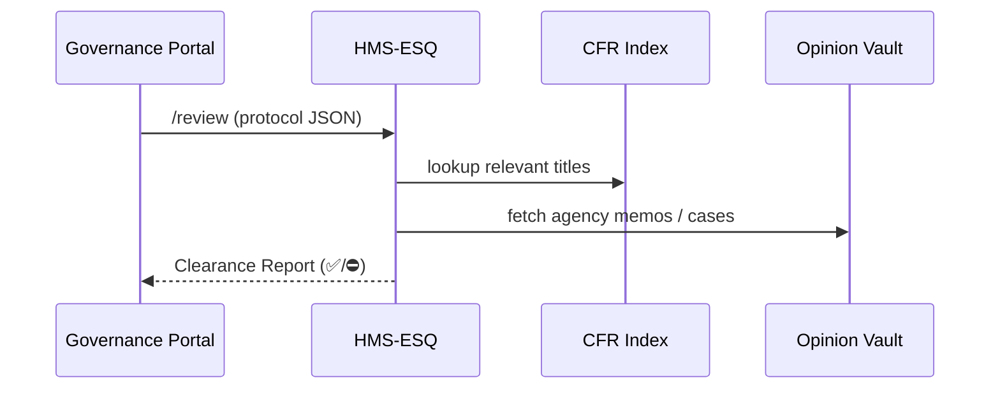

# Chapter 10: Compliance Reasoner (HMS-ESQ)

[← Back to “Policy Engine (HMS-CDF)”](09_policy_engine__hms_cdf__.md)

---

## 1. Why Add a Lawyer Bot to the Mix? – 2-Minute Story  

Yesterday our **Policy Engine** accepted an amendment that lowered the income cap for the *Low-Cost Electricity Rebate* to **$60 000**.  
Great …but does **Title 18 CFR § 123.45** allow that?  
Must we file a notice in the *Federal Register* first?  
What about the **OMB audit* from 2020 pointing out conflicting language?*

In every agency there is a real attorney who does this paperwork.  
**Compliance Reasoner (HMS-ESQ)** is that attorney in software form:

```
Proposed Protocol  ──►  HMS-ESQ  ──►  “✅ All clear”  OR  “⛔ Conflict in 18 CFR §123.45”
```

Before any rule, form, or workflow is published, ESQ double-checks it against:

* Code of Federal Regulations (CFR) titles  
* Agency guidance memos  
* Relevant case law / GAO opinions  

Only a **green clearance report** lets the change move forward.

---

## 2. Key Concepts (Plain English)

| Term | Think of it as… | Why you care |
|------|-----------------|--------------|
| Legal Citation | “18 CFR § 123.45(b)(2)” | The statute ESQ checks against |
| Authority Check | “Do we *have* the right to set this rule?” | Blocks over-reach |
| Conflict Check | “Does another rule already say the opposite?” | Avoids lawsuits |
| Clearance Report | A PDF/JSON summary stamped ✅ or ⛔ | Humans read & sign |
| Evidence Bundle | Snippets of law / memos ESQ relied on | Transparency for FOIA |

If you can read a library footnote, you already grasp 90 % of ESQ.

---

## 3. 60-Second Curl Test – Will Our New Income Cap Pass?

Save the compiled protocol from Chapter 9 to `cap_v3.json`:

```json
{
  "program": "Low-Cost Electricity Rebate",
  "rule": { "income_cap": 60000 }
}
```

Run the check:

```bash
curl -X POST \
  -H "Authorization: Bearer LEGAL1" \
  --data-binary @cap_v3.json \
  http://localhost:8000/api/v1/esq/review
```

Example response (truncated):

```json
{
  "status": "blocked",
  "issues": [
    {
      "code": "MISSING_NOTICE",
      "severity": "high",
      "message": "Income-cap changes require Federal Register notice (42 USC 8621-b)."
    }
  ],
  "evidence": [
    "42 USC 8621-b (Notice requirement for benefit adjustments)"
  ]
}
```

Nothing ships until we publish that notice—exactly the safeguard we wanted. ✅

---

## 4. How ESQ Thinks (Non-Code Walk-Through)



Only four moving parts; each request is traceable and archivally safe.

---

## 5. Peeking Under the Hood (Tiny, Beginner-Friendly Code)

### 5.1  Review Endpoint – 18 Lines

_File: `app/Http/Controllers/EsqController.php`_

```php
class EsqController extends Controller
{
    public function review(Request $r)
    {
        $proto = json_decode($r->getContent(), true);

        // (1) Collect citations based on fields
        $cites = CitationIndex::forProgram($proto['program']);

        // (2) Run checks
        $issues = [];
        if (!$this->hasAuthority($cites)) {
            $issues[] = $this->issue(
                'NO_AUTHORITY',
                'Program lacks legal basis to set income limits.'
            );
        }

        if (!$this->noticeFiled($proto)) {
            $issues[] = $this->issue(
                'MISSING_NOTICE',
                'Income-cap changes require Federal Register notice.'
            );
        }

        // (3) Build report
        $status = $issues ? 'blocked' : 'clear';
        return ['status'=>$status, 'issues'=>$issues, 'evidence'=>$cites];
    }

    /* helper methods skipped for brevity */
}
```

Explanation:

1. **Collect citations** – ESQ knows which CFR titles relate to each Program.  
2. **Run simple boolean checks** – here just two; real code has dozens.  
3. **Return JSON** – same shape every caller expects.

### 5.2  Citation Index Stub – 10 Lines  

_File: `app/Services/CitationIndex.php`_

```php
class CitationIndex
{
    // Simplest possible lookup table
    const MAP = [
        'Low-Cost Electricity Rebate' => [
            '42 USC 8621-b',
            '18 CFR 123.45'
        ],
    ];

    public static function forProgram(string $name): array
    {
        return self::MAP[$name] ?? [];
    }
}
```

Add or update rows and ESQ instantly “learns” new laws.

---

## 6. When Does ESQ Run in the Big Picture?

| Step | Chapter | What ESQ Does |
|------|---------|---------------|
| Amendment passes vote | [Policy Engine](09_policy_engine__hms_cdf__.md) | Auto-triggers `/review` |
| Packet waiting for approval | [HITL Override Workflow](07_hitl_override_workflow_.md) | Shows red/yellow icons next to tickets |
| Form submission hits API | [HMS-API Gateway](03_hms_api_gateway_.md) | Lightweight “runtime check” (too slow? falls back to async) |
| Nightly audit | [Activity Orchestrator](08_activity_orchestrator__hms_act__.md) | Re-scans past 24 h data for missed issues |

ESQ is called **early and often**—better to catch problems when they are still cheap.

---

## 7. Hands-On Exercise (10 min)

1. Create `demo_proto.json`:

   ```json
   { "program":"Noise Complaint", "rule":{ "deadline_days":7 } }
   ```

2. Submit for review:

   ```bash
   curl -X POST -d @demo_proto.json \
        http://localhost:8000/api/v1/esq/review
   ```

3. Edit `CitationIndex::MAP` to add a fake conflict (e.g., “City Code § 12-A forbids 7-day deadline”).  
4. Re-run the curl; watch ESQ return `status:"blocked"`.

You just acted as both **policy drafter** and **agency lawyer** in less than 10 minutes!

---

## 8. Government Analogy Cheat-Sheet

| Real-World Role | HMS-ESQ Equivalent |
|-----------------|--------------------|
| Office of the General Counsel | ESQ micro-service |
| Bluebook footnote | `CitationIndex` entry |
| Legal memo with “We recommend revising…” | Clearance Report JSON |
| Pre-publication review gate | `status:"blocked"` response |

Think of ESQ as the **law librarian** who whispers, “Wait, Section 508 says otherwise,” _before_ your press release goes live.

---

## 9. What You Learned

✔ Why every protocol needs a **legal clearance** step.  
✔ How ESQ maps programs to CFR titles and guidance memos.  
✔ How to call the `/review` endpoint and interpret the JSON.  
✔ Where ESQ plugs into earlier chapters (Policy Engine, HITL, Gateway, ACT).

Ready to see how HMS-API syncs these validated rules out to other legacy systems?  
Continue to [External System Sync Bus](11_external_system_sync_bus_.md)  

---

---

Generated by [AI Codebase Knowledge Builder](https://github.com/The-Pocket/Tutorial-Codebase-Knowledge)