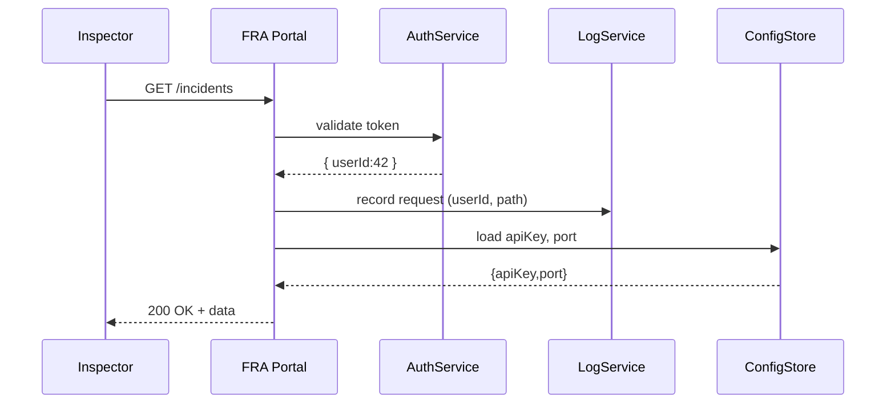

# Chapter 10: Core Infrastructure (HMS-SYS)

In [Chapter 9: Management Layer](09_management_layer_.md), we learned how to orchestrate business workflows. Now let’s go deeper “under the streets” and see the **Core Infrastructure (HMS-SYS)** that powers everything—just like a city’s utilities grid of electricity, water, and communications. In a finance-compliance agency, HMS-SYS handles secure identity management, audit trails, encryption, configuration, and more so that all higher layers run with trust and stability.

---

## 1. Why Do We Need Core Infrastructure?

Imagine the Federal Railroad Administration (FRA) builds an online incident-reporting portal for inspectors. Before an inspector can file a report, the system must:

- Confirm the inspector’s identity (authentication)  
- Record every action for future audits (logging)  
- Encrypt sensitive details (security)  
- Load agency-wide settings (configuration)

Without a central infrastructure, each service would reinvent these utilities—leading to inconsistencies, security holes, and operational headaches.

---

## 2. Key Concepts

1. **Authentication**  
   Verifying user identities (e.g., inspectors logging in with certificates).

2. **Logging & Audit Trails**  
   Recording every request, decision, and error for compliance reviews.

3. **Security & Encryption**  
   Protecting data at rest and in transit (HTTPS, token signing).

4. **Configuration Management**  
   Centralizing settings like service URLs, secrets, and feature flags.

---

## 3. Using Core Infrastructure

Below is a minimal Express.js server illustrating how HMS-SYS provides auth, logging, and config.

```js
// File: server.js
const express  = require('express')
const { auth } = require('./auth')      // authentication middleware
const logger   = require('./logger')    // logging middleware
const config   = require('./config')    // loads YAML/ENV

const app = express()
app.use(logger)    // log every request
app.use(auth)      // verify identity

app.get('/incidents', (req, res) => {
  // config.apiKey loaded from core config
  res.json({ data: `FRA incidents (key=${config.apiKey})` })
})

app.listen(config.port, () =>
  console.log(`HMS-SYS Server on ${config.port}`))
```

Explanation:  
- We **load** shared `logger`, `auth`, and `config` modules.  
- Every incoming request passes through **logging** and **authentication**.  
- Handlers trust that `req.user` is valid and that `config` holds required settings.

---

## 4. Under the Hood: Step-by-Step Flow



1. **Inspector** sends a request.  
2. **AuthService** checks the token and returns user info.  
3. **LogService** writes an audit entry.  
4. **ConfigStore** delivers settings.  
5. The handler completes the response.

---

## 5. Inside HMS-SYS: Minimal Code

### 5.1 Authentication Middleware (`auth.js`)

```js
// File: auth.js
module.exports.auth = (req, res, next) => {
  const token = req.headers.authorization
  // (Skip real verify code) Pretend we decode and check a JWT
  if (token === 'Bearer secret') {
    req.user = { id: 42, role: 'inspector' }
    next()
  } else {
    res.status(401).json({ error: 'Unauthorized' })
  }
}
```

Explanation:  
- Checks for a simple static token.  
- On success, attaches `req.user` for downstream handlers.

### 5.2 Logging Middleware (`logger.js`)

```js
// File: logger.js
module.exports = (req, res, next) => {
  const start = Date.now()
  res.on('finish', () => {
    console.log(`${req.method} ${req.path} → ${res.statusCode} in ${Date.now()-start}ms`)
    // In real life, send this to a centralized LogService
  })
  next()
}
```

Explanation:  
- Prints method, path, status, and timing.  
- A real system would push logs to a database or logging cluster.

### 5.3 Configuration Loader (`config.js`)

```js
// File: config.js
const fs = require('fs')
const yaml = require('js-yaml')

// Load YAML or fallback to environment variables
const cfg = yaml.load(fs.readFileSync('config.yaml', 'utf8'))
module.exports = {
  port: cfg.port || process.env.PORT || 3000,
  apiKey: cfg.apiKey || process.env.API_KEY
}
```

Explanation:  
- Reads `config.yaml` (or env vars).  
- Centralizes all service settings in one place.

---

## 6. Summary & Next Steps

In this chapter you learned how **Core Infrastructure (HMS-SYS)** provides the essential utilities—authentication, logging, security, and configuration—so that every higher-level service can run reliably and securely. With these “city utilities” in place, you never have to reimplement them in each microservice.

Up next, we’ll build on this foundation to design our [Chapter 11: Modular Microservices Structure](11_modular_microservices_structure_.md).

---

Generated by [AI Codebase Knowledge Builder](https://github.com/The-Pocket/Tutorial-Codebase-Knowledge)