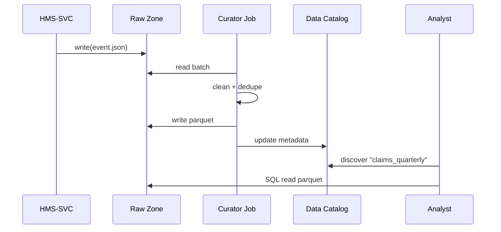

# Chapter 10: Data Lake & Repository (HMS-DTA)  
*A friendly sequel to [Core Service Mesh (HMS-SVC)](09_core_service_mesh__hms_svc__.md)*  

---

## 1. Why Do We Need HMS-DTA?

Imagine a Senate committee asks:

> “Exactly how many **FEMA hurricane-relief payments** above \$50 000 were made last quarter, and which claims were flagged for fraud?”

Without a *single* archive you would have to:

1. Hunt raw JSON logs in S3 buckets  
2. Beg the Analytics team for their “cleaned” CSV  
3. Copy the ML fraud model from a data scientist’s laptop  
4. Pray versions match

HMS-DTA is the **Library of Congress** for the platform: **raw facts, cleaned tables, and trained models all shelved in one governed lake**.  
Every agent, micro-service, and auditor now reads from the *same pages*—no more private stashes.

---

## 2. Key Ideas in Plain English

| Term (HMS-DTA) | Friendly Analogy | FEMA Example |
|----------------|------------------|--------------|
| Raw Zone       | Unopened mail sacks | `raw/events/2024/05/claim_99123.json` |
| Curated Zone   | Proof-read books   | `curated/claims_quarterly.parquet` |
| Model Registry | Recipe card box    | `models/fraud_score_v3.pkl` |
| Data Catalog   | Library index      | “Where is **claims_quarterly**? Who owns it?” |
| Governance Tag | “Top Secret” stamp | `classification = PII` |

Keep these five concepts in mind—they cover 95 % of daily work.

---

## 3. A 3-Step Walk-Through (End-to-End)

We will: **(1) land raw events → (2) clean them → (3) query an answer** in less than 40 lines of code.

### 3.1 Land Raw Events (from HMS-SVC)

```js
// 1️⃣ svc-to-dta.ingest.js  (18 lines)
import fs     from 'fs/promises'
import path   from 'path'
import crypto from 'crypto'

export async function ingest(event){            // called by HMS-SVC
  const day  = new Date().toISOString().slice(0,10)  // 2024-05-06
  const dir  = path.join('/lake/raw/events', day)
  await fs.mkdir(dir, { recursive:true })
  const file = path.join(dir, crypto.randomUUID()+'.json')
  await fs.writeFile(file, JSON.stringify(event))
}
```

Explanation  
• Creates a date-based folder  
• Drops each raw JSON with a random name  
• **No schema changes**—write first, worry later

---

### 3.2 Clean & Publish a Gold Table

```python
# 2️⃣ curate_claims.py  (≤ 20 lines)
import glob, json, pandas as pd, pyarrow.parquet as pq

files = glob.glob('/lake/raw/events/2024-05-*/claim_*.json')
rows  = [json.load(open(f)) for f in files]

df = pd.json_normalize(rows)        # flatten nested JSON
df = df[df['amount'] > 0]           # basic sanity
pq.write_table(
    table = pa.Table.from_pandas(df),
    where = '/lake/curated/claims_quarterly.parquet'
)
print('✅ Curated table written')
```

Explanation  
• Reads raw JSONs for the quarter  
• Flattens & filters obvious junk  
• Saves **one** Parquet file in the *curated* shelf

---

### 3.3 Query Like an Auditor

```python
# 3️⃣ audit_query.py  (15 lines)
import duckdb

sql = """
SELECT claim_id, amount
FROM '/lake/curated/claims_quarterly.parquet'
WHERE amount > 50000 AND fraud_flag = TRUE
"""
results = duckdb.query(sql).fetchall()
for r in results:
    print(r)
```

Output (truncated):

```
('99123', 60000)
('99407', 72000)
```

15 lines → Senate answer delivered.

---

## 4. Under the Hood – What Really Happens?



*Five actors, one clear path from birth of data to Senate report.*

---

## 5. Inside HMS-DTA (Mini Implementation)

### 5.1 Folder Layout

```
/lake
  /raw
      /events/2024-05-06/…
  /curated
      claims_quarterly.parquet
  /models
      fraud_score_v3.pkl
  /catalog
      datasets.yml
```

### 5.2 Data Catalog Record (YAML, 11 lines)

```yaml
# /lake/catalog/datasets.yml
- id: claims_quarterly
  path: /lake/curated/claims_quarterly.parquet
  owner: fema_analytics@dhs.gov
  updated: 2024-05-06
  tags:
    - pii
    - financial
  schema:
    - claim_id: string
    - amount: double
    - fraud_flag: bool
```

Explanation  
• Humans & agents can search this YAML to locate data  
• `tags` feed into policy checks from [Compliance & Legal Reasoning (HMS-ESQ)](04_compliance___legal_reasoning__hms_esq__.md)

### 5.3 Tiny Helper SDK (JavaScript, 16 lines)

```js
// dta.client.js
import { readFile } from 'fs/promises'
import duckdb from 'duckdb'

export async function query(sql){
  return new Promise((ok, err) => {
    const db = new duckdb.Database(':memory:')
    db.all(sql, (e, rows) => e ? err(e) : ok(rows))
  })
}

export async function catalog(id){
  const yml = await readFile('/lake/catalog/datasets.yml','utf-8')
  return yml.split('- id:').find(s => s.startsWith(` ${id}`))
}
```

Beginners can now:

```js
const sql = "SELECT COUNT(*) FROM '/lake/curated/claims_quarterly.parquet'"
console.log(await query(sql))       // -> [{count: 782}]
```

---

## 6. How Other Chapters Plug In

| Layer | What It Stores in HMS-DTA | Quick Pointer |
|-------|---------------------------|---------------|
| [HMS-SVC](09_core_service_mesh__hms_svc__.md) | API access logs | `raw/events/*` |
| [HMS-ACT](05_workflow_orchestrator__hms_act__.md) | Workflow run history | `curated/workflows.parquet` |
| [HMS-AGT](07_agent_framework__hms_agt___hms_agx__.md) | Conversation transcripts | `raw/agents/*` |
| [HMS-OPS](17_observability___operations__hms_ops__.md) | Metrics & traces | `curated/metrics/*.parquet` |

One lake, many contributors—zero duplication.

---

## 7. Frequently Asked Questions

**Q: Can I still keep a private CSV on my desktop?**  
You *can*—but any analysis built on it won’t pass audit. Only data that lives in HMS-DTA is considered authoritative.

**Q: What about Personally Identifiable Information (PII)?**  
Datasets tagged `pii` require encryption at rest; HMS-DTA mounts those folders on encrypted volumes and enforces role-based access.

**Q: How do I version a machine-learning model?**  
Save each binary under `/lake/models/⟨name⟩_v#.pkl` and add an entry to `catalog/models.yml`. Agents then request the version hash explicitly.

**Q: Does HMS-DTA replace a full data warehouse?**  
It can act as the storage layer under Snowflake, Redshift, or BigQuery—just point those engines at the lake path.

---

## 8. What You Learned

• HMS-DTA is the **single source of truth**—raw logs, polished tables, and ML models live together under governance.  
• Landing raw data is one function call; curating & querying take only a few dozen lines.  
• A lightweight YAML catalog lets any agent or human discover datasets without guesswork.  
• Other layers (SVC, ACT, AGT, OPS) naturally deposit and consume data from the lake—no more copy-paste chaos.

Ready to see how agencies exchange these curated datasets with *other* departments without breaking silos?  
Jump to [Inter-Agency Exchange (HMS-A2A)](11_inter_agency_exchange__hms_a2a__.md).

---

---

Generated by [AI Codebase Knowledge Builder](https://github.com/The-Pocket/Tutorial-Codebase-Knowledge)