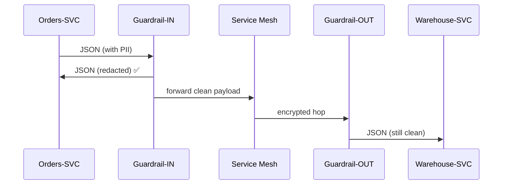

# Chapter 10: Data Privacy & Compliance Guardrails  

*A friendly continuation from* [Backend Services Mesh (HMS-SVC)](09_backend_services_mesh__hms_svc__.md)  

---

## 1 Why Bother? – A 60-Second Story

The **Defense Logistics Agency (DLA)** is rolling out a “One-Click Medical Supply Reorder” form for field medics.  
Each submission contains:

* Name + Rank  
* Duty-station address  
* Medical-supply history  
* Optional doctor’s notes (can include diagnoses)

Great for speed—terrible for privacy if the data splashes into the wrong log file or debug email.  
Congress, the Privacy Act, HIPAA, and—because medics may be EU citizens—GDPR all say:

> “Protect Personally Identifiable Information (PII) and Protected Health Information (PHI) **before** it leaves the gate.”

**Data Privacy & Compliance Guardrails** are the automatic “black-marker pens” inside HMS-UTL.  
They **redact, mask, or block** sensitive fields the millisecond data moves between services—no dev ever forgets, no auditor ever cries.

---

## 2 Big Ideas in Plain English

| Concept | Think of it as… | Why you care |
|---------|-----------------|--------------|
| Rule Book | List of words to black-out | Maps laws (HIPAA, Privacy Act, GDPR) to concrete data fields |
| Guardrail Proxy | TSA scanner | Sits in the traffic path; removes/obscures forbidden items |
| Tokenisation Vault | Locked glove box | Stores the original value, leaves a reference token |
| Redacted Payload | Black-marker PDF | Same shape, but secrets are hidden |
| Compliance Header | “Screened” stamp | Tells downstream services *which* law was enforced |

---

## 3 Quick Use Case: Shipping a Med-Supply Order

Desired flow:

1. Medic submits an order with PII/PHI to **Orders-SVC**.  
2. **Orders-SVC** must call **Warehouse-SVC**—but only *unit position* and *item list* may leave; health notes must stay behind.  
3. Guardrail intercepts, redacts, and adds a compliance header.

We’ll walk through:

* Building one rule in YAML  
* Sending a sample JSON payload  
* Seeing the redacted result

### 3.1 Define a Tiny Rule Book (`guardrails.yaml` – 12 lines)

```yaml
laws:
  hipaa:
    rules:
      - field: "doctor_notes"
        action: "redact"
      - field: "medical_history"
        action: "block"
  privacy_act:
    rules:
      - field: "ssn"
        action: "mask_last4"
```

Beginners’ notes:  
* `redact` → replace value with `"REDACTED"`  
* `block`  → drop the field entirely  
* `mask_last4` → show only last 4 digits

### 3.2 Call the Guardrail (Python – 15 lines)

```python
from guardrail import sanitize       # imaginary SDK, 1-function!

payload = {
  "name": "Cpl. Jamie West",
  "ssn": "123-45-6789",
  "doctor_notes": "Severe asthma, needs inhaler.",
  "medical_history": ["asthma","allergy"],
  "items": ["Bandage","Inhaler"]
}

clean, header = sanitize(payload, laws=["hipaa","privacy_act"])
print(clean)
print(header)
```

Expected output (pretty-printed):

```python
{
  'name': 'Cpl. Jamie West',
  'ssn': 'XXX-XX-6789',
  'doctor_notes': 'REDACTED',
  'items': ['Bandage', 'Inhaler']
}
{'X-Compliance-Laws': 'hipaa,privacy_act', 'X-Rule-Version': '2024-06-15'}
```

Explanation in plain words:

1. `medical_history` vanished (`block`).  
2. `doctor_notes` is now `"REDACTED"`.  
3. SSN shows only last 4 digits.  
4. A header tells the next service which rule set was applied.

---

## 4 Where Does the Guardrail Live?

The proxy is **injected automatically** right next to every app—exactly like the sidecars you met in [Backend Services Mesh](09_backend_services_mesh__hms_svc__.md).



Only five actors; GRin & GRout are identical guardrail proxies on each side.

---

## 5 Under the Hood – 3 Steps

1. **Pattern Match** – On first byte, proxy inspects JSON keys against `guardrails.yaml`.  
2. **Transform** – Applies `redact`, `block`, or `mask` streaming in O(n) time.  
3. **Stamp & Forward** – Adds `X-Compliance-Laws` + `X-Rule-Version`, then sends.

No payload is ever stored in the proxy’s memory after forwarding—reduces breach blast-radius.

### 5.1 Mini Proxy Snippet (`proxy.py` – 18 lines)

```python
import yaml, json, re, sys

RULES = yaml.safe_load(open("guardrails.yaml"))["laws"]

def apply_rules(data, active):
    for law in active:
        for r in RULES[law]["rules"]:
            f, act = r["field"], r["action"]
            if f in data:
                if act == "redact":        data[f] = "REDACTED"
                elif act == "block":       data.pop(f)
                elif act == "mask_last4":  data[f] = re.sub(r"\d(?=\d{4})","X",data[f])
    return data

def handle(req_bytes, active):
    data = json.loads(req_bytes)
    clean = apply_rules(data, active)
    header = {
      "X-Compliance-Laws": ",".join(active),
      "X-Rule-Version": "2024-06-15"
    }
    return json.dumps(clean).encode(), header
```

Explain like I’m five:

* Load YAML once.  
* Look at each field; decide whether to erase, drop, or mask.  
* Spit out a new JSON + header tuple.

---

## 6 Connecting to Other HMS-UTL Layers

• **Governance Layer** – Version `2024-06-15` comes from a signed policy stored in [Chapter 1](01_governance_layer__hms_gov__.md).  
• **RBAC** – Guardrail inspects the caller’s `X-Caller-Role` header (set by [RBAC](08_role_based_access___permissions__rbac__.md)); some roles (e.g., `MEDICAL_OFFICER`) may bypass certain redactions.  
• **Service Mesh** – Guardrail proxies are chained inside the same sidecar pod you saw in [HMS-SVC](09_backend_services_mesh__hms_svc__.md).  
• **Metrics Dashboard** – Counts of redacted vs. allowed fields stream to [Metrics & Monitoring Dashboard](15_metrics___monitoring_dashboard_.md) for audit.

---

## 7 Hands-On Lab (5 min)

1. Run the tiny proxy locally:

```bash
python proxy.py < sample.json
```

*(Pretend `sample.json` contains the medic payload.)*  

2. Observe the clean JSON + header printed to stdout.  
3. Edit `guardrails.yaml`—change `mask_last4` to `redact`—rerun and watch SSN disappear.  
4. Commit the YAML, bump version `1.1.0`, and publish via the same `/policies` endpoint you learned in [Chapter 1](01_governance_layer__hms_gov__.md).

---

## 8 Frequently Asked Questions

**Q: Does the guardrail slow down traffic?**  
A: Typical redaction adds ~1 ms for a 5 KB JSON—negligible compared to network latency.

**Q: What about file uploads (PDFs, images)?**  
A: The proxy can reject or quarantine binary data if rules match MIME types; a separate OCR bolt-on can scan PDFs for SSNs.

**Q: Can developers add custom actions (e.g., hash instead of mask)?**  
A: Yes—register a Python function name under `action:`; the proxy imports it dynamically.

**Q: How are GDPR “Right to be Forgotten” requests handled?**  
A: The Tokenisation Vault stores a mapping table. Deleting the token severs the link, effectively erasing the personal data everywhere else.

---

## 9 What You Learned

• Guardrails are automatic black-marker pens that embed Privacy Act, HIPAA, and GDPR rules straight into every data hop.  
• A 12-line YAML file defines *what* to hide; an 18-line proxy enforces it.  
• Compliance headers prove to downstream services—and auditors—that sanitation already happened.  
• Guardrails hook into governance, RBAC, mesh, and monitoring layers you met earlier.

Ready to discover **how services find each other** so the guardrails know *where* to forward traffic?  
Jump to [Microservice Registry & Discovery](11_microservice_registry___discovery_.md).

---

Generated by [AI Codebase Knowledge Builder](https://github.com/The-Pocket/Tutorial-Codebase-Knowledge)