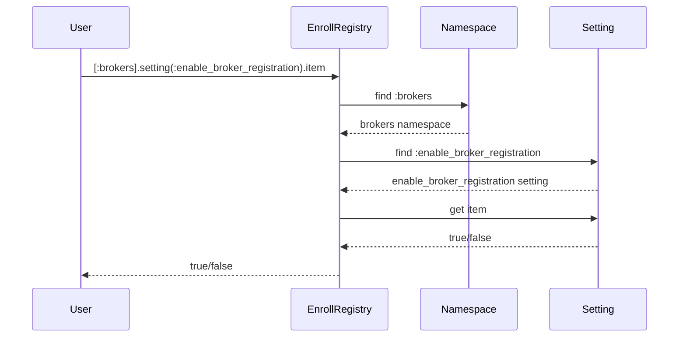

# Chapter 10: EnrollRegistry

In the previous chapter, [WorkflowStateTransition](09_workflowstatetransition.md), we learned how to track the history of changes to an object's status.  This chapter introduces the `EnrollRegistry`, a powerful tool for managing application settings and feature flags.

## What problem does `EnrollRegistry` solve?

Imagine we're building a complex health insurance application.  We have features like broker registration, financial assistance calculations, and document verification.  Some of these features might be under development, or we might want to enable or disable them based on the environment (e.g., testing, production).  How do we manage these settings without constantly changing the code? The `EnrollRegistry` solves this by providing a central repository for configuration settings and feature flags. It's like a control panel for the application, allowing you to toggle features on or off and adjust various settings without modifying the code directly.

## Key Concepts:

1. **Namespaces:** The `EnrollRegistry` is organized into namespaces, similar to folders on your computer.  These namespaces group related settings together. For example, settings related to brokers might be under the `brokers` namespace, while settings related to enrollments might be under the `enroll_app` namespace.

2. **Settings:**  Each namespace contains one or more settings. A setting is a key-value pair, where the key is the name of the setting and the value is its current configuration.  For example, a setting called `enable_broker_registration` might have a value of `true` or `false`.

3. **Feature Flags:** Feature flags are a special type of setting that allows you to turn features on or off dynamically.  This is useful for testing new features or rolling them out gradually.

## Using the `EnrollRegistry`

Let's say we want to check if broker registration is enabled:

```ruby
# ... other code ...

if EnrollRegistry[:brokers].setting(:enable_broker_registration).item
  # Broker registration is enabled
  # ... code to display broker registration form ...
else
  # Broker registration is disabled
  # ... code to display a message that broker registration is closed ...
end

# ... other code ...
```

This code checks the value of the `enable_broker_registration` setting within the `brokers` namespace.  If the value is `true`, it executes the code to display the broker registration form. Otherwise, it displays a message that registration is closed.

## Under the Hood

When you call `EnrollRegistry[:brokers].setting(:enable_broker_registration).item`, the following happens:

1. **Namespace Lookup:** The `EnrollRegistry` looks up the `brokers` namespace.

2. **Setting Retrieval:** Within the `brokers` namespace, it retrieves the `enable_broker_registration` setting.

3. **Value Access:** It accesses the `item` property of the setting, which returns the current value (`true` or `false`).



The code for this is primarily in `enroll_registry.rb` and `setting.rb`.  Here's a simplified example:

```ruby
# enroll_registry.rb (simplified)
class EnrollRegistry
  def self.[](namespace)
    # ... code to retrieve namespace ...
  end
end

# setting.rb (simplified)
class Setting
  def item
    # ... code to retrieve setting value ...
  end
end
```

The `EnrollRegistry` class provides the `[]` method for accessing namespaces, and the `Setting` class provides the `item` method for retrieving the setting's value.  The actual implementation involves more complex logic for handling different setting types, default values, and environment-specific configurations.  For example, the `Setting` class might store the value in the database or retrieve it from a configuration file.

## Conclusion

This chapter introduced the `EnrollRegistry`, a central repository for managing application settings and feature flags. We learned about its key concepts and how to use it to check if a feature is enabled.  This allows us to easily configure our application without modifying the code.  This concludes the tutorial.


---

Generated by [AI Codebase Knowledge Builder](https://github.com/The-Pocket/Tutorial-Codebase-Knowledge)