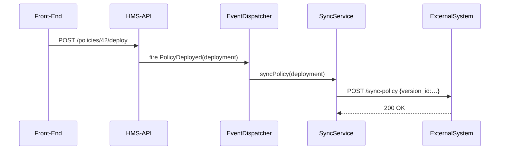

# Chapter 10: External System Sync

Welcome back! In [Policy Deployment Mechanism](09_policy_deployment_mechanism_.md) we saw how to push new policy versions live. Now we’ll build **real-time data pipelines**—External System Sync—to keep all your scheduling, records, and analytics systems up to date the instant HMS-API changes.

---

## 1. Motivation: Staying in Step Across Agencies

Imagine the City Council approves a new **Curfew Policy** at 10 PM. As soon as it’s live:

- The **Public Website** must display the new curfew time.  
- The **Patrol Scheduler** needs to adjust officer shifts.  
- The **Analytics Dashboard** must start tracking curfew compliance.  

External System Sync acts like a press release: once HMS-API deploys a policy, it broadcasts updates in real time so every partner system “knows” the latest rules, instantly.

---

## 2. Key Concepts

1. **Configurable Targets**  
   A list of external systems (URLs) to notify—e.g., scheduler, analytics, archive.  

2. **Sync Service**  
   A reusable class (`external.sync`) that reads target list and sends HTTP posts.  

3. **Event Hooks**  
   Fire sync logic after a deployment event (`PolicyDeployed`).  

4. **Retry & Error Handling**  
   Optional logic to retry failed deliveries or log errors.  

5. **Separation of Concerns**  
   Decouples HMS-API core logic from external notification details.

---

## 3. Using External System Sync

### 3.1 Configuration

Define your targets in `config/external-systems.php`:

```php
return [
  'systems' => [
    'scheduler' => ['url' => env('SCHEDULER_URL')],
    'analytics' => ['url' => env('ANALYTICS_URL')],
  ],
];
```
This tells our sync service **who** to call and **where**.

### 3.2 Service Registration

In a service provider, bind the sync service:

```php
// app/Providers/ExternalSyncServiceProvider.php
public function register()
{
  $this->app->singleton('external.sync', function($app) {
    return new \App\Services\ExternalSystemSyncService(
      $app['config']['external-systems']
    );
  });
}
```
Now you can call `app('external.sync')` anywhere in HMS-API.

### 3.3 Triggering a Sync

In the listener for policy deployments:

```php
// app/Listeners/ExternalSystemSyncListener.php
public function handle(\App\Events\PolicyDeployed $e)
{
  // Send the deployed version to each external system
  app('external.sync')->syncPolicy($e->deployment);
}
```
Whenever a policy goes live, this runs automatically.

---

## 4. Under the Hood: What Happens Step-by-Step

Here’s a simplified sequence when you call `POST /policies/42/deploy`:



1. The API fires the `PolicyDeployed` event.  
2. Our sync listener calls the **SyncService**.  
3. For each configured target, `SyncService` sends an HTTP POST.  
4. External systems acknowledge receipt in real time.

---

## 5. Deep Dive: Core Implementation

### 5.1 Sync Service

```php
// app/Services/ExternalSystemSyncService.php
namespace App\Services;

use GuzzleHttp\Client;

class ExternalSystemSyncService
{
  protected $systems;
  protected $http;

  public function __construct(array $config)
  {
    $this->systems = $config['systems'];
    $this->http    = new Client(['timeout'=>5.0]);
  }

  public function syncPolicy($deployment)
  {
    foreach ($this->systems as $name => $cfg) {
      // Post version info to each system
      $this->http->post($cfg['url'], [
        'json' => [
          'policy_id'  => $deployment->version->policy_id,
          'version_id' => $deployment->version->id
        ]
      ]);
    }
  }
}
```
This loops over each target and pushes the version details as JSON.

### 5.2 Wire It into Events

Register the listener in `app/Providers/EventServiceProvider.php`:

```php
protected $listen = [
  \App\Events\PolicyDeployed::class => [
    \App\Listeners\ExternalSystemSyncListener::class,
  ],
];
```

And ensure your provider (`ExternalSyncServiceProvider`) is listed in `config/app.php`.

---

## Conclusion

In this chapter you learned how to:

- Configure a list of **external systems** to notify  
- Register and call a **SyncService** (`external.sync`)  
- Hook into the **PolicyDeployed** event for automatic updates  
- Understand the **sequence** of real-time notifications  

With External System Sync in place, all your downstream tools—schedulers, analytics, archives—stay perfectly in step with HMS-API upgrades. That wraps up our core tutorial on HMS-API! Feel free to explore advanced topics like custom retry logic or webhook security in the examples folder.  

Happy syncing!

---

Generated by [AI Codebase Knowledge Builder](https://github.com/The-Pocket/Tutorial-Codebase-Knowledge)