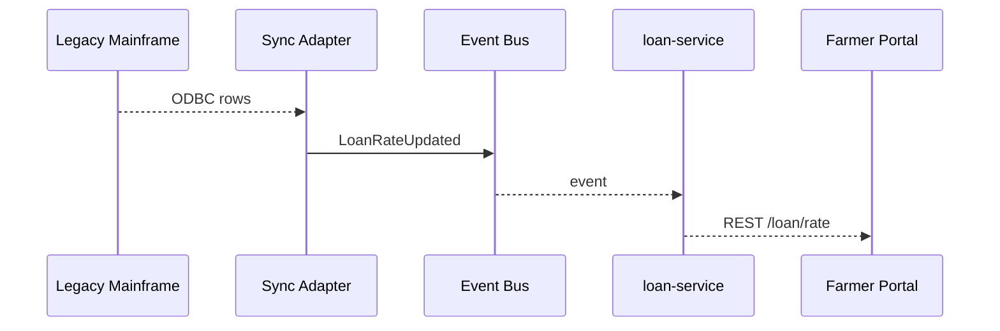

# Chapter 10: External System Synchronization Adapter  
*[Link back to Chapter&nbsp;9: ETL & Data Pipeline (HMS-ETL)](09_etl___data_pipeline__hms_etl__.md)*  

---

## 1. Why Do We Need a “Bilingual Interpreter” for Software?

Central use-case (2 sentences)  
• The **U.S. Department of Agriculture (USDA)** still calculates **farm-loan interest rates** on a 1980s COBOL mainframe.  
• A brand-new HMS portal promises farmers *instant* rate quotes—without forcing USDA to rewrite 2 million lines of COBOL.  

The **External System Synchronization Adapter (Sync Adapter)** is that bilingual interpreter.  
It sits between *legacy* platforms (COBOL, Oracle Forms, FTP folders) and shiny HMS micro-services, translating data **both ways** in near real-time so nothing gets “lost in translation.”

---

## 2. Key Concepts (Plain-English Cheat-Sheet)

| Travel Analogy | Sync Adapter Term | TL;DR for Beginners |
|----------------|-------------------|---------------------|
| Embassy | Adapter Process | Speaks *both* languages (legacy ⇄ HMS) |
| Passport Control | Mapping Rules | Convert field names & data types |
| Shuttle Bus | Transport | How data moves (ODBC, SFTP, REST) |
| Daily Flight | Polling | Adapter asks, “Anything new?” every N sec |
| Radio Alert | Push Event | Legacy system *notifies* adapter (webhook) |
| “Breaking News” Ticker | Debounce | Merge rapid fire updates into one |

Keep this table open—the rest of the chapter is just these six ideas in action!

---

## 3. 5-Minute Walk-Through

### Scenario: Sync Farm-Loan Rates Every Minute  

1. The COBOL mainframe keeps a table `RATE_TBL` with fields `LN_CD`, `INT_RT`, `EFF_DT`.  
2. HMS wants a JSON event `LoanRateUpdated` that looks like:

```json
{"code":"FARM_STD","rate":3.25,"effective":"2024-07-01"}
```

3. The Sync Adapter:  
   • **Polls** the mainframe every 60 s.  
   • Applies **mapping rules**.  
   • Publishes the event on the [Event Bus](08_event_bus___streaming_layer_.md).  
   • Optionally **writes back** any HMS-side overrides to the mainframe.

Let’s build it step-by-step—each file under 20 lines.

---

### 3.1 Declare the Mapping (10 lines)

`adapters/usda_rate.yaml`
```yaml
id: USDA_RATE_SYNC
transport:
  type: odbc
  dsn: "DSN=usda_cobol"
poll_every: "60s"
query: "SELECT LN_CD, INT_RT, EFF_DT FROM RATE_TBL"
mapping:
  LN_CD -> code
  INT_RT -> rate
  EFF_DT -> effective
publish_topic: "LoanRateUpdated"
```

Explanation  
• Think of this YAML as the “phrase book.”  
• `transport` tells the adapter **how** to talk to legacy; `mapping` tells it **what words to swap**.

---

### 3.2 Tiny Adapter Code (18 lines)

`sync_adapter/run.py`
```python
import yaml, pyodbc, json, time
from hms_bus import publish          # Chapter 8 helper

CFG = yaml.safe_load(open("usda_rate.yaml"))

def fetch_rows():
    conn = pyodbc.connect(CFG["transport"]["dsn"])
    cur = conn.cursor()
    return cur.execute(CFG["query"]).fetchall()

def translate(row):
    return {
        "code": row.LN_CD,
        "rate": float(row.INT_RT),
        "effective": row.EFF_DT.strftime("%Y-%m-%d")
    }

while True:
    for r in fetch_rows():
        publish(CFG["publish_topic"], translate(r))
    time.sleep(60)    # poll_every
```

What happens?  
1. Connects via ODBC to the COBOL DB.  
2. Runs the SQL, row by row converts to JSON.  
3. Calls `publish()`—the HMS Event Bus distributes to all subscribers.  
4. Sleeps 60 s and repeats.

---

### 3.3 Subscriber Side (for completeness)

```python
# loan_service/rate_listener.py  (≤ 15 lines)
from hms_bus import subscribe

@subscribe("LoanRateUpdated")
def update_cache(evt):
    cache["FARM_STD"] = evt.payload
```

Now the HMS portal shows fresh rates without ever touching COBOL!

---

## 4. Under the Hood—Step-By-Step



Only **5 participants**—simple to reason about and debug.

---

## 5. Peek Inside the Adapter Library (≤ 20 Lines Each)

### 5.1 Generic Engine — `hms_sync/engine.py`
```python
import importlib, yaml, time
from hms_bus import publish

def run(cfg_path):
    cfg = yaml.safe_load(open(cfg_path))
    mod = importlib.import_module(f"hms_sync.trans.{cfg['transport']['type']}")
    client = mod.Client(cfg["transport"])
    while True:
        rows = client.fetch(cfg["query"])
        for r in rows:
            evt = {dst: getattr(r, src) for src, dst in cfg["mapping"].items()}
            publish(cfg["publish_topic"], evt)
        time.sleep(_parse(cfg["poll_every"]))
```
Explanation  
• Transport-specific code lives in sub-modules (`trans.odbc`, `trans.sftp`, …).  
• Core engine is agnostic: **fetch → map → publish → sleep**.

### 5.2 ODBC Transport Stub — `hms_sync/trans/odbc.py`
```python
import pyodbc
class Client:
    def __init__(self, cfg):
        self.conn = pyodbc.connect(cfg["dsn"])
    def fetch(self, sql):
        return self.conn.cursor().execute(sql).fetchall()
```

Two tiny methods—easy to extend for Oracle, SAP, etc.

---

## 6. Safety Rails from Earlier Chapters

| Concern | How the Adapter Complies |
|---------|--------------------------|
| Governance (Ch 1) | Mapping YAML must be approved via Change Ticket. |
| Policy Engine (Ch 2) | PPE rule checks that *rate* ≤ 100 %. |
| Version & Rollback (Ch 3) | Mis-mapping? Point `current` back to last good YAML. |
| Security (Ch 4) | Adapter container has a Seal ID; ODBC credentials in Vault. |
| IAM (Ch 5) | Adapter JWT must include `scope:publish:LoanRateUpdated`. |
| Service Mesh (Ch 7) | Adapter publishes through sidecar → mTLS on the bus. |
| Observability (Ch 11) | Each poll logs row count & latency for auditors. |

You get all this “for free”—that’s HMS synergy!

---

## 7. Common Pitfalls & Quick Fixes

| Oops! | Why It Happens | Quick Fix |
|-------|----------------|----------|
| Duplicate events | Same row polled twice | Add `WHERE EFF_DT > :last_seen` in `query` or track row hash. |
| COBOL table locks up | Long-running query | Lower poll frequency or add DB index. |
| Field mismatch crash | Legacy column renamed | Version bump YAML, redeploy via Governance. |

---

## 8. Mini-Lab: Debounce a Noisy System

1. Add to YAML:  
   ```yaml
   debounce_ms: 500
   ```  
2. Modify engine loop:

```python
# inside while True loop
seen = set()
for r in rows:
    key = (r.LN_CD, r.INT_RT)
    if key in seen: continue      # <- debounced
    seen.add(key)
    publish(...)
```

3. Restart adapter, observe that rapid rate tweaks within 0.5 s are merged into one event.  
You just spared downstream services a flood of duplicates!

---

## 9. What You Learned

✓ Why legacy systems still matter and how the Sync Adapter bridges old & new.  
✓ Key ideas: mappings, polling, push events, debounce.  
✓ Built a full adapter in under 20 lines of code.  
✓ Saw the under-the-hood engine and ODBC transport.  
✓ Noted how HMS governance, security, and observability wrap the adapter.  

Ready to *watch* and *audit* all these sync events in one place?  
Jump to [Observability & Audit Log](11_observability___audit_log_.md).

---

---

Generated by [AI Codebase Knowledge Builder](https://github.com/The-Pocket/Tutorial-Codebase-Knowledge)