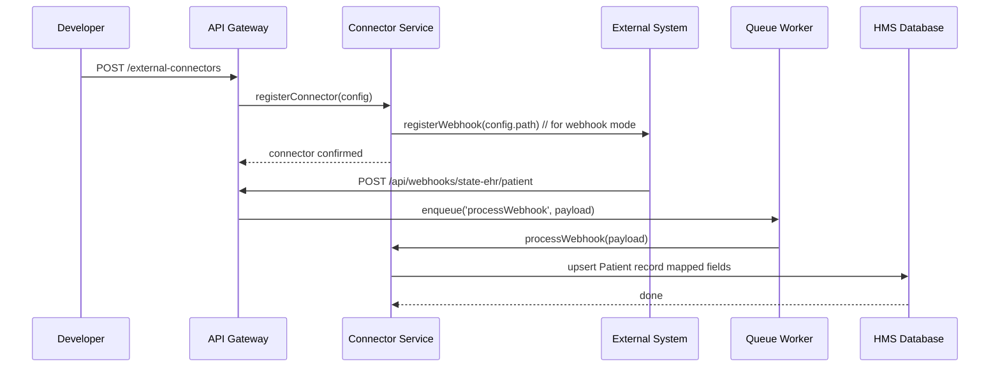

# Chapter 10: External System Synchronization

In [Chapter 9: Agent Integration Framework](09_agent_integration_framework_.md), we learned how HMS-API talks to AI and human agents on demand. Now we’ll see how HMS-API keeps itself in lock-step with outside platforms—like scheduling tools, FHIR health records, or payment gateways—so data flows automatically and in real time.

---

## 10.1 Why External System Synchronization?

**Use Case:**  
Your state’s public health office uses an external scheduling service for COVID vaccine appointments. When someone books or cancels in that service, HMS-API needs to reflect it immediately so caseworkers can prepare doses and notify citizens. Likewise, when HMS-API updates a patient’s record (e.g., after a shot), the external EHR must stay current.

Without a synchronization layer, you’d write one-off scripts or manual CSV imports. With External System Synchronization, you configure a connector once—HMS-API handles authentication, format translation, and update triggers so both systems stay aligned automatically.

---

## 10.2 Key Concepts

1. **Connector**  
   Represents an external platform (name, type, endpoint, credentials).

2. **Authentication**  
   How HMS-API logs in—API key, OAuth2 client, or signed webhook secret.

3. **Data Mapping**  
   Defines which resource (e.g., Patient, Appointment) goes where and how fields translate (HMS → FHIR, JSON → XML).

4. **Triggers**  
   - **Webhooks:** External system pushes changes to HMS.  
   - **Polling Jobs:** HMS polls an API at intervals.  
   - **Message Queues:** Pub/sub streams events (e.g., via Kafka, RabbitMQ).

5. **Sync Status**  
   Tracks last sync time, errors, and queued updates so you can monitor health of each connector.

> Analogy: Think of this as a “diplomatic liaison office.” You register each foreign embassy (external system) with its language (format) and passport rules (auth). Then you set up couriers (webhooks, polling) to carry updates back and forth.

---

## 10.3 How to Use External System Synchronization

### 10.3.1 Register a Connector

```http
POST /api/external-connectors
Content-Type: application/json

{
  "name": "StateEHR",
  "type": "FHIR",
  "endpoint": "https://stateehr.gov/fhir/Patient",
  "auth": {
    "scheme": "OAuth2",
    "clientId": "ABC123",
    "clientSecret": "SECRET"
  },
  "sync": {
    "mode": "webhook",
    "path": "/api/webhooks/state-ehr/patient"
  },
  "mapping": { "hmsPatientId": "id", "hmsName": "name" }
}
```
**What happens:**  
- HMS-API saves the connector config.  
- If using OAuth2, it fetches an access token.  
- If using webhooks, it registers your `/api/webhooks/...` URL with the external system.

```json
{
  "connectorId": "conn_001",
  "name": "StateEHR",
  "status": "connected"
}
```

### 10.3.2 View All Connectors

```http
GET /api/external-connectors
```
```json
[
  { "connectorId": "conn_001", "name": "StateEHR", "status": "connected" },
  { "connectorId": "conn_002", "name": "StripePayments", "status": "error" }
]
```

### 10.3.3 Trigger a Manual Sync

```http
POST /api/external-connectors/conn_001/sync
```
```json
{ "status": "sync_started", "startedAt": "2024-06-15T12:00Z" }
```

This will queue a full pull or re-send missed webhooks.

---

## 10.4 What Happens Under the Hood?



1. **Register:** HMS-API configures authentication and webhooks or polling schedule.  
2. **Event:** External system sends a webhook or HMS polls on a timer.  
3. **Queue:** A worker picks up the event or fetch result.  
4. **Process:** Connector Service translates and writes data into HMS Database.

---

## 10.5 Internal Implementation

### models/external_connector_model.js

```js
// models/external_connector_model.js
class ExternalConnector {
  constructor(data) { Object.assign(this, data); }

  static async create(config) {
    // save to DB, handle OAuth handshake if needed
    const saved = await db.insert('connectors', config);
    return new ExternalConnector(saved);
  }
}
module.exports = ExternalConnector;
```
*Represents each connector and stores its config and status.*

### services/connectorService.js

```js
// services/connectorService.js
async function registerConnector(cfg) {
  // 1. save config
  const conn = await ExternalConnector.create(cfg);
  // 2. if webhook, call external API to subscribe
  if (cfg.sync.mode === 'webhook') {
    await fetch(cfg.endpoint + '/subscribe', { /* secret header */ });
  }
  return conn;
}

async function processWebhook(payload) {
  // Translate fields based on mapping
  const mapped = mapFields(payload, payload.connector.mapping);
  // Upsert into local HMS table
  await db.upsert('patients', mapped);
}
module.exports = { registerConnector, processWebhook };
```
*Handles registration and incoming data processing.*

### controllers/externalConnectorController.js

```js
// controllers/externalConnectorController.js
const express = require('express');
const { registerConnector } = require('../services/connectorService');
const router = express.Router();

router.post('/', async (req, res) => {
  const conn = await registerConnector(req.body);
  res.status(201).json(conn);
});

module.exports = router;
```
*Exposes the HTTP endpoint to register connectors.*

---

## Conclusion

You’ve learned how **External System Synchronization** lets HMS-API act as a diplomatic liaison—registering connectors, managing auth, translating formats, and reacting to real-time events so third-party tools (scheduling, health records, payments) stay in sync with HMS.  

Next up: deep-dive into batch reporting and analytics!

---

Generated by [AI Codebase Knowledge Builder](https://github.com/The-Pocket/Tutorial-Codebase-Knowledge)