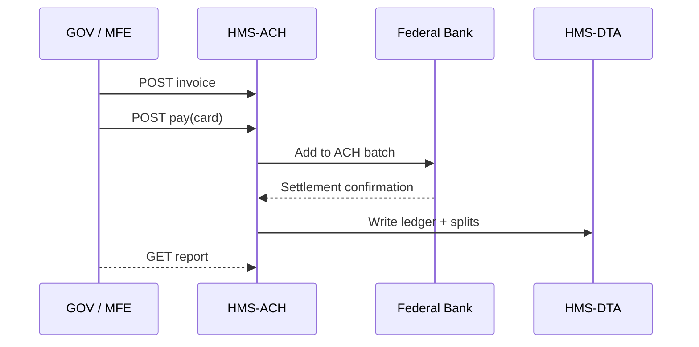

# Chapter 10: Financial Transaction System (HMS-ACH)

*[Jump back to Chapter 9: Codified Democracy Foundation Engine (HMS-CDF)](09_codified_democracy_foundation_engine__hms_cdf__.md)*  

---

## 1. Why Do We Need HMS-ACH?

Use-case story:

> The **National Park Service** approves a $750 “Special Event Permit” so a film crew can shoot at the Grand Canyon.  
> • The fee must be collected from the producer’s credit card.  
> • 80 % goes to the park’s maintenance fund, 20 % goes to the U.S. Treasury.  
> • The receipt, split, and audit trail must be visible to inspectors, and the money has to settle in the right accounts—no missing pennies.

Without automation, accountants swap spreadsheets and manually wire money every Friday.  
**HMS-ACH** is the **treasury desk** for the whole platform: it receives charges, routes funds, and produces an iron-clad ledger that satisfies every federal finance audit.

---

## 2. Key Concepts in Plain English

| Term | Plain-English Analogy |
|------|-----------------------|
| **Ledger** | The agency’s checkbook—every debit and credit line item. |
| **ACH Batch** | A sealed envelope of many payments sent to the bank at once. |
| **Funding Source** | Which pocket the money comes from (visa card, grant account, etc.). |
| **Disbursement Rule** | The recipe for splitting money (“80 % park, 20 % Treasury”). |
| **Reconciliation Report** | End-of-day print-out that proves the checkbook matches the bank. |

---

## 3. A 4-Step Beginner Demo

Below we:  
1. Create a permit fee invoice.  
2. Charge the card.  
3. Auto-split the funds.  
4. Fetch the reconciliation report.

### 3.1 Create an Invoice

```python
# step1_create_invoice.py  (≤15 lines)
import httpx, json
invoice = httpx.post(
  "/api/ach/invoices",
  json={ "amount": 75000, "currency": "USD", "purpose": "NPS Film Permit" }
).json()
print(invoice)
# → {'id':'INV-9001','status':'PENDING'}
```

### 3.2 Collect Payment

```python
# step2_pay.py
httpx.post(f"/api/ach/invoices/{invoice['id']}/pay",
           json={ "cardToken": "tok_visa_123" })
# ACH flips status → PAID  (checked in next call)
```

### 3.3 Auto-Split Funds

```bash
curl /api/ach/invoices/INV-9001/splits
# → [
#   {"fund":"NPS_MAINT","amount":60000},
#   {"fund":"TREASURY_GEN","amount":15000}
# ]
```

### 3.4 Get Reconciliation Report

```bash
curl /api/ach/reports/today
# → { "totalIn":75000, "totalOut":75000, "batches":1, "status":"BALANCED" }
```

Done! Money moved, every cent tracked.

---

## 4. What Happens Behind the Curtain?



Step-by-step (human words):

1. The UI asks ACH to create an invoice and later to charge a card.  
2. ACH inserts a **ledger entry** and queues the charge in the next **ACH Batch**.  
3. Overnight the batch is transmitted to the **Federal Bank**; confirmation returns.  
4. ACH executes **Disbursement Rules**, writes final lines to [Central Data Repository (HMS-DTA)](07_central_data_repository__hms_dta__.md).  
5. Reports read straight from this immutable ledger.

---

## 5. Internals in Tiny Code

### 5.1 Ledger Table (SQL, 10 lines)

```sql
CREATE TABLE ledger (
  id        SERIAL,
  invoice   TEXT,
  fund      TEXT,
  debit     INT,   -- cents
  credit    INT,   -- cents
  ts        TIMESTAMP DEFAULT now(),
  UNIQUE(invoice, fund, debit, credit, ts)
);
```

Every money movement is one row; `credit` or `debit` is zero.

### 5.2 Route: Pay Invoice (Node, 18 lines)

```js
// services/ach/pay.js
router.post('/:id/pay', async (req,res)=>{
  const inv = await Invoices.find(req.params.id);
  if (inv.status !== 'PENDING') return res.status(409).send('paid');
  await Bank.charge(req.body.cardToken, inv.amount);      // external SDK
  await Splits.apply(inv);                                // 80/20 rule
  await Ledger.record(inv);                               // writes rows
  await Invoices.update(inv.id, { status:'PAID' });
  res.sendStatus(200);
});
```

Explanation:  
1. Guard double-payment.  
2. Charge card.  
3. Run `Splits.apply` which calculates fund lines.  
4. Write ledger rows.  
5. Mark invoice **PAID**.

### 5.3 Splits.apply (Python-style, 12 lines)

```python
def apply(inv):
    rule = get_rule(inv.purpose)        # returns {'NPS_MAINT':0.8,'TREASURY_GEN':0.2}
    for fund, pct in rule.items():
        Ledger.insert(invoice=inv.id, fund=fund,
                      debit=0, credit=int(inv.amount*pct))
```

Tiny but powerful—keeps the math centralized.

---

## 6. Talking to Other Layers

| Layer | How It Touches ACH |
|-------|--------------------|
| [HMS-GOV](01_governance_layer___admin_portal__hms_gov__.md) | Shows invoices, approvals, and reports. |
| [HMS-AGX](02_ai_representative_agent__hms_agx__.md) | Generates grant-disbursement tasks that call `/invoices` and `/pay`. |
| [HITL](03_human_in_the_loop__hitl__oversight_.md) | Adds a **HumanApproval** gate for transfers over $1 M. |
| [HMS-ACT](06_agent_orchestration_engine__hms_act__.md) | Inserts `ach.pay` steps in multi-stage workflows. |
| [HMS-OPS](12_operational_monitoring___logging__hms_ops__.md) | Monitors batch success & ledger integrity. |

---

## 7. Frequently Asked Questions

**Q: What if a card fails?**  
ACH marks the invoice **FAILED** and publishes `ach.payment.failed` so notifications or AGX can retry or alert a human.

**Q: Can I add custom split formulas?**  
Yes—create a JSON rule in `config/splits.json`; ACH reloads rules without a restart.

**Q: How is federal compliance (FMS, USSGL) handled?**  
Each ledger row carries USSGL account codes; nightly ETL exports rows to agency financial systems.

---

## 8. What You Learned

• HMS-ACH is the **money mover**: collects payments, applies split rules, writes an immutable ledger, and reconciles with the bank.  
• You created and paid an invoice in <20 lines of code, then retrieved a balanced report.  
• Under the hood, small routes, a simple ledger table, and batch files keep every cent traceable.

Ready to see how these payments can power an open **Marketplace** for third-party apps and data sets?  
Continue to [Marketplace Service (HMS-MKT)](11_marketplace_service__hms_mkt__.md).

---

Generated by [AI Codebase Knowledge Builder](https://github.com/The-Pocket/Tutorial-Codebase-Knowledge)