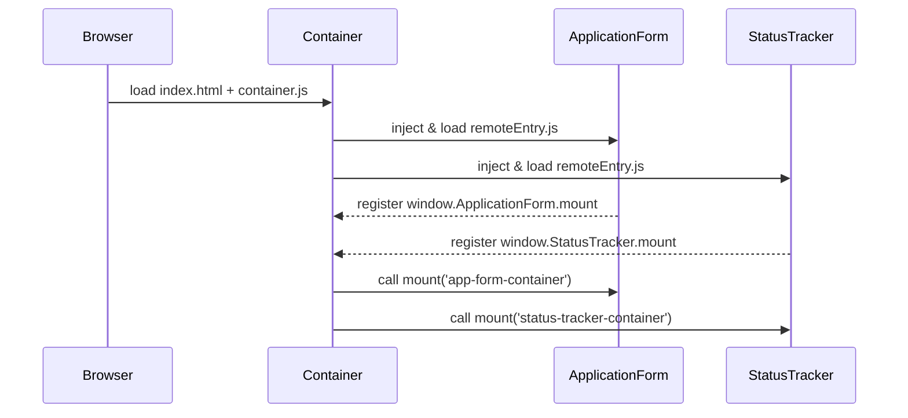

# Chapter 10: Frontend Micro‐Frontend (MFE)

Building on our work with the [Interface Layer](09_interface_layer_.md), we now split our UI into self-contained, independently deployable pieces called **Micro-Frontends (MFEs)**. Just like different departments in a city hall share the same signage style but run their own counters, MFEs let us stitch together bits of the UI—forms, dashboards, widgets—while keeping each part simple and reusable.

---

## 1. Why We Need Micro-Frontends

Imagine a federal citizen portal where:

- The **public** submits benefit applications (form inputs, status tracker).  
- The **back-office** reviews submissions (approval panels, analytics).  
- The **audit team** examines logs of user actions.

If all these screens live in one big codebase, every small change risks affecting everything else. MFEs solve this by letting teams build and deploy UI pieces in isolation, yet assemble them at runtime into a cohesive interface.

Benefits:
1. **Independent Deployments**  
   Each feature team can ship updates without rebuilding the entire portal.  
2. **Consistent Look & Feel**  
   A shared design system (our “standardized signage”) ensures buttons, colors, and layouts match.  
3. **Faster Development**  
   Teams can work in parallel—one on the status tracker, another on the analytics widget—without merge conflicts.

---

## 2. Key Concepts

1. **Container App**  
   The shell that loads and displays all MFEs (like the lobby of city hall).  
2. **Remote App (MFE)**  
   A self-contained UI module (e.g., “ApplicationForm” MFE).  
3. **Registration**  
   How the container knows which remotes to load (their URLs and mount points).  
4. **Mount Function**  
   A small entry point in each MFE that attaches its UI into the container’s DOM.  
5. **Shared Libraries**  
   Common dependencies (e.g., React) that we don’t bundle multiple times, saving download size.

---

## 3. Using MFEs to Solve Our Use Case

### 3.1 Registering Remotes

In the **Container App**, we keep a list of MFEs:

```javascript
// container-config.js
export const remotes = [
  {
    name: 'ApplicationForm',
    url: 'https://forms.gov/appForm/remoteEntry.js',
    mountPoint: 'app-form-container'
  },
  {
    name: 'StatusTracker',
    url: 'https://status.gov/track/remoteEntry.js',
    mountPoint: 'status-tracker-container'
  }
];
```
This tells our container:
- **where** to fetch each MFE (`url`),  
- **what** DOM node to render it into (`mountPoint`).

### 3.2 Dynamically Loading and Mounting

```javascript
// container.js
import { remotes } from './container-config';

async function loadAndMount(remote) {
  // 1) Load the remote entry script
  await new Promise(r => {
    const s = document.createElement('script');
    s.src = remote.url; s.onload = r;
    document.head.appendChild(s);
  });
  // 2) Call its global mount function
  window[remote.name].mount(remote.mountPoint);
}

// Kick off all MFEs
remotes.forEach(loadAndMount);
```

Explanation:
1. We inject the remote’s script tag at runtime.  
2. Once loaded, we assume it registers itself under `window[remote.name]`.  
3. We call its `.mount()` with the ID of our container div.

### 3.3 Example Container HTML

```html
<!-- index.html of Container App -->
<div id="app-form-container"></div>
<div id="status-tracker-container"></div>
<script src="container.js"></script>
```

Explanation: The two empty `<div>`s are placeholders. When `container.js` runs, each MFE plugs itself into the right spot.

---

## 4. What Happens Under the Hood?



1. **Container** fetches its HTML and JS.  
2. It **injects** each remote’s entry script.  
3. Each MFE registers a global `mount` function.  
4. The container **calls** `.mount()` to render each widget.

---

## 5. Inside a Remote App (MFE)

### 5.1 Non-Code Walkthrough
1. **Bundle**: The MFE is built separately (e.g., via Webpack Module Federation or Rollup).  
2. **Expose**: It exposes a small API—usually a `mount` and `unmount` function.  
3. **Bootstrap**: When `remoteEntry.js` loads, it sets up React (or your framework) and waits to be mounted.  

### 5.2 Minimal MFE Code

```javascript
// mfe-entry.js (built into remoteEntry.js)
import React from 'react';
import ReactDOM from 'react-dom';
import App from './App';

window.ApplicationForm = {
  mount: (containerId) => {
    ReactDOM.render(<App />, document.getElementById(containerId));
  },
  unmount: (containerId) => {
    ReactDOM.unmountComponentAtNode(document.getElementById(containerId));
  }
};
```

Explanation:
- We attach an object to `window` named `ApplicationForm`.  
- Its `mount` method knows how to render our React `<App />` into a given DOM node.  
- We also provide `unmount` to clean up if needed.

---

## 6. Summary & Next Steps

In this chapter, you learned how **Micro-Frontends** let teams build and ship UI components independently:

- We defined a **Container App** that dynamically loads and mounts remote MFEs.  
- We saw how a **Remote App** exposes `mount`/`unmount` functions.  
- We walked through the **runtime sequence** that brings each piece together.

Next up, we’ll explore how administrators use these MFEs in the [Admin/Gov Portal](11_admin_gov_portal_.md), customizing dashboards and controls for policy managers.

---

Generated by [AI Codebase Knowledge Builder](https://github.com/The-Pocket/Tutorial-Codebase-Knowledge)