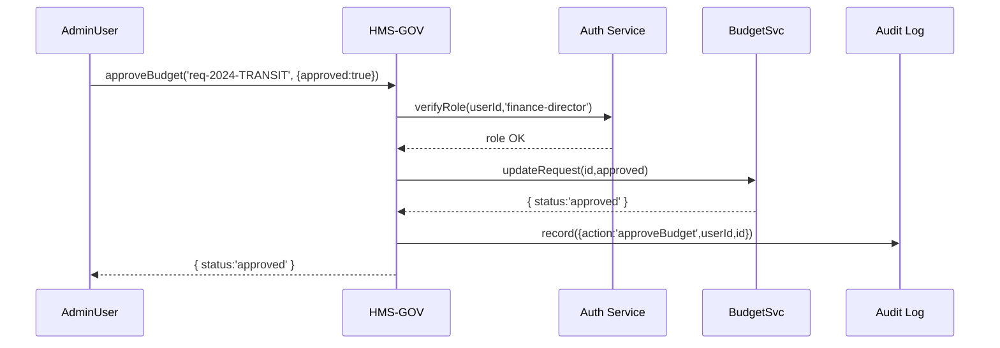

# Chapter 10: Government Admin Portal (HMS-GOV)

Welcome back! In [Chapter 9: Policy Management Module (HMS-Policy)](09_policy_management_module__hms_policy__.md) we learned how to draft, version, review, and publish policies. Now we bring it all together in the **Government Admin Portal (HMS-GOV)**—the “mayor’s office dashboard” where decision-makers review AI proposals, tweak policies, approve budgets, and issue directives in one place.

## 1. Why a Government Admin Portal?

Imagine the Mayor’s Office Dashboard:

- The policy team sees pending AI-generated rule changes.  
- The finance director reviews department budget requests.  
- The chief of staff issues high-level directives to various agencies.  

Without a single cockpit, they’d juggle spreadsheets, emails, and multiple apps. **HMS-GOV** solves that by unifying performance metrics, policy edits, budget approvals, and audit logs—all with secure, role-based access.

### Concrete Example: Approving a New Transit Policy

1. An AI agent proposes lowering bus fares during off-peak hours.  
2. The policy analyst loads that proposal in HMS-GOV.  
3. They adjust parameters (e.g., 20% discount → 15%).  
4. They click “Publish”—and the change goes live after audit logging.  
5. Simultaneously, the finance director sees the projected revenue impact and signs off on the budget.

## 2. Key Concepts

1. **Dashboard**  
   Central UI showing metrics (ridership, revenue, policy changes).  
2. **Role-Based Access**  
   Only users with `role=policy-analyst` or `role=finance` see certain panels.  
3. **Policy Adjustment**  
   Inline editing of rules from [HMS-Policy](09_policy_management_module__hms_policy__.md).  
4. **Budget Approval**  
   Reviewing and signing off on department spending requests.  
5. **Audit Logging**  
   Every high-level action (approve, publish, directive) is recorded immutably.

## 3. Using HMS-GOV in Your Code

Below is a minimal example of wiring up the portal in a Node.js service.

```javascript
// file: gov-portal/app.js
const gov = require('hms-gov').init({ serviceName: 'GovPortal' })

// 1) When admin logs in, check their role
gov.onLogin(async (user) => {
  await gov.checkRole(user.id, ['policy-analyst','finance-director'])
  gov.showDashboard()
})

// 2) Approve a budget request
async function signOffBudget(requestId) {
  const result = await gov.approveBudget(requestId, { approved: true })
  console.log('Budget status:', result.status)
}

signOffBudget('req-2024-TRANSIT')
```

Explanation:

- `init()` wires in authentication, UI setup, audit logger.  
- `onLogin` ensures only permitted roles see the admin dashboard.  
- `approveBudget` calls into HMS-SVC to update budget status and writes an audit record.

## 4. Step-by-Step Workflow

Here’s what happens when an admin clicks “Approve Budget”:



1. **Role Check**: Ensures the admin can perform this action.  
2. **Budget Update**: Calls the Finance Service (see [HMS-SVC](02_backend_microservices_layer__hms_svc__.md)).  
3. **Audit Log**: Records the action with timestamp and user.  
4. **UI Update**: Returns the new budget status to the portal.

## 5. Under the Hood: Core Implementation

Let’s peek at a simplified slice of `hms-gov` internals.

```javascript
// file: hms-gov/core.js
const auth = require('hms-sys').init()       // [Core Infrastructure](01_core_infrastructure__hms_sys__.md)
const bus  = require('hms-sys').init()

exports.init = ({ serviceName }) => {
  return {
    onLogin: (fn) => {/* attach login hook */},
    checkRole: (userId, roles) =>
      auth.auth.checkRoles(userId, roles),
    showDashboard: () => {/* render metrics and panels */},
    approveBudget: async (id, opts) => {
      // 1) Send command to Budget Service
      await bus.publish('budget.approve', { id, ...opts })
      // 2) Log audit entry
      await bus.publish('audit.log', { serviceName, action:'approveBudget', id })
      return { status: opts.approved ? 'approved':'denied' }
    }
  }
}
```

Explanation:

- Uses **HMS-SYS** for auth and messaging.  
- `approveBudget` publishes to two topics: one for the finance logic, one for the audit trail.  
- Downstream services (e.g., `BudgetSvc`) consume these messages.

## 6. Summary

In this chapter you learned how **Government Admin Portal (HMS-GOV)**:

- Provides a unified dashboard for policy review, budget approvals, and directives.  
- Enforces role-based access and logs every decision.  
- Integrates with core auth, messaging ([Chapter 1: HMS-SYS](01_core_infrastructure__hms_sys__.md)), finance services ([Chapter 2: HMS-SVC](02_backend_microservices_layer__hms_svc__.md)), and policy management ([Chapter 9: HMS-Policy](09_policy_management_module__hms_policy__.md)).  

Up next, we’ll explore how to add **Human-in-the-Loop Oversight** so experts can step in at critical points.  
[Chapter 11: Human-in-the-Loop Oversight](11_human_in_the_loop_oversight_.md)

---

Generated by [AI Codebase Knowledge Builder](https://github.com/The-Pocket/Tutorial-Codebase-Knowledge)