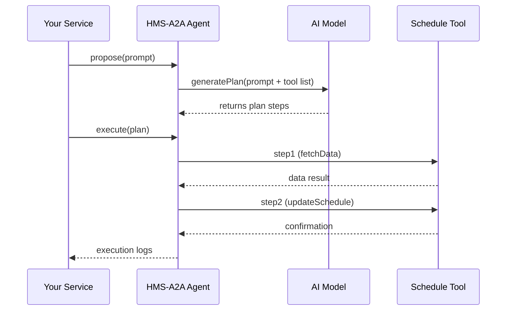

# Chapter 10: HMS-A2A AI Agent Framework

Welcome back! In [Chapter 9: HMS-ACH Financial Processing](09_hms_ach_financial_processing_.md) you learned how to disburse funds securely. Now we’ll meet the “expert consultant” in our architecture: **HMS-A2A**, the AI Agent Framework that proposes improvements, optimizes workflows, and even automates updates—while keeping humans in the loop.

---

## 1. Motivation & Central Use Case

Imagine the **Child Support Office** wants to speed up application processing:

- They have data on how long each application takes.  
- They manually shuffle staff schedules to handle peaks, but it’s slow and error-prone.  
- They wish for an “AI consultant” that can analyze last month’s data, suggest a better staffing plan, and even update the scheduling system automatically.

Enter **HMS-A2A**. It’s your programmable AI brain. You feed it data, and it will:

1. Propose a step-by-step improvement plan (e.g., “Add one caseworker on Mondays”).  
2. Show you the plan for review (transparency & human oversight).  
3. Execute approved steps by calling backend services.

Let’s see how to build this AI Agent in minutes.

---

## 2. Key Concepts

1. **Agent**  
   The core object you configure with a name, an LLM, and a set of “tools” (APIs it can call).

2. **Tools**  
   Pre-registered functions that the agent can invoke (e.g., `fetchData()`, `updateSchedule()`).

3. **Plan**  
   A JSON array of ordered steps that the AI generates.

4. **Executor**  
   Runs each plan step by calling the matching tool.

5. **Human Oversight & Transparency**  
   Every plan and execution log is stored so that an official can review or override decisions.

---

## 3. Using HMS-A2A to Solve the Use Case

Below is a minimal example of defining and running an AI Agent to optimize staffing.  

```js
// src/agents/childSupportAgent.js
import { AIAgent } from 'hms-a2a-agent';
import { fetchData, updateSchedule } from '../tools/scheduleTools';

// 1. Create the agent
const agent = new AIAgent({
  name: 'ChildSupportOptimizer',
  llmApiKey: process.env.LLM_KEY,
  tools: { fetchData, updateSchedule }
});

// 2. Propose an improvement plan
const plan = await agent.propose('analyze and optimize last month’s workload');
// plan = [ { tool: 'fetchData', args:{month:'2023-05'} }, ... ]

// 3. (Optional) Review plan in your UI, then execute
await agent.execute(plan);
console.log('Schedule updated successfully');
```

- `propose()` sends a prompt to the AI model to generate a plan.  
- `plan` is a list of steps like `{ tool: "updateSchedule", args: {...} }`.  
- `execute()` runs each step in order, calling your tools.

---

## 4. What Happens Under the Hood



1. **propose()** packages your prompt and known tools, calls the LLM, and returns a plan.  
2. **execute()** loops through each step, finds the matching tool function, and awaits its result.  
3. All actions and responses are logged for audit and review.

---

## 5. Inside HMS-A2A: Core Implementation

### a) AIAgent Class

File: `hms-a2a-agent/src/AIAgent.js`
```js
export class AIAgent {
  constructor({ name, llmApiKey, tools }) {
    this.name = name;
    this.llmKey = llmApiKey;
    this.tools = tools;
  }

  async propose(prompt) {
    // Send prompt + tool schema to AI model
    const response = await callLLM(this.llmKey, buildPrompt(prompt, this.tools));
    return parsePlan(response);
  }

  async execute(plan) {
    for (const step of plan) {
      const fn = this.tools[step.tool];
      if (!fn) throw new Error(`Unknown tool: ${step.tool}`);
      await fn(step.args);
      // Log each execution for transparency
      Logger.log({ agent: this.name, step });
    }
  }
}
```

- `propose()` builds a prompt that describes available tools and user request.  
- `execute()` finds and calls each tool function, logging every step.

### b) Tool Definition

File: `src/tools/scheduleTools.js`
```js
// Fetch processed application counts by day
export async function fetchData({ month }) {
  // Imagine calling your data API
  return await axios.get(`/api/stats?month=${month}`);
}

// Update staffing schedule
export async function updateSchedule({ day, extraWorkers }) {
  return await axios.post('/api/schedule', { day, extraWorkers });
}
```

Tools are just async functions you register; the agent can call any of them.

---

## 6. Human-in-the-Loop & Transparency

Every plan and execution step is saved:

- Before running, you can show the plan in a UI for approval.  
- After running, logs include timestamps, inputs, and outputs.  
- Auditors can replay or review decisions.

This ensures trust and accountability in government operations.

---

## 7. What You’ve Learned

- **Why** HMS-A2A lets you treat an AI model as an “expert consultant” that suggests and automates process improvements.  
- **How** to configure an `AIAgent` with tools, call `propose()`, review a plan, then `execute()`.  
- **What** happens behind the scenes: the prompt to the AI, plan parsing, step-by-step tool invocation, and logging.  
- **How** human oversight and transparent logs keep everything compliant.

Up next, we’ll see how to keep our data in sync with external partners in  
[Chapter 11: External System Sync](11_external_system_sync_.md).

---

Generated by [AI Codebase Knowledge Builder](https://github.com/The-Pocket/Tutorial-Codebase-Knowledge)