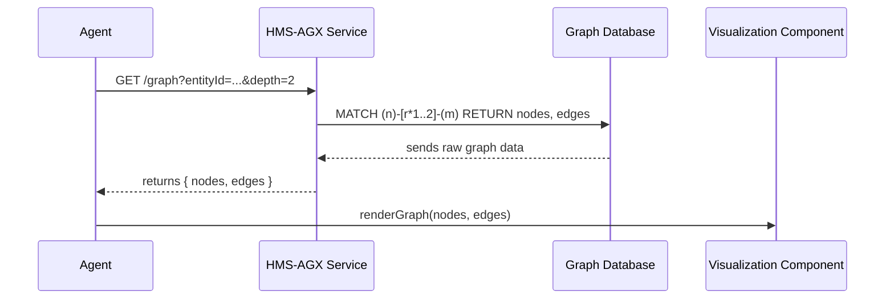

# Chapter 10: HMS-AGX (Knowledge Graph)

In [Chapter 9: AI Agent](09_ai_agent_.md) you learned how an AI Agent gathers data and makes recommendations. Sometimes agents need **richer context**—links between statutes, precedents, expert analyses—to draft legislation or explain decisions. That’s where **HMS-AGX** comes in.

---

## 1. Motivation & Central Use Case

**Problem:** When drafting or reviewing policy, you often ask “What related statutes and past decisions apply?” Manually tracking those links is time-consuming and error-prone.

**Use Case Example:**  
An AI Agent is drafting a “No Poverty” amendment. It calls HMS-AGX to:
1. Find the original statute (e.g., Title 42, Section 113).
2. Discover related case law and expert commentary.
3. Visualize how these entities connect.
4. Cite a path—statute → court precedent → policy analysis—for full traceability.

With that graph, the agent can draft precise language and show reviewers exactly **why** each source applies.

---

## 2. Key Concepts

1. **Entity**  
   A node in the graph (e.g., a statute, a court decision, an analysis).

2. **Relationship**  
   A directed edge linking two entities (e.g., “cited by”, “amends”, “analyzed in”).

3. **Graph Query**  
   A request like “Give me all neighbors of Section 113 up to depth 2”.

4. **Visualization**  
   Rendering nodes and edges so humans see the web of knowledge.

5. **Traceability Path**  
   A chain of entities and relationships that explains how you arrived at a conclusion.

---

## 3. Using HMS-AGX to Explore a Knowledge Graph

### 3.1 Initialize the AGX Client

```js
// src/client/agxClient.js
import axios from 'axios'

export const agxClient = axios.create({
  baseURL: process.env.AGX_API_URL
})
```

This sets up a simple HTTP client to talk to HMS-AGX.  

### 3.2 Fetch a Policy Graph

```js
// in some agent code
const response = await agxClient.get('/graph', {
  params: { entityType: 'policy', entityId: 'no-poverty-2024', depth: 2 }
})
const { nodes, edges } = response.data
```

Here we ask AGX: “Starting from policy `no-poverty-2024`, show me connected entities up to two hops.” We get back `nodes` (entities) and `edges` (relationships).  

### 3.3 Visualize the Graph

```js
// simple render in an HTML canvas (pseudocode)
renderGraph('#canvas', nodes, edges)
```

A helper like `renderGraph` draws nodes and arrows. Reviewers can hover on a node to see full metadata (statute text, court summary, etc.).

---

## 4. What Happens Under the Hood



1. **Agent** calls `/graph`.  
2. **AGX** runs a graph database query (e.g., Neo4j).  
3. DB returns matching nodes/edges.  
4. **AGX** packages them and sends them back.  
5. **Agent/UI** renders the result.

---

## 5. Internal Implementation

### 5.1 File Structure

```
hms-agx/
└── src/
    ├── client/
    │   └── agxClient.js
    ├── services/
    │   └── graphService.js
    ├── controllers/
    │   └── graphController.js
    └── db/
        └── graphDb.js
```

### 5.2 Controller Layer

```js
// src/controllers/graphController.js
import { buildGraph } from '../services/graphService'

export async function getGraph(req, res) {
  const { entityType, entityId, depth } = req.query
  const graph = await buildGraph(entityType, entityId, parseInt(depth))
  res.json(graph)
}
```

The controller parses query params and calls the service.  

### 5.3 Service Layer

```js
// src/services/graphService.js
import { queryGraph } from '../db/graphDb'

export async function buildGraph(type, id, depth) {
  // 1. Ask the DB for nodes/edges
  const { nodes, edges } = await queryGraph(type, id, depth)
  // 2. Optionally enrich nodes with metadata
  return { nodes, edges }
}
```

The service delegates to the DB and could add extra annotations if needed.  

### 5.4 Graph Database Access

```js
// src/db/graphDb.js
export async function queryGraph(type, id, depth) {
  // Pseudo-code for a Neo4j query
  const cypher = `
    MATCH (start:${type} {id:$id})
    CALL apoc.path.subgraphAll(start, {maxLevel:$depth})
    YIELD nodes, relationships
    RETURN nodes, relationships
  `
  // Imagine runCypher returns raw node/edge arrays
  return runCypher(cypher, { id, depth })
}
```

Here we use a single Cypher call to get a subgraph around our start node.  

---

## 6. Conclusion & Next Steps

In this chapter you learned how **HMS-AGX** builds and explores a structured “legislative library” linking statutes, precedents, and analyses. You saw how to:

- Initialize a client and call `/graph`  
- Receive and render nodes and edges  
- Peek under the hood at controller, service, and graph-DB queries  

With this knowledge graph, agents can draft legislation or explain decisions with full traceability. 

Up next, we’ll cover tenant-level settings and configurations in [Chapter 11: Tenant Management](11_tenant_management_.md).

---

Generated by [AI Codebase Knowledge Builder](https://github.com/The-Pocket/Tutorial-Codebase-Knowledge)