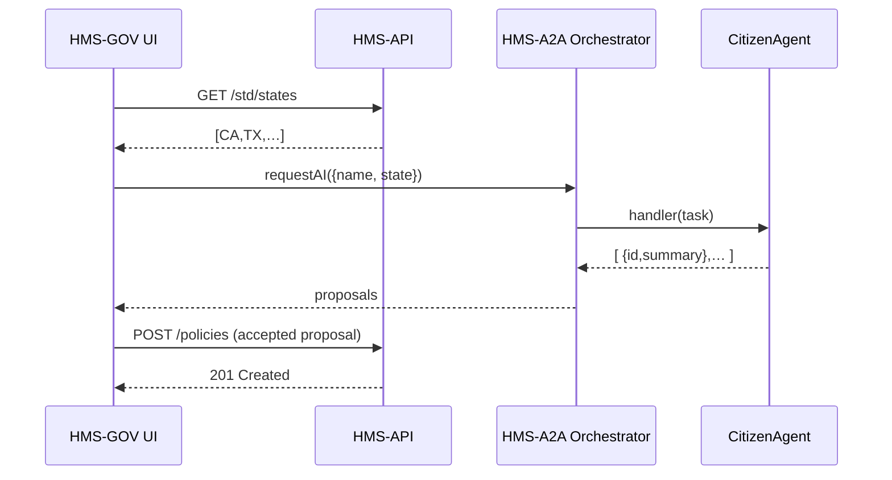

# Chapter 10: HMS-GOV (Admin Frontend)

In [Chapter 9: HMS-A2A (Agent-to-Agent System)](09_hms_a2a__agent_to_agent_system__.md) we saw how agents coordinate behind the scenes. Now we’ll build **HMS-GOV**, the Vue.js-based “governor’s office” dashboard where policy-makers and agency admins draft, review, and publish legislation or program settings.

---

## 1. Motivation: Why HMS-GOV?

Imagine you’re the director of the Housing Assistance program. You need to:

1. Draft a new policy for emergency rent relief.  
2. Get AI agent proposals on eligibility rules.  
3. Review, tweak, and apply your final approval.  
4. Publish the new configuration so citizen portals update instantly.

**HMS-GOV** is your one-stop control center. It connects to [HMS-API (Backend API)](06_hms_api__backend_api__.md), shows forms, policy editors, AI suggestions from HMS-A2A, and lets you override or accept before deploying.

---

## 2. Key Concepts

1. **Vue.js Frontend**  
   A SPA (single-page app) built with Vue that loads admin modules.

2. **Components**  
   - `input-line`: a text input with label  
   - `dropdown-modern`: a styled select box  
   - `v-tag-light`: light tags for status or labels  
   - `v-block-base` / `slider-base`: containers and sliders

3. **AI Proposals Panel**  
   Shows HITL suggestions from agents—admins can accept or override.

4. **Publish Workflow**  
   After review, click “Publish” to push new policy via [HMS-API](06_hms_api__backend_api__.md).

---

## 3. Getting Started: Project Setup

1. Create a new Vue project or use the HMS-GOV boilerplate.  
2. Install dependencies:
   ```bash
   npm install vue axios vue-router
   ```
3. In `main.js`, configure your base API URL:
   ```js
   import Vue from 'vue'
   import App from './App.vue'
   import router from './router'
   import axios from 'axios'

   axios.defaults.baseURL = 'https://hhs.us.gov-ai.co/api'
   new Vue({ router, render: h => h(App) }).$mount('#app')
   ```
   *This tells HMS-GOV where to send API calls.*

---

## 4. Building the Policy Editor

### 4.1 Draft Form

Create `components/PolicyForm.vue`:

```html
<template>
  <v-block-base>
    <h2>New Policy</h2>
    <input-line v-model="policy.name" label="Policy Name"/>
    <dropdown-modern
      v-model="policy.state"
      :options="states"
      label="State"/>
    <button @click="fetchAIProposals">Get AI Suggestions</button>
  </v-block-base>
</template>

<script>
import { getStates, getAIProposals } from '@/services/api'
export default {
  data: () => ({ policy:{ name:'', state:'' }, states:[] }),
  async created(){ this.states = await getStates() },
  methods:{
    async fetchAIProposals(){
      this.$emit('ai-request', await getAIProposals(this.policy))
    }
  }
}
</script>
```

- `getStates()` calls **HMS-API** to load standard state codes.  
- `getAIProposals()` invokes an agent via **HMS-A2A**.

### 4.2 AI Proposals Panel

Create `components/AIProposals.vue`:

```html
<template>
  <v-block-base>
    <h3>AI Proposals</h3>
    <div v-for="p in proposals" :key="p.id">
      <v-tag-light>{{ p.summary }}</v-tag-light>
      <button @click="$emit('accept', p)">Accept</button>
    </div>
  </v-block-base>
</template>

<script>
export default { props:['proposals'] }
</script>
```

- Lists each AI suggestion with `v-tag-light`.  
- Admin clicks “Accept” to adopt a proposal.

### 4.3 Putting It Together

In `App.vue`:

```html
<template>
  <policy-form @ai-request="proposals = $event"/>
  <ai-proposals
    v-if="proposals.length"
    :proposals="proposals"
    @accept="publishPolicy"/>
</template>
<script>
import PolicyForm from './components/PolicyForm.vue'
import AIProposals from './components/AIProposals.vue'
import { publish } from '@/services/api'
export default {
  components:{ PolicyForm, AIProposals },
  data:() => ({ proposals:[] }),
  methods:{ publishPolicy(p){
    publish(p).then(()=>alert('Policy published'))
  }}
}
</script>
```

---

## 5. Under the Hood: Sequence of Events



1. Load standard data from **HMS-API**.  
2. Ask **HMS-A2A** for AI proposals.  
3. Display proposals; admin accepts one.  
4. Publish via **HMS-API**.

---

## 6. Internal Implementation Snippets

### 6.1 API Service

File: `src/services/api.js`:

```js
import axios from 'axios'
export function getStates() {
  return axios.get('/std/states').then(r=>r.data)
}
export function getAIProposals(policy) {
  return axios.post('/agents/policy-suggest', policy)
              .then(r=>r.data)
}
export function publish(proposal) {
  return axios.post('/policies', proposal)
}
```

- Each function calls a backend endpoint.  
- Keep these methods minimal and reusable.

### 6.2 Store Management (Optional)

If you use Vuex, store the current policy and proposals in `store/modules/policy.js`:

```js
export const state = () => ({ current:{}, proposals:[] })
export const mutations = {
  setPolicy(s,p){ s.current = p },
  setProposals(s,ps){ s.proposals = ps }
}
export const actions = {
  async fetchProposals({commit},policy){
    let ps = await this.$api.getAIProposals(policy)
    commit('setProposals', ps)
  }
}
```

---

## 7. Conclusion

You’ve built a minimal **HMS-GOV** frontend that lets agency admins:

- Load standard metadata (states, codes) from [HMS-NFO](08_hms_nfo__system_level_info__.md) via **HMS-API**.  
- Draft a new policy with forms (`input-line`, `dropdown-modern`).  
- Fetch AI-generated proposals from [HMS-A2A](09_hms_a2a__agent_to_agent_system__.md).  
- Review and publish the final policy.

Next up, we’ll see how to automate legislation workflows in [Chapter 11: HMS-CDF (Legislative Engine)](11_hms_cdf__legislative_engine__.md).

---

Generated by [AI Codebase Knowledge Builder](https://github.com/The-Pocket/Tutorial-Codebase-Knowledge)