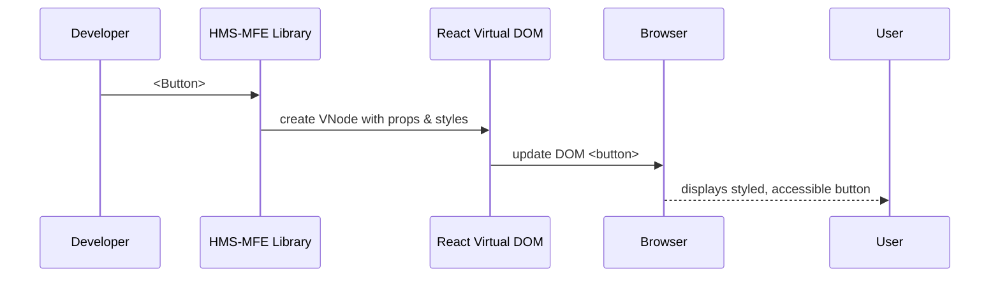

# Chapter 10: HMS-MFE Frontend Interface Library

In [Chapter 9: Human-in-the-Loop (HITL) Workflow](09_human_in_the_loop__hitl__workflow_.md) we added a review step so humans sign off on AI proposals. Now we’ll build **HMS-MFE Frontend Interface Library**, a shared set of UI components used by citizen-facing portals and admin dashboards. It’s like having one set of “road signs and forms” that every government website uses—consistent, accessible, and easy to maintain.

---

## 1. Motivation: Why a Shared UI Library?

Imagine the Office of Child Support Services (OCSS) and the Department of Homeland Security (DHS) each build a web portal. Without a shared library, button styles, form layouts, and color themes all differ:

- Citizens get confused by inconsistent form fields  
- Accessibility features (like keyboard navigation) vary  
- Developers rewrite the same styles over and over  

**HMS-MFE Interface Library** solves this by offering:

- Pre-built, styled UI components (Buttons, Forms, Inputs)  
- Built-in accessibility (ARIA attributes, focus styles)  
- A theme system for colors and fonts  

Just like standard road signs let drivers navigate any highway, our library lets developers build new portals in minutes.

---

## 2. Key Concepts

1. **Component**  
   A reusable piece of UI (e.g., `<Button>`, `<Form>`, `<DatePicker>`).

2. **Theming**  
   A way to switch colors or font sizes in one place (light/dark mode).

3. **Accessibility**  
   Built-in support for screen readers, keyboard focus, and ARIA labels.

4. **Responsiveness**  
   Components adapt to mobile, tablet, and desktop layouts.

5. **Modularization**  
   Import only the components you need to keep bundles small.

---

## 3. Using the Interface Library

Let’s build a very simple “Submit Application” page using our library.

### 3.1 Install the Package

```bash
npm install hms-mfe-interface
```

This adds the shared UI library to your project’s `node_modules`.

### 3.2 Render a Button

```jsx
// App.jsx
import React from 'react'
import { Button } from 'hms-mfe-interface'

export default function App() {
  return (
    <Button onClick={() => alert('Submitted!')}>
      Submit Application
    </Button>
  )
}
```

After you save and refresh, you’ll see a styled, accessible button that matches all other HMS portals.

### 3.3 Build a Simple Form

```jsx
// ApplicationForm.jsx
import React from 'react'
import { Form, Input, DatePicker, Button } from 'hms-mfe-interface'

export function ApplicationForm() {
  return (
    <Form onSubmit={data => console.log('Form data:', data)}>
      <Form.Field label="Full Name">
        <Input name="fullName" placeholder="Jane Doe" />
      </Form.Field>

      <Form.Field label="Date of Birth">
        <DatePicker name="dob" />
      </Form.Field>

      <Form.Actions>
        <Button type="submit">Save</Button>
      </Form.Actions>
    </Form>
  )
}
```

When users fill in the fields and click “Save,” the library handles data gathering, validation styles, and keyboard support for you.

---

## 4. Under the Hood

### 4.1 Sequence Flow



1. You write `<Button>` in your JSX.  
2. The library maps it to a Virtual DOM node with default styles and ARIA labels.  
3. React renders it to an actual `<button>` element in the browser.  
4. Users see a consistent, accessible button.

### 4.2 Internal Implementation Snippet

Here’s a simplified look at how the `Button` component might work:

```jsx
// src/components/Button.jsx
import React from 'react'
import './Button.css' // shared CSS for colors, padding, focus

export function Button({ children, ...props }) {
  return (
    <button
      className="hms-button"
      {...props}
      // ensure screen-readers see it
      aria-label={props['aria-label'] || (typeof children === 'string' ? children : '')}
    >
      {children}
    </button>
  )
}
```

- The CSS file defines `.hms-button` with consistent colors, hover/focus states, and responsive sizing.  
- We add an `aria-label` if needed for icon-only buttons.

---

## 5. Theming Context (Bonus)

To support light/dark themes, we use a React Context:

```jsx
// src/ThemeContext.jsx
import React from 'react'
export const ThemeContext = React.createContext('light')

// In your app root:
<ThemeContext.Provider value="dark">
  <App />
</ThemeContext.Provider>
```

Components read `ThemeContext` to switch colors automatically—no extra work per component.

---

## 6. Conclusion

You’ve learned how **HMS-MFE Frontend Interface Library** provides:

- Reusable, accessible UI components  
- A simple theming system  
- Consistent look & feel across citizen portals and admin dashboards  

Next up, we’ll see how these components power a real admin portal:

[Chapter 11: HMS-GOV Admin/Gov Portal](11_hms_gov_admin_gov_portal_.md)

---

Generated by [AI Codebase Knowledge Builder](https://github.com/The-Pocket/Tutorial-Codebase-Knowledge)