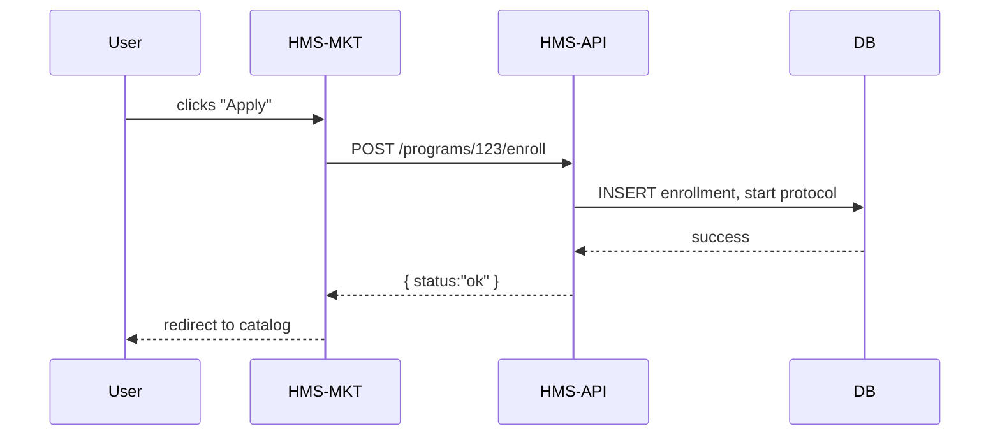

# Chapter 10: HMS-MKT (Public Marketplace Frontend)

In [Chapter 9: HMS-GOV (Admin Frontend)](09_hms_gov__admin_frontend__.md) we built the admin dashboard for policy-makers. Now it’s time to create the **public facing portal** where citizens discover, enroll, and interact with government programs—our **HMS-MKT**.

---

## 1. Motivation & Central Use Case

Imagine Sarah, a California resident, wants to see all housing-related benefits available to her. She goes to the public marketplace, filters by “Housing,” and clicks “Apply” on the “No Poverty Initiative.” A friendly wizard guides her through eligibility questions, then starts her application.

**HMS-MKT** solves this by providing:
- A **Program Catalog** where users browse available services.
- **Filters** to narrow down by category, eligibility, or region.
- An **Enrollment Wizard** that runs the chosen program’s protocol steps.
- **Agent Interactions** (chatbots) for help or status updates.

---

## 2. Key Concepts

1. **Program Catalog**  
   A list of cards, each showing an available program.
2. **Filters & Tracking**  
   UI controls (toggles, search) to help users find the right program.  
   We use `switch-block-label` for toggles and `v-field-id-tracking` to record what users click.
3. **Program Card**  
   A visual box with program title, description, icon (`avatar-fake-square`), and an “Apply” button.
4. **Enrollment Wizard**  
   A step-by-step form that follows the program’s workflow defined in [Chapter 3: Core Models (Program & Protocol)](03_core_models__program___protocol__.md).

---

## 3. Project Setup

```bash
vue create hms-mkt
cd hms-mkt
npm install axios switch-block-label v-field-id-tracking avatar-fake-square
```

- **axios** for HTTP calls to **HMS-API**  
- **switch-block-label** for filter toggles  
- **v-field-id-tracking** to log user interactions  
- **avatar-fake-square** to show program icons  

---

## 4. Bootstrapping the App

src/main.js
```js
import Vue from 'vue'
import App from './App.vue'
import router from './router'
import './assets/styles.css'

Vue.config.productionTip = false
new Vue({
  router,
  render: h => h(App)
}).$mount('#app')
```

src/router/index.js
```js
import Vue from 'vue'
import Router from 'vue-router'
import Catalog from '../components/ProgramCatalog.vue'
import Wizard  from '../components/EnrollmentWizard.vue'

Vue.use(Router)
export default new Router({
  routes: [
    { path: '/',        component: Catalog },
    { path: '/enroll/:id', component: Wizard, props: true }
  ]
})
```

---

## 5. Building the Program Catalog

### 5.1 ProgramCatalog.vue

```html
<template>
  <div>
    <h1>Public Marketplace</h1>
    <switch-block-label 
      v-model="showHousing" 
      label="Show Housing Programs"/>
    <div class="cards">
      <ProgramCard
        v-for="p in filtered"
        :key="p.id"
        :program="p"/>
    </div>
  </div>
</template>
<script>
import ProgramCard from './ProgramCard.vue'
import api from '../services/api'
export default {
  components: { ProgramCard },
  data: () => ({ programs: [], showHousing: false }),
  computed: {
    filtered() {
      return this.programs.filter(p => 
        !this.showHousing || p.category==='Housing'
      )
    }
  },
  async created() {
    this.programs = await api.fetchPrograms()
  }
}
</script>
```

- We use `switch-block-label` to toggle filters.  
- On mount, we load all programs from **HMS-API**.

### 5.2 ProgramCard.vue

```html
<template>
  <div class="card" v-field-id-tracking="program.id">
    <avatar-fake-square :seed="program.id"/>
    <h3>{{ program.name }}</h3>
    <p>{{ program.description }}</p>
    <router-link :to="`/enroll/${program.id}`">
      <button>Apply</button>
    </router-link>
  </div>
</template>
<script>
export default {
  props: ['program']
}
</script>
```

- `avatar-fake-square` generates a simple icon.  
- `v-field-id-tracking` logs which programs users click.

---

## 6. Enrollment Wizard

### 6.1 EnrollmentWizard.vue

```html
<template>
  <div>
    <h2>Enroll: {{ program.name }}</h2>
    <div v-if="step === 0">
      <p>Step 1: Basic Info</p>
      <input v-model="form.name" placeholder="Your Name"/>
    </div>
    <div v-if="step === 1">
      <p>Step 2: Income</p>
      <input v-model.number="form.income" placeholder="Annual Income"/>
    </div>
    <button @click="next">Next</button>
  </div>
</template>
<script>
import api from '../services/api'
export default {
  props: ['id'],
  data: () => ({ program: {}, step: 0, form: {} }),
  async created() {
    this.program = await api.fetchProgram(this.id)
  },
  methods: {
    async next() {
      if (this.step +1 < this.program.steps.length) {
        this.step++
      } else {
        await api.startEnrollment(this.id, this.form)
        this.$router.push('/')
      }
    }
  }
}
</script>
```

- We fetch the program’s workflow (`steps`) from **HMS-API**.  
- Each click advances the wizard; on final step we call `startEnrollment`.

---

## 7. API Service Layer

src/services/api.js
```js
import axios from 'axios'
const client = axios.create({ baseURL: 'http://localhost:3000/api' })

export default {
  fetchPrograms() {
    return client.get('/programs').then(r => r.data)
  },
  fetchProgram(id) {
    return client.get(`/programs/${id}`).then(r => r.data)
  },
  startEnrollment(id, data) {
    return client.post(`/programs/${id}/enroll`, data)
  }
}
```

- `fetchPrograms` → GET `/api/programs`  
- `startEnrollment` → POST `/api/programs/:id/enroll`  

---

## 8. Under the Hood: Request Flow



1. **User** clicks “Apply.”  
2. **HMS-MKT** calls **HMS-API** to start enrollment.  
3. **HMS-API** creates a new enrollment in the database.  
4. Success is returned and user is redirected.

---

## 9. Conclusion & Next Steps

You’ve learned how **HMS-MKT** delivers a citizen-facing portal:

- A **catalog** of programs with filters (`switch-block-label`).  
- **Program cards** tracked by `v-field-id-tracking` and icons with `avatar-fake-square`.  
- A minimal **enrollment wizard** that follows program steps from [Chapter 3: Core Models](03_core_models__program___protocol__.md).  
- How HMS-MKT talks to **HMS-API** to fetch programs and start workflows.

Next up, we’ll break down our frontends into independent pieces with micro-frontends in [Chapter 11: HMS-MFE (Micro-Frontends)](11_hms_mfe__micro_frontends__.md). 

Happy coding!

---

Generated by [AI Codebase Knowledge Builder](https://github.com/The-Pocket/Tutorial-Codebase-Knowledge)