# Chapter 10: Human-in-the-Loop Governance (HITL)

[⬅︎ Back to Chapter 9: AI Representative Agent (HMS-A2A)](09_ai_representative_agent__hms_a2a__.md)

---

## 1. Why do we need “stop-lights” for algorithms?

Imagine the **National Park Foundation** (NPF) wants to reduce long entrance lines at Yellowstone.  
An AI Agent (from the last chapter) drafts a new rule:

> “Increase daily visitor cap from 9 000 → 11 000.”

If this went live automatically it could:

* Break wildlife-protection laws  
* Overwhelm rangers  
* Lead to blame games when bison start blocking roads 🦬

**Human-in-the-Loop Governance (HITL)** inserts mandatory **checkpoints** so a *real person*—Park Superintendent, Legal Counsel, or an Oversight Board—can **review, amend, or veto** AI proposals **before** they hit production.

Think of it as the Senate’s **advice-and-consent** role, but for software.

---

## 2. Key Concepts (plain English)

| Term             | What it means                        | Capitol analogy                |
|------------------|--------------------------------------|--------------------------------|
| Checkpoint       | Required pause where humans decide   | Senate committee hearing       |
| Reviewer Role    | Person/board allowed to decide       | Senator with committee seat    |
| Decision Bundle  | `approve` / `request_changes` / `veto` + comment | Bill outcome report |
| Audit Stamp      | Immutable record of the decision     | Congressional Record entry     |
| SLA Timer        | Max time to respond (e.g., 48 h)     | “Pocket veto” deadline         |

Keep these five in mind—everything else is wiring.

---

## 3. Walk-through: approving the Yellowstone cap

```mermaid
sequenceDiagram
    participant A2A as AI Agent
    participant HITL as HITL Gate
    participant SUP as Park Superintendent
    participant API as HMS-API
    participant AUD as Audit Log
    A2A->>HITL: Draft Rule "cap 11 000"
    HITL-->>SUP: "Please review"
    SUP-->>HITL: approve ✅
    HILT->>API: publish change
    HITL->>AUD: stamp decision
```



Five actors, easy to follow.

---

## 4. How to use HITL (hands-on)

### 4.1 AI Agent submits a draft

```bash
curl -X POST http://localhost:5000/hitl/drafts \
     -H "Authorization: Bearer $TOKEN_A2A" \
     -d '{
          "program":"yellowstone-visitors",
          "change":"increase_cap",
          "value":11000,
          "rationale":"Lines > 2h last month"
        }'
```

HMS-API responds:

```json
{ "draftId":"d_734", "status":"PENDING_REVIEW", "slaHours":48 }
```

### 4.2 Superintendent reviews in HMS-GOV

```tsx
// src/gov/screens/Review.tsx
export function Review({ draft }) {
  return (
    <form onSubmit={submit}>
      <h1>Visitor Cap Change</h1>
      <p>From {draft.old} → {draft.new}</p>
      <textarea name="comment" placeholder="Why approve or veto?" />
      <button name="decision" value="approve">Approve</button>
      <button name="decision" value="veto">Veto</button>
    </form>
  );
}
```

Explanation  
• The form shows the diff and two buttons—simple!

### 4.3 POST the decision

```bash
curl -X POST http://localhost:5000/hitl/drafts/d_734/decision \
     -H "Authorization: Bearer $TOKEN_SUP" \
     -d '{ "decision":"approve", "comment":"Meets capacity plan" }'
```

Response:

```json
{ "result":"QUEUED_FOR_DEPLOY", "auditId":"a_5521" }
```

HMS-API now triggers the [Policy Deployment Pipeline](11_policy_deployment_pipeline_.md).

---

## 5. What happens under the hood?

1. **🛑 Checkpoint created** – draft stored in `drafts` table with `status=PENDING_REVIEW`.  
2. **🔔 Notification sent** – reviewers get email + dashboard badge.  
3. **⌛ SLA timer** – background job autovetoes if no action in 48 h.  
4. **✍️ Decision stored** – `audit` table logs: who, what, when, why.  
5. **🚚 If approved** – change is forwarded to the deployment pipeline.  

Everything runs inside HMS-API so microservices stay unchanged.

---

## 6. Minimal HITL code (Node, <20 lines each)

### 6.1 Middleware guard

```ts
// src/lib/hitlGuard.ts
export function needsReview(change) {
  // Simple rule: ANY cap change needs human eyes
  return change.type === 'increase_cap';
}
```

### 6.2 Draft creation endpoint

```ts
// src/routes/hitl.ts
r.post('/hitl/drafts', iam('draft:create'), async (req, res) => {
  const draft = { id: uid(), ...req.body, status:'PENDING_REVIEW' };
  db.insert('drafts', draft);
  notifyReviewers(draft);
  res.status(201).json({ draftId:draft.id, status:draft.status, slaHours:48 });
});
```

### 6.3 Decision endpoint

```ts
r.post('/hitl/drafts/:id/decision', iam('draft:decide'), async (req, res) => {
  const { decision, comment } = req.body;
  db.update('drafts', req.params.id, { status:decision.toUpperCase() });
  db.insert('audit', { draft:req.params.id, decision, by:req.user.id, comment });
  if (decision === 'approve') queueDeploy(req.params.id);
  res.json({ result:decision === 'approve' ? 'QUEUED_FOR_DEPLOY' : 'VETOED' });
});
```

*Under 20 lines each; all heavy lifting (emails, timers) happens in helper files.*

---

## 7. Where HITL plugs into other chapters

* Drafts come from **HMS-A2A** or humans – see [AI Representative Agent](09_ai_representative_agent__hms_a2a__.md).  
* Approved changes roll into the **Policy Deployment Pipeline** (next chapter).  
* IAM scopes (`draft:create`, `draft:decide`) enforced by [Zero-Trust IAM](04_access___identity_control__zero_trust_iam__.md).  
* Audit stamps feed the **Metrics & Monitoring Loop** in Chapter 12.

---

## 8. Common pitfalls & pro tips

| Pitfall                              | Remedy                                     |
|--------------------------------------|--------------------------------------------|
| Draft bypasses HITL due to bug       | `needsReview()` unit tests + contract test |
| Reviewer forgets to act (SLA miss)   | Auto-veto after `slaHours`, bot re-notifies |
| Veto reasoning too vague             | Require `comment.length > 20` chars        |
| Blurred blame later                  | Always write `by`, `decision`, `timestamp` into `audit` |

---

## 9. What you learned

✓ The *why* and *how* of inserting humans into algorithmic decisions  
✓ Five key parts: Checkpoint, Reviewer, Decision Bundle, Audit Stamp, SLA Timer  
✓ One-click review UI and two tiny Express endpoints  
✓ How HITL connects AI drafts to safe production changes  

Ready to see **how an approved rule actually ships to production servers**?  
Continue to [Chapter&nbsp;11: Policy Deployment Pipeline](11_policy_deployment_pipeline_.md)

---

Generated by [AI Codebase Knowledge Builder](https://github.com/The-Pocket/Tutorial-Codebase-Knowledge)