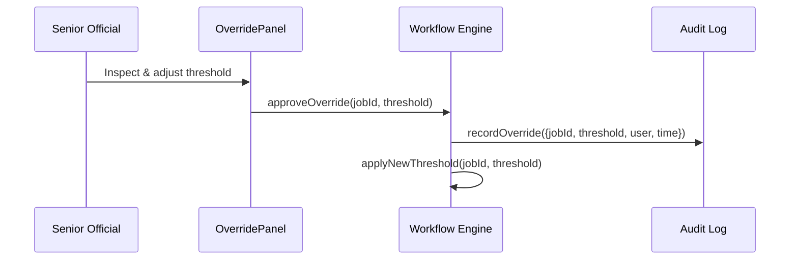

# Chapter 10: Human-in-the-Loop (HITL) Override

In [Chapter 9: Metrics & Monitoring](09_metrics___monitoring_.md) we learned how HMS-OPS tracks performance and SLAs. Now let’s add a safety net when AI-driven changes need a human check: the **Human-in-the-Loop (HITL) Override**.

---

## 1. Why HITL Override?

Imagine the Office of Community Oriented Policing Services uses an AI engine to suggest new response-time targets for incident reports. The AI proposes dropping the review time to 24 hours, but a senior official wants to pause that rollout, tweak it to 36 hours, and only then make it live. The HITL Override is that safety switch:

- It **pauses** automated recommendations.
- Let’s a human **review** parameters.
- Records an **audit trail** of who changed what.
- Enforces **role-based permissions** on who can override.

This builds accountability and trust into every policy change.

---

## 2. Key Concepts

1. **Override Switch**  
   A flag that pauses or holds AI-driven updates until reviewed.

2. **Review Workflow**  
   A guided UI flow where designated reviewers inspect, tweak, and then approve.

3. **Audit Trail**  
   A log of override actions: who did it, when, and what parameters changed.

4. **Role-Based Permissions**  
   Only appointed roles (e.g., Senior Official, Policy Manager) can perform overrides.

---

## 3. Using HITL Override in Your UI

Below is a minimal React component in **hms-gov** that lets an official inspect and adjust an AI suggestion before approving it.

```js
// hms-gov/src/components/OverridePanel.js
import React, { useState } from 'react'

export default function OverridePanel({ job, onApprove }) {
  const [threshold, setThreshold] = useState(job.suggestedThreshold)

  return (
    <div>
      <h3>AI Suggested Review Time: {job.suggestedThreshold}h</h3>
      <label>
        Adjust to (hours):
        <input
          type="number"
          value={threshold}
          onChange={e => setThreshold(+e.target.value)}
        />
      </label>
      <button onClick={() => onApprove({ jobId: job.id, threshold })}>
        Approve Override
      </button>
    </div>
  )
}
```

Explanation:
- We display the AI’s suggested threshold.
- The reviewer can adjust the value.
- Clicking **Approve Override** calls `onApprove` with the new setting.

---

## 4. What Happens Step-by-Step



1. The official adjusts and approves in the UI.  
2. The Workflow Engine records the override in the Audit Log.  
3. The new threshold is applied to future AI decisions.

---

## 5. Under the Hood

### 5.1 Sequence Walkthrough

1. **Fetch Job**: The engine loads the pending AI job (with default parameters).  
2. **Check Override**: If an override exists but isn’t approved, the engine waits.  
3. **Apply Change**: Once approved, it uses the overridden value instead of the AI default.  
4. **Log Action**: Every override is written to an audit trail with user details.

### 5.2 Core Code Snippets

#### a) Storing an Override

File: `hms-svc/src/overrideService.js`

```js
export async function approveOverride({ jobId, threshold, user }) {
  // 1. Mark the job as overridden
  await db.insert('overrides', {
    job_id: jobId,
    new_threshold: threshold,
    approved_by: user.id,
    approved_at: new Date()
  })
  // 2. Update the workflow job record
  await db.update('workflow_jobs', jobId, { overridden: true })
}
```

Explanation:
- We insert a record into the `overrides` table for auditing.
- We flag the job in `workflow_jobs` to unblock processing.

#### b) Applying the Override

File: `hms-svc/src/workflowProcessor.js`

```js
export async function processJob(jobId) {
  const job = await db.get('workflow_jobs', jobId)
  if (job.overridden) {
    const { new_threshold } = await db.getLatestOverride(jobId)
    job.threshold = new_threshold
  }
  // Continue with AI or workflow steps using job.threshold
}
```

Explanation:
- If `overridden` is true, we fetch the latest override record.
- We replace the AI’s default threshold with the human-approved value.

---

## 6. Why This Matters

- **Trust & Accountability**: Every change is human-reviewed and logged.  
- **Flexibility**: Experts can tweak AI outputs without code deploys.  
- **Security**: Only authorized roles can override, thanks to [RBAC controls](11_role_based_access_control__rbac__.md).  
- **Transparency**: Audit trails help auditors trace who approved what and when.

---

## Conclusion

You now know how the **Human-in-the-Loop Override** gives a safety switch over AI suggestions: pausing automation, enabling review, enforcing permissions, and recording audit logs. Up next, we’ll see in detail how to manage those permissions with **Role-Based Access Control (RBAC)**:  
[Chapter 11: Role-Based Access Control (RBAC)](11_role_based_access_control__rbac__.md)

---

Generated by [AI Codebase Knowledge Builder](https://github.com/The-Pocket/Tutorial-Codebase-Knowledge)