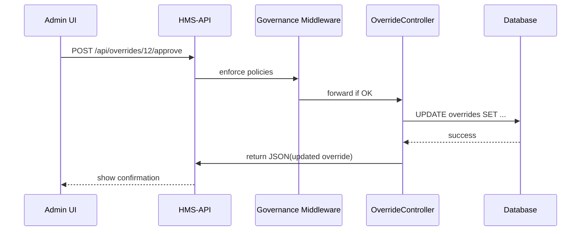

# Chapter 10: Human-in-the-Loop Override

In the previous chapter, we saw how a real person reviews AI suggestions in [Chapter 9: Human Decision Maker](09_human_decision_maker_.md). Now we’ll learn about the **Human-in-the-Loop Override**—the “Approve/Reject” safety button that lets a human adjust AI recommendations and take final responsibility.

---

## 1. Motivation & Central Use Case

Imagine the U.S. Sentencing Commission uses an AI Agent to propose speeding up sentence-review steps. Before deploying, a judge or policy director wants to:

1. See the AI’s **suggested workflow** change.  
2. **Edit** the steps if needed (e.g., rename “Parallel Checks” to “Fast-Track Checks”).  
3. **Approve** or **Reject** the change.  

This is the Human-in-the-Loop Override: a one-click mechanism to pause automation until a person signs off.

---

## 2. Key Concepts

1. **Override Draft**  
   A mutable copy of the AI’s recommendation that a human can edit.

2. **Human Approval**  
   The act of confirming (Approve) or blocking (Reject) the change.

3. **Final Deployment**  
   Once approved, the updated policy goes live; if rejected, it stays in “pending.”

4. **Accountability Log**  
   Every override is recorded with who approved/rejected and any comments.

---

## 3. How to Use the Override

### 3.1 List Pending Overrides

Fetch all AI suggestions waiting for a human:

```
GET /api/overrides/pending
→ [
  {
    "id": 12,
    "proposal": "Parallelize background & eligibility checks",
    "draft_steps": ["Submit","Background & Eligibility","Finalize"]
  },
  …
]
```

### 3.2 Edit & Approve

On your admin UI, let the user modify `draft_steps`. Then call:

```http
POST /api/overrides/12/approve
Content-Type: application/json

{
  "final_steps": ["Submit","Fast-Track Checks","Finalize"],
  "comment": "Rename for clarity"
}
```

Response:

```json
{
  "id": 12,
  "status": "approved",
  "deployed_at": "2024-06-15T02:00:00Z"
}
```

### 3.3 Reject

If you want to stop it:

```http
POST /api/overrides/12/reject
Content-Type: application/json

{ "comment": "Needs legal review" }
```

Response:

```json
{ "id":12, "status":"rejected", "comment":"Needs legal review" }
```

---

## 4. What Happens Step-by-Step



1. User clicks “Approve,” sending the final steps + comment.  
2. **Governance** checks policy rules.  
3. **OverrideController** updates the override record, marks it approved, triggers deployment.  
4. The UI shows success.

---

## 5. Under the Hood

### 5.1 Route Definition

File: `routes/api.php`

```php
Route::prefix('overrides')->group(function() {
    Route::get('pending',       [OverrideController::class, 'pending']);
    Route::post('{id}/approve', [OverrideController::class, 'approve']);
    Route::post('{id}/reject',  [OverrideController::class, 'reject']);
});
```

*Registers three endpoints: list, approve, reject.*

### 5.2 Controller Logic

File: `app/Http/Controllers/OverrideController.php`

```php
class OverrideController extends Controller
{
    public function approve($id, Request $req)
    {
        $ov = Override::findOrFail($id);
        $ov->update([
          'status'      => 'approved',
          'final_steps' => $req->input('final_steps'),
          'comment'     => $req->input('comment'),
        ]);
        // Deploy the approved workflow
        dispatch(new DeployWorkflow($ov));
        return response()->json($ov);
    }

    public function reject($id, Request $req)
    {
        $ov = Override::findOrFail($id);
        $ov->update([
          'status'  => 'rejected',
          'comment' => $req->input('comment'),
        ]);
        return response()->json($ov);
    }

    public function pending()
    {
        return Override::where('status','pending')->get();
    }
}
```

*Each method loads the override record, updates its status, and returns the updated object.*

### 5.3 Deployment Job

File: `app/Jobs/DeployWorkflow.php`

```php
class DeployWorkflow implements ShouldQueue
{
    public function __construct(public Override $ov) {}
    public function handle()
    {
        // Call into HMS-API core to update protocol steps
        ProtocolService::updateSteps(
          $this->ov->protocol_id,
          $this->ov->final_steps
        );
    }
}
```

*Once approved, we queue a background job to push the new steps live.*

---

## 6. Recap & Next Steps

You’ve learned how the **Human-in-the-Loop Override** adds a safety net:

- **Draft**: AI generates a suggestion.  
- **Edit**: A human can tweak the workflow.  
- **Approve/Reject**: Final sign-off with accountability.  
- **Deploy**: Approved changes go live via a background job.  

Up next, we’ll see how everything runs on the [Core System Platform (HMS-GOV)](11_core_system_platform__hms_gov__.md).

---

Generated by [AI Codebase Knowledge Builder](https://github.com/The-Pocket/Tutorial-Codebase-Knowledge)