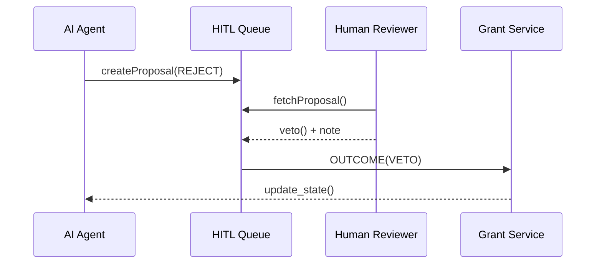

# Chapter 10: Human-in-the-Loop Oversight (HITL)
*[← Back to Chapter 9: HMS-AGT / HMS-AGX (Core & Extended AI Agent Framework)](09_hms_agt___hms_agx__core___extended_ai_agent_framework__.md)*  

---

## 1. Why Do We Need HITL?

The **Small Business Administration (SBA)** just deployed an AI agent that pre-screens grant applications.  
Yesterday, the bot flagged *“Anna’s Bakery”* for rejection because its tax filings looked odd.  
But a human reviewer quickly saw the issue was a **data entry typo** and over-rode the decision.

Without a *formal* way to intervene, three bad things could happen:

1. **No paper trail** – Why was the bot over-ruled?  
2. **Shadow fixes** – Humans quietly edit the database, breaking audits.  
3. **Public distrust** – Citizens assume algorithms act in secret.

**Human-in-the-Loop Oversight (HITL)** plugs these holes. It turns every AI proposal into a *recommendation* that must pass a **human steering wheel** before becoming final.

---

## 2. Key Concepts (Plain English)

| HITL Term            | Friendly Analogy           | One-Sentence Meaning |
|----------------------|----------------------------|----------------------|
| Proposal             | Flight plan                | An agent’s suggested action (e.g., “Reject Grant #123”). |
| Reviewer             | Pilot in command           | Authorized human who can **approve**, **adjust**, or **veto** a proposal. |
| Rationale Note       | Black-box voice recorder   | Short text explaining any human change. |
| Decision Record      | Final logbook entry        | JSON blob: *proposal → human decision → timestamp → signature*. |
| Queue                | Waiting room               | List of proposals still needing human eyes. |
| Policy               | Traffic light              | Rules that decide which proposals *must* get human review vs. auto-approve. |

---

## 3. The 5-Minute “Hello-HITL”

Goal: run the SBA grant-screening bot from Chapter 9, but enforce that **any rejection** goes to a human queue first.

### 3.1  Define a Review Policy

```python
# file: policies.py  (≤12 lines)
from hms_hitl import Policy

rejection_policy = Policy(
    name="reject_needs_review",
    when=lambda p: p.tag == "REJECT",      # only rejections
    reviewers=["sba_officer"],             # role name
    timeout="48h"                          # auto-approve after 48 h? no
)
```

*Explanation*  
If the agent labels a proposal with tag `"REJECT"`, it is **blocked** until someone with role `sba_officer` decides.

---

### 3.2  Agent Submits a Proposal

```python
# file: agent_snippet.py  (≤15 lines)
from hms_agt import Agent
from hms_hitl import queue_proposal

def screen_app(app):
    if app.score < 0.4:
        queue_proposal(              # hand to HITL
            id=f"grant:{app.id}",
            tag="REJECT",
            payload={"score": app.score}
        )
    else:
        approve(app)                 # fast-path OKs
```

*Explanation*  
The agent only *suggests* a rejection; HITL takes over.

---

### 3.3  Human Reviewer Dashboard (CLI for brevity)

```python
# file: reviewer.py  (≤18 lines)
from hms_hitl import Inbox

for p in Inbox(user="j.doe@sba.gov", role="sba_officer"):
    print("Proposal:", p.id, "score=", p.payload["score"])
    decision = input("[a]pprove / [v]eto / [c]hange score? ")

    if decision == "a":
        p.approve()
    elif decision == "v":
        p.veto("Applicant sent corrected tax form.")
    elif decision == "c":
        new_score = float(input("New score: "))
        p.modify(payload={"score": new_score}, note="Manual correction")
```

What will happen?  

1. `Inbox` streams waiting proposals.  
2. Actions (`approve`, `veto`, `modify`) write a **Decision Record**.  
3. The grant service listens for the outcome and updates the database.

---

### 3.4  Reading the Audit Trail

```python
# file: audit.py  (≤8 lines)
from hms_hitl import DecisionLog
log = DecisionLog.get("grant:42")
print(log)
```

Sample output:

```json
{
  "proposal_id": "grant:42",
  "agent_tag": "REJECT",
  "human_action": "veto",
  "rationale": "Applicant sent corrected tax form.",
  "time": "2024-03-26T15:21Z",
  "reviewer": "j.doe@sba.gov"
}
```

Voilà—*full transparency* for FOIA or congressional hearings.

---

## 4. What Happens Behind the Curtain?



1. Agent logs a **Proposal**.  
2. HITL stores it + notifies reviewers (e-mail, Slack, etc.).  
3. Reviewer acts → **Decision Record** written.  
4. Downstream service proceeds accordingly.

---

## 5. Peek at the Source

### 5.1  Minimal Queue

```python
# file: hitl/queue.py  (≤14 lines)
class Queue:
    _pending = {}        # id → Proposal

    def add(self, p):              # from agent
        self._pending[p.id] = p

    def fetch(self, role):
        for p in list(self._pending.values()):
            if p.requires(role):
                yield p
```

Small yet powerful—just a dict and a role check.

### 5.2  Decision Recorder

```python
# file: hitl/record.py  (≤12 lines)
from datetime import datetime, timezone

def record(p, action, note, user):
    entry = {
        "proposal_id": p.id,
        "agent_tag": p.tag,
        "human_action": action,
        "rationale": note,
        "time": datetime.now(timezone.utc).isoformat(),
        "reviewer": user
    }
    append_to_jsonl("decision_log.jsonl", entry)
```

Every decision is **append-only** so no one can rewrite history.

---

## 6. How HITL Connects to Other HMS Layers

* **[HMS-ACT (Agent Action Orchestrator)](11_hms_act__agent_action_orchestrator__.md)** – routes outcomes back into multi-step workflows.  
* **[HMS-DTA (Data Lake & Governance)](06_hms_dta__data_lake___governance__.md)** – ingests `decision_log.jsonl` nightly for analytics.  
* **[HMS-ESQ (Legal Compliance Intelligence)](07_hms_esq__legal_compliance_intelligence__.md)** – verifies that reviewer rationales satisfy statutory requirements (e.g., FOIA).  
* **[HMS-OPS (Observability & Platform Operations)](19_hms_ops__observability___platform_operations__.md)** – raises alerts if proposals **timeout** without review.

---

## 7. FAQ & Troubleshooting

| Symptom | Likely Cause | Quick Fix |
|---------|--------------|-----------|
| Proposal never shows in inbox | Wrong role name | Check `reviewers` list in the Policy. |
| Reviewer forgot to add rationale | Policy flag `require_rationale` | Turn it on to block empty approvals. |
| Agent keeps re-submitting same proposal | Service didn’t mark outcome consumed | Ensure downstream calls `proposal.ack()`. |
| Decision log missing entries | Disk full or path typo | Verify `decision_log.jsonl` location in config. |

---

## 8. What You Learned

You now know how to:

1. Turn an **agent action** into a **Proposal**.  
2. Enforce review policies that require a **human handshake**.  
3. Capture a transparent, tamper-evident **Decision Record**.  
4. Keep the public and auditors confident that **humans stay in charge**.

Next, we’ll see how multiple agents and human decisions come together inside a single end-to-end workflow using the **Agent Action Orchestrator**.  

→ *Continue to* [HMS-ACT (Agent Action Orchestrator)](11_hms_act__agent_action_orchestrator__.md)

---

Generated by [AI Codebase Knowledge Builder](https://github.com/The-Pocket/Tutorial-Codebase-Knowledge)