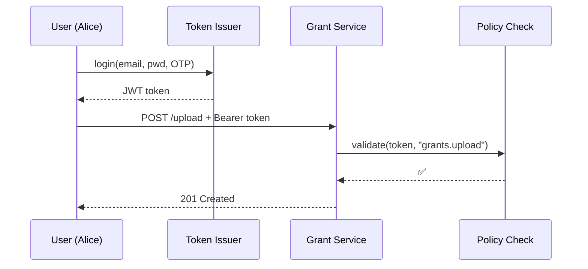

# Chapter 10: Identity, Access & Authorization
*(continues from [Chapter 9: External System Adapter](09_external_system_adapter_.md))*  

---

## 1  Why do we need “digital passports”?

Imagine **Maria**, a small-business owner, applying for a **COVID-19 Recovery Grant**:

1. She logs in with her e-mail + phone OTP.  
2. Her accountant logs in too, but may **only upload tax documents**—not approve payments.  
3. An AI robot later reads the application to extract numbers, yet must **never** see Maria’s SSN.  

Without a rock-solid way to prove **who** is acting (identity) and **what** they’re allowed to do (authorization), either:

* The process blocks honest users (“error: 401 unauthorized”) **or**  
* Sensitive data leaks to the wrong eyes—violating the Privacy Act and killing public trust.

**The Identity, Access & Authorization (IAA) layer is HMS’s digital passport office.**  
It issues ID cards (tokens), stamps privileges (roles), and checkpoints every request with multifactor rules.

---

## 2  Key concepts (beginner-friendly)

| Word | Think of it as… | Why it matters |
|------|-----------------|----------------|
| **Identity** | A person’s face | Uniquely says “I’m Maria.” |
| **Credential** | The driver’s license | Password + OTP, FIDO key, service secret. |
| **Role** | Job title (Clerk, Minister) | Bundles permissions (read-grant, approve-grant). |
| **Permission** | A building door | Concrete action like `grants.upload`. |
| **Token** | Digital passport stamp | Short-lived proof you already showed ID. |
| **Policy Check** | Security guard | Verifies each request’s token & role. |

Keep these six words; 90 % of IAA is just enforcing them automatically.

---

## 3  Quick-start: secure a “Grant Upload” API

Below we will:

1. Define a role: **Accountant** may upload but not approve.  
2. Create a user and attach that role.  
3. Log in (password + OTP) and receive a JWT token.  
4. Call the protected API with that token.

### 3.1  Define the role (YAML, 10 lines)

```yaml
# roles/accountant.yaml
id: ROLE_ACCOUNTANT
label: "Grant Accountant"
permissions:
  - grants.upload
  - grants.view
max_token_ttl: 60m          # tokens live 60 minutes
```

*Explanation*  
A role is just a file listing allowed **permissions**. Anyone wearing this badge inherits them.

### 3.2  Create the user (Python, 14 lines)

```python
from hms_iam import IAMAdmin

iam = IAMAdmin()

iam.create_user(
    email="alice@cpa.com",
    mfa_phone="+1-202-555-0199",
    roles=["ROLE_ACCOUNTANT"]
)
print("✅ user created")
```

*Explanation*  
`create_user()` stores a hashed password, OTP seed, and role list in the IAM database.

### 3.3  Log in and grab a token (12 lines)

```python
from hms_iam import IAMClient

iam = IAMClient()

otp = input("Enter 6-digit phone code: ")

token = iam.login(
    email="alice@cpa.com",
    password="Super$ecret1",
    otp=otp
)
print("Your JWT:\n", token[:60], "...")   # shortened for display
```

The returned **JWT** already embeds:

```
{
  "sub": "alice@cpa.com",
  "roles": ["ROLE_ACCOUNTANT"],
  "exp": 1717354261
}
```

### 3.4  Call the API (curl, 3 lines)

```bash
curl -H "Authorization: Bearer $TOKEN" \
     -F "file=@tax_return.pdf" \
     https://api.grants.gov/v1/upload
```

Outcome  
* If the token is valid and contains `grants.upload`, the file is stored.  
* Otherwise you receive `403 Forbidden`.

---

## 4  What happens behind the curtain?



Step-by-step (plain English):

1. IAM verifies password + OTP, then signs a **JWT** with its private key.  
2. The client sends the token on every request.  
3. A lightweight middleware (`Policy Check`) decodes the JWT, checks expiration, and ensures the role includes the required permission.  
4. If any check fails, the request is rejected and an audit log is written.

---

## 5  A tiny peek at the implementation

### 5.1  Token issuer (simplified, 17 lines)

```python
# file: iam/issuer.py
import jwt, time

PRIVATE_KEY = open("/keys/iam.pem").read()

def issue(sub, roles, ttl=3600):
    payload = {
        "sub": sub,
        "roles": roles,
        "iat": int(time.time()),
        "exp": int(time.time()) + ttl
    }
    return jwt.encode(payload, PRIVATE_KEY, algorithm="RS256")
```

Beginners: a JWT is just a signed JSON blob with `sub`, `roles`, and `exp`.

### 5.2  Policy middleware (Flask example, 15 lines)

```python
# file: grants_service/auth.py
from flask import request, abort
import jwt, requests

PUB_KEY = requests.get("https://iam.local/.well-known/jwks").text

def check(permission):
    def inner(fn):
        def wrapper(*args, **kwargs):
            token = request.headers.get("Authorization", "")[7:]
            try:
                claims = jwt.decode(token, PUB_KEY, algorithms=["RS256"])
                if permission not in claims["roles_permissions"]:
                    abort(403)
            except Exception:
                abort(401)
            return fn(*args, **kwargs)
        return wrapper
    return inner
```

Apply it to any endpoint:

```python
@app.route("/upload", methods=["POST"])
@check("grants.upload")
def upload():
    ...
```

### 5.3  MFA validator (excerpt, 9 lines)

```python
def verify_otp(seed, otp):
    import onetimepass as otpmod
    return otpmod.valid_totp(token=otp, secret=seed, tolerance=1)
```

One line of OTP math + a small tolerance.

---

## 6  Where IAA sits in the big picture

```
Citizen / Agent
      │
      ▼  (login, token)
[Identity, Access & Authorization]  ← this chapter
      │  (Bearer token)
      ▼
[Governance Layer](02_governance_layer__hms_gov__.md) – enforces policies
      ▼
Micro-services, Adapters, Workflows … all checked by
      │    [Operations Hub](01_operations___monitoring_hub__hms_ops__.md)
```

* **HMS-GOV** plugs directly into IAA to fetch role & permission info for every inbound API call.  
* **HMS-OPS** watches failed logins and spikes in `401/403` errors as early warnings.  
* **External System Adapters** (previous chapter) fetch a *service token* from IAA before calling outside APIs.

---

## 7  Beginner FAQ

**Q1: Do I need to run a separate IAM database?**  
No. HMS ships with a light Postgres table backed by a HA key-vault.

**Q2: Can I use government PIV cards or Login.gov?**  
Yes. The login flow can delegate to any SAML/OIDC identity provider; the JWT still looks the same to services.

**Q3: What if a token is stolen?**  
Tokens are short-lived (≤ 60 min). You can also call `iam.revoke(sub)` to nuke all tokens for a user.

**Q4: How do machine-to-machine services authenticate?**  
Each service gets a rotating **client secret** and uses `iam.issue_service_token()` (same JWT format, but with `sub: "service:grant-worker"`).

---

## 8  Recap & what’s next

In this chapter you:

1. Learned why **Identity, Access & Authorization** is the digital passport office of HMS.  
2. Defined a role, created a user, and obtained a JWT token with MFA.  
3. Protected an API endpoint with a 15-line middleware.  
4. Peeked at the ultra-small code that issues and verifies tokens.  
5. Saw how IAA plugs into every other HMS layer.

Next we meet the **AI Representative Agent** that can act on behalf of citizens—but only within the strict boundaries you just learned to enforce.  
Continue to [Chapter 11: AI Representative Agent](11_ai_representative_agent_.md).

---

Generated by [AI Codebase Knowledge Builder](https://github.com/The-Pocket/Tutorial-Codebase-Knowledge)