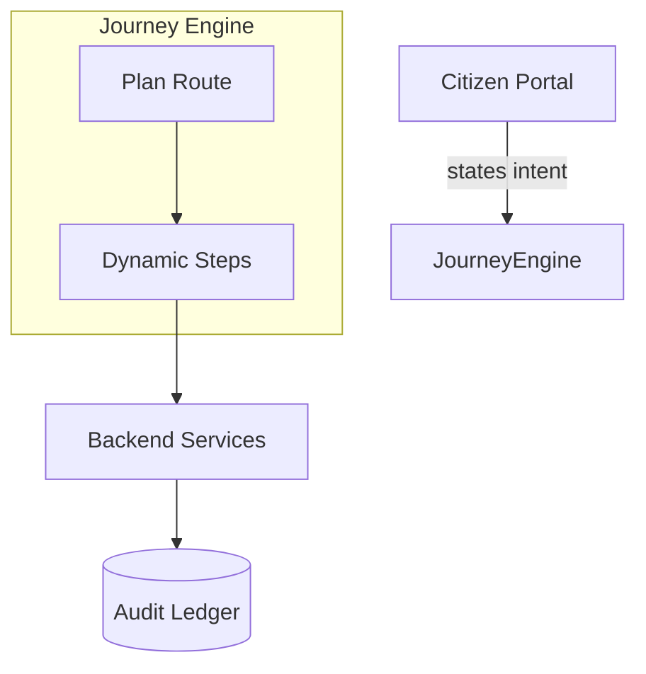
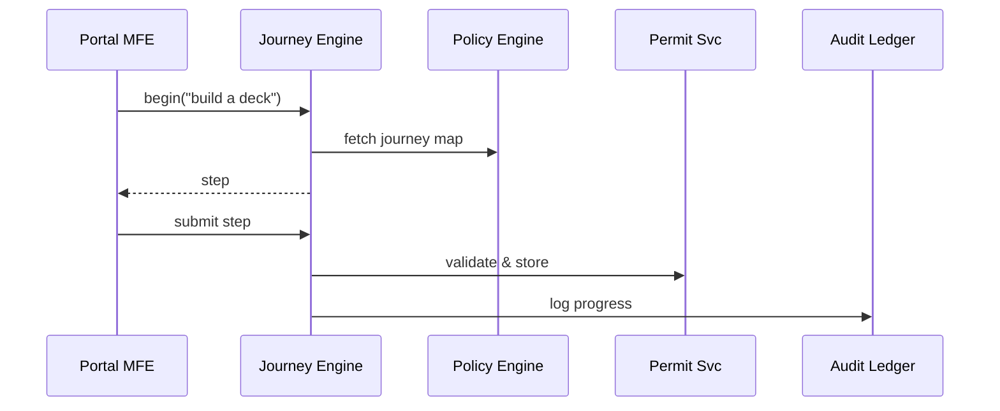

# Chapter 10: Intent-Driven Navigation & Guided Journeys
*[Jump back to Chapter 9: Interface Layer (HMS-MFE & Portals)](09_interface_layer__hms_mfe___portals__.md)*  

---

## 1. Why Do We Need “Guided Journeys”?

Picture a first-time homeowner in **FEMA flood-plain territory**.  
They visit the county portal and stare at 40+ links:

* “Elevation Certificate”  
* “LOMA Application”  
* “Community Rating System CRS-NFIP”  
* …huh?

All they really know is **“I want to build a small deck”**.  
The portal should *ask that*, not force them to decipher agency jargon.  
**Intent-Driven Navigation** does exactly this:

1. **Capture the outcome** the citizen wants in plain language.  
2. **Plan** a minimal, policy-compliant set of steps (a *Journey*).  
3. **Guide** the user through dynamic forms, skipping anything irrelevant.  

Think of it as a super-smart 311 operator who never puts you on hold.

---

## 2. Key Concepts (Plain-English Cheatsheet)

| Term                | Friendly Analogy |
|---------------------|------------------|
| Intent Prompt       | The question: “What do you need today?” |
| Journey Map         | A GPS route from A → B with optional detours |
| Step                | A single screen or action (fill form, upload doc) |
| Branch Rule         | A highway exit; only taken if conditions match |
| Contextual Help     | Road signs that pop up *only* when useful |
| Skip Logic          | Waze auto-removing closed roads (irrelevant steps) |

---

## 3. One-Minute Mental Model



1. Citizen answers *one* plain question.  
2. Journey Engine plans a route (steps).  
3. Each step talks to APIs already secured by earlier layers.  
4. Progress stored in the [Auditing & Traceability Ledger](13_auditing___traceability_ledger_.md).

---

## 4. Hands-On Walk-Through: “Build a Deck in Flood Zone”

### 4.1 Declare the Journey (YAML ≤ 18 lines)

```yaml
# deck_permit.journey.yml
intent: "I want to build a deck"
steps:
  - id: site_check
    form: /forms/site-info.json
  - id: flood_calc
    when: "site.elevation < 10ft"
    form: /forms/elevation-calc.json
  - id: upload_plans
    form: /forms/blueprint-upload.json
  - id: pay_fee
    action: POST /payments
  - id: confirmation
    view: /views/receipt.html
```

Explanation  
• `when` is a **Branch Rule**; the flood calculation only appears if needed.  
• A step can be a **form**, **action**, or **view**.

### 4.2 Publish the Journey

```bash
hms-journey publish deck_permit.journey.yml
```

Console:

```
✔ Parsed 5 steps
✔ Skip-logic compiled
✔ Journey registered as "build-deck"
```

### 4.3 Capture Intent in the Portal (React ≤ 12 lines)

```jsx
import { journey } from "@hms/sdk";

async function startJourney() {
  const id = await journey.begin("I want to build a deck");
  navigate(`/journey/${id}`); // router jump
}
```

What happens?  
* `journey.begin` asks the engine to match the **intent string** to the `deck_permit` journey and returns a unique journey instance ID.

### 4.4 Render Dynamic Steps (hook ≤ 18 lines)

```jsx
function JourneyRunner({ id }) {
  const { step, data } = journey.useStep(id);  // live info

  if (step.type === "form") return <SmartForm src={step.form} />;
  if (step.type === "action") {
     journey.runAction(id, step);              // e.g., pay fee
     return <Loading />;
  }
  if (step.type === "view") return <StaticView src={step.view} />;
}
```

`SmartForm` auto-generates fields from JSON, honoring
validation rules coming from the [Policy & Process Engine](02_policy___process_engine__backend_api__.md).

### 4.5 Skip Logic in Action (GIF-style description)

1. User enters *elevation = 15 ft* → engine **skips** `flood_calc`.  
2. Goes straight to **upload_plans**.  
3. Fees auto-calculated—no flood surcharge.  

The citizen never saw irrelevant screens.

---

## 5. What Happens Under the Hood?

### 5.1 Five-Participant Sequence



### 5.2 Mini Peek: Branch Evaluation (Go ≤ 16 lines)

```go
// engine/branch.go
func shouldShow(step Step, ctx map[string]any) bool {
    if step.When == "" { return true }
    expr, _ := gov.Parse(step.When)     // reuse Policy Engine parser
    ok, _ := expr.Eval(ctx)            // ctx holds previous answers
    return ok
}
```

Beginner notes  
* **Reuse** of Policy Engine means you write conditions once, use them everywhere.  
* `ctx` is the answer bag built as the citizen progresses.

---

## 6. Adding Contextual Help (≤ 14 lines)

```yaml
- id: upload_plans
  form: /forms/blueprint-upload.json
  help:
    when: "file.size > 10MB"
    text: "Large files? Use the FTP drop-box 🔗"
```

The engine shows the help message *only* when the rule triggers.

---

## 7. Common Pitfalls & Quick Fixes

| Symptom | Cause | Fix |
|---------|-------|-----|
| Journey not found | Intent string mismatch | List intents: `hms-journey list` |
| Stuck on “Loading” | Step action failed | Check browser console; verify API gateway reachable |
| Branch fires wrong | Comparison units mismatch | Use consistent units (`ft`, `m`) in data & rule |

---

## 8. FAQ

**Q: How many journeys can one portal have?**  
Tested with 1 000+ journeys; engine matches intent with TF-IDF + synonyms.

**Q: Can I localize intent prompts?**  
Yes—add `locale:` blocks or connect to the upcoming [AI Representative Agent](11_ai_representative_agent__hms_a2a__.md) for natural-language detection.

**Q: Is progress saved?**  
Every step submission stores a checkpoint; users can resume from any device.

---

## 9. What You Learned

• **Intent-Driven Navigation** turns “I need X” into a **Journey Map** of only the necessary steps.  
• Branch rules and skip logic keep citizens away from pointless forms.  
• Journeys reuse parsers and validations from earlier HMS layers—no duplicate logic.  
• Adding a new journey is just one YAML file + one publish command.

Next, we’ll meet the **AI Representative Agent (HMS-A2A)** that can *speak* those intents back in natural language and even fill forms for users.  
*[Continue to Chapter 11: AI Representative Agent (HMS-A2A)](11_ai_representative_agent__hms_a2a__.md)*

---

Generated by [AI Codebase Knowledge Builder](https://github.com/The-Pocket/Tutorial-Codebase-Knowledge)