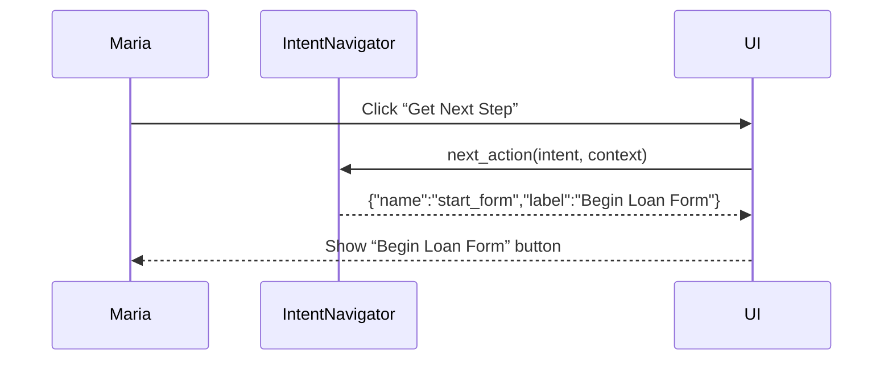

# Chapter 10: Intent-Driven Navigation

Welcome back! In [Chapter 9: Real-Time Synchronization](09_real_time_synchronization_.md) we learned how to keep every part of our system up-to-the-second. Now, let’s explore **Intent-Driven Navigation**, a way to guide users—like a museum docent—to their goals in a complex government workflow.

---

## 1. Motivation: Why Intent-Driven Navigation?

Imagine a small business owner, Maria, wants to apply for an SBA loan. She:

1. Doesn’t know which form to start.  
2. Is unsure what documents she needs next.  
3. Wants to avoid bouncing between pages.

**Intent-driven navigation** acts like a friendly AI tour guide:  
- It asks Maria a few questions (intent & profile),  
- Understands she’s seeking a “small business loan,”  
- And dynamically presents her “next best action”—upload a tax return, fill out the loan application, or schedule an appointment with an advisor.

This approach reduces confusion and helps citizens breeze through complicated procedures.

---

## 2. Key Concepts

1. **Intent**  
   What the user wants to achieve (e.g., “apply for loan,” “schedule screening”).  

2. **User Profile & Inputs**  
   Data about the user (e.g., business size, previous steps completed).  

3. **Next Best Action**  
   The single, simplest task they should do now (e.g., “upload document,” “verify identity”).  

4. **Dynamic Presentation**  
   Real-time adjustment of UI or prompts based on progress.  

5. **Streamlined Flow**  
   Linking actions together so users never get lost.

---

## 3. Using Intent-Driven Navigation

Let’s build a minimal example for Maria’s loan application.

### 3.1 Define Intents and Actions

```python
# file: loan_navigator.py
from hms_nav.intent_navigator import IntentNavigator

nav = IntentNavigator()

# Register an intent called "loan_application"
nav.register_intent("loan_application", conditions=[
    lambda ctx: not ctx.get("form_started"),
    lambda ctx: ctx.get("business_registered")
], actions=[
    {"name": "start_form", "label": "Begin Loan Form"},
    {"name": "upload_docs", "label": "Upload Financial Docs"},
    {"name": "review_submit", "label": "Review & Submit"}
])
```

Explanation:  
- We create an `IntentNavigator`.  
- We register one intent with two conditions:  
  1. The form isn’t started.  
  2. The business is registered.  
- We list the sequence of actions the user will follow.

### 3.2 Ask for Next Action

```python
# file: loan_flow.py
from loan_navigator import nav

# Simulate Maria’s current context
user_ctx = {"business_registered": True, "form_started": False}

# Get “next best action”
next_step = nav.next_action("loan_application", user_ctx)
print(next_step["label"])
# → "Begin Loan Form"
```

Explanation:  
- We pass Maria’s context into `next_action`.  
- The navigator finds the first unmet action and returns it.

---

## 4. Under the Hood: Step-by-Step Flow

When Maria clicks “Next,” here’s what happens:



1. **UI** asks `IntentNavigator` for the next action.  
2. `IntentNavigator` checks conditions, finds the first incomplete action.  
3. UI renders that action for Maria.

---

## 5. Internal Implementation

Let’s peek into a simplified version of `IntentNavigator`.

```python
# file: src/hms_nav/intent_navigator.py
class IntentNavigator:
    def __init__(self):
        self.intents = {}

    def register_intent(self, name, conditions, actions):
        self.intents[name] = {"conditions": conditions, "actions": actions}

    def next_action(self, intent_name, ctx):
        intent = self.intents[intent_name]
        # Ensure all conditions pass
        if not all(cond(ctx) for cond in intent["conditions"]):
            return {"name":"error","label":"Complete prerequisites first"}
        # Find first action not yet done
        for act in intent["actions"]:
            if not ctx.get(act["name"], False):
                return act
        return {"name":"done","label":"All steps complete"}
```

Explanation:  
- We store each intent’s conditions and actions.  
- `next_action` checks if prerequisites are met.  
- It iterates through actions and returns the first one marked incomplete in the user context.

---

## 6. Conclusion

In this chapter, you learned how **Intent-Driven Navigation** guides users step-by-step:

- Define **intents**, **conditions**, and **actions**.  
- Call `next_action(...)` to discover the **next best step**.  
- Under the hood, the navigator checks context and presents one action at a time.

Next up, we’ll see how an **AI Representative Agent** can further enhance assistance by proactively interacting on the user’s behalf:

[Chapter 11: AI Representative Agent (HMS-A2A)](11_ai_representative_agent__hms_a2a__.md)

---

Generated by [AI Codebase Knowledge Builder](https://github.com/The-Pocket/Tutorial-Codebase-Knowledge)