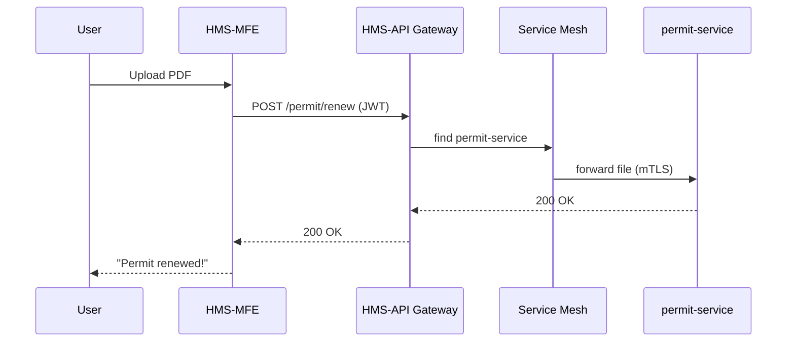

# Chapter 10: Interface Layer (HMS-MFE, HMS-GOV Portals)

[← Back to Chapter 9: External System Sync Adapter](09_external_system_sync_adapter_.md)

---

## 1. Motivation — “Renew My Fishing Permit in 5 Minutes”  

It’s Saturday morning.  
Patricia, a recreational fisher in Alaska, wants to renew her federal fishing permit before heading to the docks.

She opens **permit.gov** on her phone, taps *Renew Permit*, uploads last year’s PDF, pays \$20, and walks away with a fresh permit — all in under five minutes.

Behind that single page:

* 18 micro-services calculate fees, verify identity, and update NOAA databases.  
* 4 federal agencies share the same web look-&-feel.  
* Accessibility rules (Section 508) and privacy laws (HIPAA, PII) are enforced automatically.

The **Interface Layer** is the *front door* that makes this complexity look and feel like a simple, friendly form.

---

## 2. What *Is* the Interface Layer?

```
Citizens & Officials  ⇄  Interface Layer  ⇄  HMS-MCP Backend
```

Two main portals live here:

| Portal | Audience | Nickname |
|--------|----------|----------|
| HMS-MFE (Multi-Front-End) | Citizens & businesses | “Public Lobby” |
| HMS-GOV                  | Government staff      | “Staff Entrance” |

A **Shared UI Library** keeps colors, buttons, and error messages consistent — like identical signage in every federal building.

---

## 3. Key Concepts (Beginner-Friendly)

| Concept | 1-Line Definition | Analogy |
|---------|-------------------|---------|
| Component Library | Re-usable buttons, inputs, tables | Box of identical Lego bricks |
| Design Tokens | Colors, fonts, spacing stored as variables | Federal color palette booklet |
| Accessibility Guard | Automated test that blocks non-compliant UI | Wheelchair-ramp inspector |
| API Hook | Tiny function that calls [HMS-API Gateway](07_backend_api_gateway__hms_api__.md) | Elevator between lobby ↔ offices |
| Session Store | Keeps user’s JWT & role on the browser | Visitor badge |

---

## 4. A 20-Line “Hello Permit” Page  

Below is a **React** page that:

1. Imports a button from the Shared UI Library.  
2. Calls the *Renew Permit* endpoint through HMS-API.  
3. Shows success or error.

```jsx
// File: pages/RenewPermit.jsx
import { Button, TextField, Alert } from "@hms/ui";
import { useState } from "react";
import api from "../utils/api";              // tiny API hook

export default function RenewPermit() {
  const [file, setFile] = useState(null);
  const [msg, setMsg] = useState("");

  async function submit() {
    try {
      await api.post("/permit/renew", { file });
      setMsg("✅ Permit renewed!");
    } catch (e) {
      setMsg("❌ " + e.message);
    }
  }

  return (
    <>
      <h1>Renew Fishing Permit</h1>
      <TextField type="file" onChange={e => setFile(e.target.files[0])} />
      <Button onClick={submit} disabled={!file}>Submit</Button>
      {msg && <Alert>{msg}</Alert>}
    </>
  );
}
```

Explanation (in plain English):

1. User chooses a PDF → stored in `file`.  
2. `submit()` sends the file to `/permit/renew` (exposed by HMS-API).  
3. Message banner shows the result.

---

### 4.1 The Tiny API Hook (≤ 15 lines)

```js
// File: utils/api.js
import axios from "axios";

export default {
  post: async (path, data) => {
    const jwt = sessionStorage.getItem("jwt");   // saved at login
    const res = await axios.post(
      `https://api.gov.example${path}`,
      data,
      { headers: { Authorization: `Bearer ${jwt}` } }
    );
    return res.data;
  }
};
```

*All traffic flows through the single Gateway defined in [Chapter 7](07_backend_api_gateway__hms_api__.md).*

---

## 5. How “Renew Permit” Travels Through the Stack  



Key takeaways:

1. Interface Layer never talks to services directly — always via **Gateway**.  
2. Accessibility & design consistency live entirely in the front-end code.

---

## 6. Inside the Interface Layer

### 6.1 Folder Map (Simplified)

```
hms-interface/
 ├─ packages/
 │   └─ ui/                 # Shared UI library
 ├─ apps/
 │   ├─ mfe/                # Public portal
 │   └─ gov/                # Admin portal
 └─ scripts/
     └─ a11y-test.js        # Accessibility guard
```

### 6.2 Design Tokens (5 lines!)

```jsonc
// packages/ui/tokens.json
{
  "color.primary": "#004f9f",
  "radius.sm": "4px",
  "font.base": "Public Sans"
}
```

The **UI library** reads these values so every agency automatically gets the official blue, rounded buttons, and approved font.

### 6.3 Accessibility Guard (Node, 18 lines)

```js
// scripts/a11y-test.js
import { check } from "axe-core";
import fs from "fs";

const html = fs.readFileSync(process.argv[2], "utf8");
check(html).then(results => {
  if (results.violations.length) {
    console.error("❌ Accessibility errors:", results.violations);
    process.exit(1);
  }
  console.log("✅ Passed a11y test");
});
```

CI runs `node a11y-test.js dist/index.html`.  
If any WCAG 2.1 rule fails, the build is blocked — no inaccessible page reaches production.

---

## 7. Ties to Other HMS Layers

| Other Layer | Why the Interface Cares |
|-------------|-------------------------|
| [RBAC & Multi-Tenant Security](04_role_based_access_control__rbac____multi_tenant_security_.md) | UI shows/hides pages based on the user’s role in the JWT. |
| [Data Privacy & Compliance Engine](03_data_privacy___compliance_engine_.md) | File uploads are pre-scanned by DPCE before storage. |
| [Monitoring Dashboard](16_monitoring___metrics_dashboard_.md) | Front-end emits Web-Vital metrics (`LCP`, `CLS`) to the dashboard. |
| [Human-in-the-Loop Override](15_human_in_the_loop__hitl__override_.md) | HMS-GOV portal surfaces HITL alerts to staff. |

---

## 8. Tips & Gotchas

1. **Never Bypass the Gateway**  
   Calling internal URLs directly breaks auth and logging.

2. **One UI Library, Many Agencies**  
   Add new themes via *tokens*, not custom CSS; prevents visual drift.

3. **Offline-First**  
   Use Service Workers so citizens in rural areas can fill forms without 24/7 connectivity.

4. **Progressive Disclosure**  
   Hide complex fields until needed — keeps pages beginner-friendly.

5. **Audit-Friendly Logs**  
   Log only a request ID in the browser console; backend logs map IDs to PII, protecting privacy.

---

## 9. Recap & Next Steps

In this chapter you:

1. Learned that HMS-MFE (public) and HMS-GOV (admin) are the two “doors” into the platform.  
2. Built a 20-line React page that renews a permit through the Gateway.  
3. Saw how shared components, design tokens, and accessibility guards create a unified, lawful experience.  
4. Mapped how the Interface Layer collaborates with security, privacy, and monitoring layers.

Next we’ll make these portals *smarter* — guiding Patricia step-by-step instead of dumping long forms on her.  
Head over to [Chapter 11: Intent-Driven Navigation & Guided Journeys](11_intent_driven_navigation___guided_journeys_.md).

---

Generated by [AI Codebase Knowledge Builder](https://github.com/The-Pocket/Tutorial-Codebase-Knowledge)