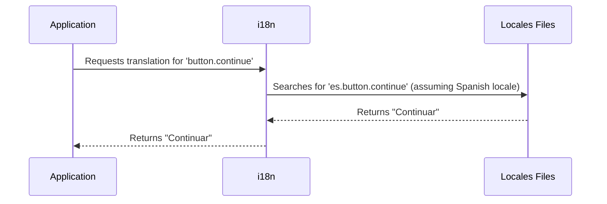

# Chapter 10: Internationalization (i18n)

In the previous chapter, [Engines](09_engines.md), we learned how to organize our application into smaller, reusable components. Now, let's imagine our Enroll application needs to be used by people who speak different languages.  Our central use case is displaying the "Continue" button in both English and Spanish. This is where internationalization (i18n) comes in.

## Internationalization (i18n): Your Application's Multilingual Translator

Internationalization (i18n) allows your application to support multiple languages. It's like having different versions of a book translated into different languages. The `locales` directory contains these translations.

## Example: Displaying the "Continue" Button in English and Spanish

Let's see how we can display the "Continue" button in English:

```erb
<%= t('button.continue') %>
```

This code uses the `t` helper (short for `translate`) to look up the translation for `button.continue`.

Now, let's add the Spanish translation.  In the `locales/view.es.yml` file (which you might need to create), add the following:

```yaml
es:
  button:
    continue: "Continuar"
```

This defines the Spanish translation for `button.continue` as "Continuar".

Now, if a user's language is set to Spanish, the `t('button.continue')` helper will display "Continuar".

## How i18n Works Under the Hood



The application requests the translation for `button.continue`. The i18n framework checks the user's locale (e.g., Spanish) and searches for the corresponding translation in the locale files.  It finds the translation in `view.es.yml` and returns it to the application.

## Internal Implementation

The i18n framework is configured in the `config/application.rb` file.  This file specifies the available locales and the default locale.

```ruby
# config/application.rb (simplified)
config.i18n.available_locales = [:am, :en, :es, :ja]
config.i18n.default_locale = :en
```

This code sets the available locales to Amharic, English, Spanish, and Japanese, with English as the default.  The `config/initializers/i18n_backend.rb` file configures the backend for storing and retrieving translations.  It uses a `MongoI18n` store, allowing translations to be stored in MongoDB.  It also includes caching to improve performance.  The fallback configuration ensures that if a translation is missing for a specific locale, it falls back to English:

```ruby
# config/application.rb (simplified)
config.i18n.fallbacks = [I18n.default_locale, {'am' => 'en', 'es' => 'en', 'ja' => 'en'}]
```

The `i18n-tasks.yml` file helps manage translations, including finding missing or unused translations.

## Conclusion

In this chapter, we learned how internationalization (i18n) allows our application to support multiple languages. We saw how to use the `t` helper to display translated text and how to define translations in YAML files within the `locales` directory. This makes our application accessible to a wider audience.  This concludes our exploration of key concepts within the `config` project.  We hope this tutorial has provided a solid foundation for understanding how these abstractions work together to build a robust and scalable application.


---

Generated by [AI Codebase Knowledge Builder](https://github.com/The-Pocket/Tutorial-Codebase-Knowledge)