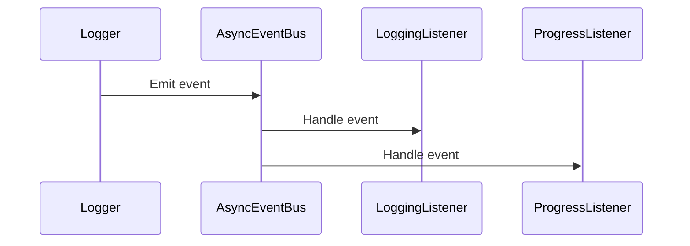

# Chapter 10: Logger

In the previous chapter, [Context](09_context.md), we learned about the central information hub for our `HMS-MCP` application. Now, let's explore how to keep track of what's happening in our application using the `Logger`.

## What problem does the Logger solve?

Imagine you're building an AI assistant that helps you manage your tasks.  You want to know when the assistant starts a task, when it finishes, and if it encounters any errors along the way.  The `Logger` helps you track these events, providing a record of what's happening in your application. Think of it as a project logbook where you write down important events, like when a task starts, finishes, or encounters an error.

## Key Concepts

The `Logger` records events with different severity levels:

1. **Debug:** Detailed information for troubleshooting.
2. **Info:** General information about the application's progress.
3. **Warning:** Events that might indicate a potential problem.
4. **Error:** Events that indicate an error has occurred.

## Using the Logger

You can use the `Logger` to record events in your application. Here's a simple example:

```python
from mcp_agent.logging.logger import get_logger

logger = get_logger(__name__)

logger.info("Starting task...")

# ... your task code ...

logger.info("Task completed.")

```

This code gets a `Logger` instance and logs two info messages: one when the task starts and another when it finishes.  These messages will be recorded by the `Logger` and can be viewed in the console or a log file.

Let's see how to log an error:

```python
from mcp_agent.logging.logger import get_logger

logger = get_logger(__name__)

try:
    # ... some code that might raise an exception ...
    raise ValueError("Something went wrong!")
except ValueError as e:
    logger.error("An error occurred:", exc_info=True, data={"error": str(e)})

```

This code logs an error message along with the exception information and additional data about the error.

## Internal Implementation

The `Logger` uses an [AsyncEventBus](src/mcp_agent/logging/transport.py) to handle events asynchronously.  When you call `logger.info()`, `logger.error()`, etc., the `Logger` creates an [Event](src/mcp_agent/logging/events.py) and sends it to the `AsyncEventBus`. The `AsyncEventBus` then distributes the event to registered listeners.



The `LoggingListener` writes events to the console or a log file, while the `ProgressListener` updates the progress display.

Here's a simplified look at the `emit` function from `src/mcp_agent/logging/transport.py`:

```python
async def emit(self, event: Event):
    for listener in self.listeners.values():
        await listener.handle(event)
```

This code iterates through all registered listeners and calls their `handle` method to process the event.

The `LoggingListener`'s `handle` function might look like this (simplified):

```python
async def handle(self, event: Event):
    if self.event_filter.filter(event):
        # ... format the event ...
        print(formatted_event)
```

This code checks if the event passes the filter and then formats and prints the event.

## Conclusion

The `Logger` provides a simple and efficient way to track events in your `HMS-MCP` application. It allows you to record events with different severity levels and view them in the console or a log file.  This helps you monitor the progress of your application and troubleshoot any issues that may arise.  This concludes the tutorial.  We hope this has provided a solid foundation for understanding and using the `HMS-MCP` project.


---

Generated by [AI Codebase Knowledge Builder](https://github.com/The-Pocket/Tutorial-Codebase-Knowledge)