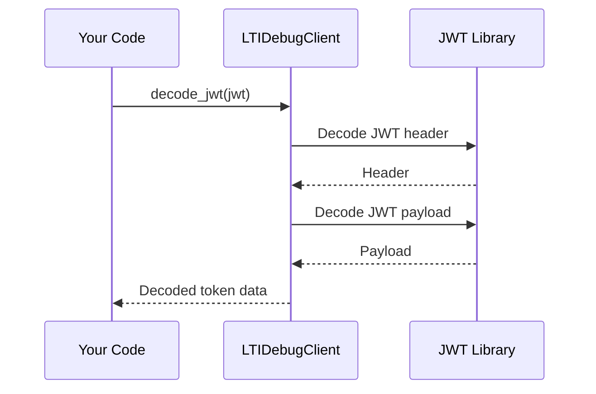

# Chapter 10: LTI Debug Client (LTI Communication Inspection)

Coming from our understanding of how the [ContributorKnowledgeBase (Expertise Tracking)](09_contributorknowledgebase__expertise_tracking__.md) helps us find the right experts, let's now dive into a tool that helps us understand the communication between our educational tools. Imagine you're setting up a new integration between your Learning Management System (LMS) and an external tool.  Everything seems configured correctly, but the integration isn't working.  How do you figure out what's going wrong?  That's where the `LTIDebugClient` comes in. It's like a network analyzer specifically designed for educational tools that use LTI (Learning Tools Interoperability).

## What is the LTIDebugClient?

The `LTIDebugClient` helps you inspect the LTI messages exchanged between your LMS and the external tool.  It can decode and analyze JWTs (JSON Web Tokens), monitor requests to services like the Names and Roles Provisioning Service (NRPS) and Assignment and Grade Services (AGS), and even simulate token requests. This makes it much easier to troubleshoot integration issues.

## Key Concepts

1. **JWT (JSON Web Token):**  This is a standard way to securely transmit information between parties as a JSON object.  In LTI, JWTs are used to authenticate and authorize users and tools.  Think of it as a digital passport that contains information about the user and the context of the launch.

2. **LTI Claims:** These are specific pieces of information within the JWT, like the user's name, role, and the course they're accessing.  They're like the different fields on a passport.

3. **NRPS (Names and Roles Provisioning Service):**  This service allows the tool to retrieve information about the users in the course, like their names and roles.

4. **AGS (Assignment and Grade Services):** This service allows the tool to manage assignments and grades within the LMS.

## Use Case: Decoding a JWT

Let's say you receive a JWT from your LMS.  You want to understand what information it contains.  Here's how you can use the `LTIDebugClient` to decode it:

```ruby
require_relative 'lti_debug_client'

client = LTIDebugClient.new

jwt = "eyJhbGciOiJIUzI1NiIsInR5cCI6IkpXVCJ9..." # Your JWT

decoded_token = client.decode_jwt(jwt)

puts decoded_token[:payload] # Output: The decoded JWT payload
```

**Explanation:**

1. We create a new `LTIDebugClient` instance.
2. We call the `decode_jwt` method with the JWT as input.
3. The method returns a hash containing the decoded header, payload, and LTI claims.  We print the payload to the console.

## Internal Implementation of `decode_jwt`

Here's a simplified sequence diagram showing how `decode_jwt` works:



The `decode_jwt` method uses a JWT library (like the `jwt` gem) to decode the header and payload of the JWT.  It then extracts the LTI claims and returns them along with the header and payload.

Here's a simplified code snippet from `lti_debug_client.rb`:

```ruby
# File: lti_debug_client.rb (simplified)
class LTIDebugClient
  def decode_jwt(token, verify = false, key = nil)
    # ... (Error handling omitted for simplicity) ...
    header = JWT.decode(token, nil, false)[1]
    payload = JWT.decode(token, nil, false)[0]
    # ... (Extract LTI claims) ...
    return { header: header, payload: payload, lti_claims: lti_claims }
  end
end
```

This simplified code shows how the `decode_jwt` method uses the `JWT.decode` function to decode the JWT.

## Conclusion

In this chapter, we learned about the `LTIDebugClient` and how it helps us inspect LTI communication. We saw how to use it to decode a JWT and explored the internal implementation of `decode_jwt`.  This tool is essential for troubleshooting LTI integrations and understanding the information exchanged between your LMS and external tools.  While there are no further chapters planned for this tutorial, you can explore the other methods of the `LTIDebugClient`, such as `monitor_nrps_request` and `monitor_ags_request`, to further enhance your LTI debugging skills.  Refer to the code documentation and examples for more details.


---

Generated by [AI Codebase Knowledge Builder](https://github.com/The-Pocket/Tutorial-Codebase-Knowledge)